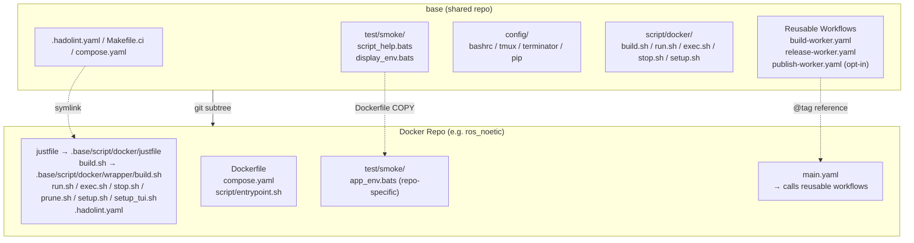
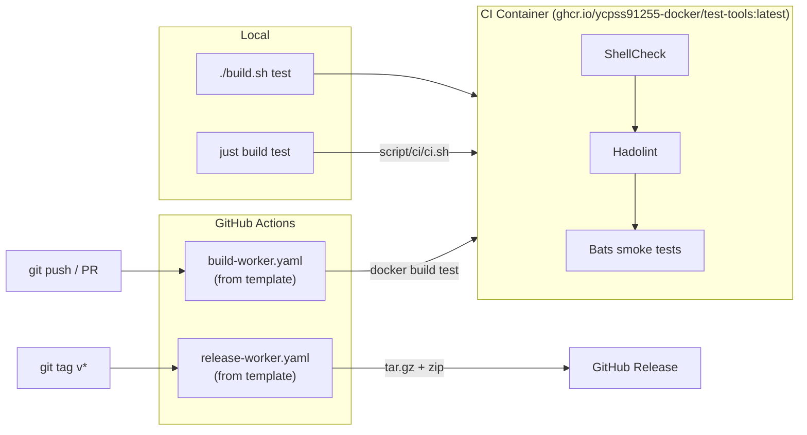

# base

[](https://github.com/ycpss91255-docker/base/actions/workflows/self-test.yaml)
[](https://codecov.io/gh/ycpss91255-docker/base)


[](./LICENSE)

Shared template for Docker container repos in the [ycpss91255-docker](https://github.com/ycpss91255-docker) organization.

**[English](README.md)** | **[繁體中文](doc/readme/README.zh-TW.md)** | **[简体中文](doc/readme/README.zh-CN.md)** | **[日本語](doc/readme/README.ja.md)**

---

## Table of Contents

- [TL;DR](#tldr)
- [Overview](#overview)
- [Quick Start](#quick-start)
- [CI Reusable Workflows](#ci-reusable-workflows)
- [Running Template Tests](#running-template-tests)
- [Tests](#tests)
- [Directory Structure](#directory-structure)

---

## TL;DR

```bash
# New repo from scratch: init + first commit + subtree + init.sh
mkdir <repo_name> && cd <repo_name>
git init
git commit --allow-empty -m "chore: initial commit"
git subtree add --prefix=.base \
    https://github.com/ycpss91255-docker/base.git vX.Y.Z --squash
./.base/init.sh

# Upgrade to latest
just upgrade-check   # check
just upgrade         # pull + update version + workflow tag

# Run CI
make -f Makefile.ci test   # ShellCheck + Bats + Kcov
just                       # show all recipes
```

## Overview

This repo consolidates shared scripts, tests, and CI workflows used across all Docker container repos. Instead of maintaining identical files in 15+ repos, each repo pulls this template as a **git subtree** and uses symlinks.

### Architecture



### CI/CD Flow



### What's included

| File | Description |
|------|-------------|
| `build.sh` | Build containers (TTY-aware `--setup` launches `setup_tui.sh`, else runs `setup.sh`) |
| `run.sh` | Run containers (X11/Wayland support; same `--setup` semantics as `build.sh`; `--build` opt-in pre-flight ./build.sh test for fresh-clone CI parity) |
| `exec.sh` | Exec into running containers |
| `stop.sh` | Stop and remove containers |
| `prune.sh` | Prune dangling images / build cache for the repo |
| `setup_tui.sh` | Interactive setup.conf editor (dialog / whiptail front-end) |
| `script/docker/wrapper/setup.sh` | Auto-detect system parameters and generate `.env` + `compose.yaml` |
| `script/docker/lib/_lib.sh` | Core wrapper library (`_load_env`, `_compose`, `_compose_project`, ...) |
| `script/docker/lib/bootstrap.sh` | Common wrapper initialization and arg parsing |
| `script/docker/lib/compose.sh` | Docker Compose YAML generation and manipulation |
| `script/docker/lib/conf.sh` | INI file parser and section merger |
| `script/docker/lib/conf_logging.sh` | Logging configuration helpers |
| `script/docker/lib/env.sh` | Environment variable setup and defaults |
| `script/docker/lib/gitignore.sh` | Gitignore file management |
| `script/docker/lib/hook.sh` | Per-wrapper pre/post hook invocation |
| `script/docker/lib/i18n.sh` | Language detection and localization (`_detect_lang`, `_LANG`) |
| `script/docker/lib/log.sh` | Unified logging and output utilities |
| `script/docker/lib/config_summary.sh` | Summary of runtime configuration |
| `script/docker/lib/_tui_backend.sh` | dialog/whiptail wrapper functions used by `setup_tui.sh` |
| `script/docker/lib/_tui_conf.sh` | INI validators + read/write for `setup_tui.sh` and `setup.sh` writeback |
| `script/docker/runtime/logging.sh` | Host-side log tee helper |
| `script/docker/runtime/smoke.sh` | Runtime install-check smoke |
| `script/docker/runtime/entrypoint.sh` | Template entrypoint helper |
| `script/ci/ci.sh` | CI orchestration (local + remote) |
| `script/ci/lint_bare_stderr.sh` | Bare stderr lint checker |
| `script/ci/lint_mixed_test_layout.sh` | Mixed-tool test layout validator |
| `config/` | Container-internal shell configs (bashrc, tmux, terminator) |
| `setup.conf` | Single per-repo runtime configuration (image / build / deploy / gui / network / volumes) |
| `test/smoke/` | Shared smoke tests + runtime assertion helpers (see below) |
| `test/unit/` | Template self-tests (bats + kcov) |
| `test/integration/` | Level-1 `init.sh` end-to-end tests |

Multi-tool downstream repos (e.g. `.bats` + `pytest` in one category)
segregate by a `<tool>` subdir -- `test/<category>/<tool>/` (e.g.
`test/smoke/bats/`, `test/smoke/pytest/`). Single-tool repos stay flat.
See [ADR-00000004](doc/adr/00000004-test-category-tool-subdir-layout.md).

| `.hadolint.yaml` | Shared Hadolint rules |
| `justfile` | Repo entry — `just <verb>` recipes (`just build`, `just run`, `just stop`, etc.). Sub-cmds and flags pass straight through as `{{args}}` (`just build --no-cache test`); `just` with no recipe lists all recipes. |
| `Makefile.ci` | Template CI entry (`make -f Makefile.ci test`, `make -f Makefile.ci lint`, etc.). The user-facing vs CI-facing split is intentional. |
| `init.sh` | First-time symlink setup + new-repo scaffolding |
| `upgrade.sh` | Subtree version upgrade |
| `dockerfile/Dockerfile.example` | Multi-stage Dockerfile template for new repos |
| `dockerfile/Dockerfile.test-tools` | Pre-built lint/test tools image (shellcheck, hadolint, bats, bats-mock) |
| `.github/workflows/` | Reusable CI workflows (build + release) |

### Wrapper UX cheat sheet (#291)

Single canonical reference for what each user-facing script accepts.
Downstream READMEs link here instead of duplicating the table.

| Flag / form | `build.sh` | `run.sh` | `exec.sh` | `stop.sh` | `setup.sh` (CLI) |
|---|:---:|:---:|:---:|:---:|:---:|
| `-h` / `--help` | yes | yes | yes | yes | yes |
| `-C` / `--chdir DIR` | yes | yes | yes | yes | — |
| `--lang LANG` | yes | yes | yes | yes | yes |
| `--dry-run` | yes | yes | yes | yes | — |
| `-s` / `--setup` | yes | yes | — | — | — (target of `--setup`) |
| `-t` / `--target TARGET` | yes (#280, alias to positional) | yes | yes | — (Q2: stays project-wide) | — |
| `--instance NAME` | — (build-time concept) | yes | yes | yes | — |
| `-q` / `--quiet` | — | — | — | — | yes (#285, on mutating subcommands) |
| `--gui auto\|force\|off` | yes (#338) | yes (#338) | — | — | yes (apply, #338) |
| `--no-x11-cookie` | yes (#338) | yes (#338) | — | — | yes (apply, #338) |
| `--print-resolved` | — | — | — | — | yes (apply, #338) |
| `--` separator | — | yes | yes (#289) | — | yes (per subcommand) |
| Positional meaning | TARGET | CMD | CMD | `docker compose down` pass-through | subcommand name |

Design decisions locked by #291:

- **Q1** (build.sh positional vs flag): keep positional + `-t` / `--target` as a backwards-compatible alias. `./build.sh runtime` and `./build.sh -t runtime` both work; downstream READMEs may use either, but should prefer the flag form for parity with `run.sh` / `exec.sh`.
- **Q2** (stop.sh `-t`): not adopted. `stop.sh` stays project-wide (`docker compose down`), since per-service stop has different docker-side semantics (`docker compose stop <service>`) and would conflate two cleanup verbs under one flag. Users wanting per-service control call `docker compose stop <service>` directly.
- **Q3** (setup.sh positional): subcommand-first verb-style (`./setup.sh set <key> <value>`), unchanged. Different mental model from the wrapper trio's TARGET / CMD, matching `git` / `docker` CLI convention.

### Dockerfile stages (convention)

Downstream repos follow a standard multi-stage layout, defined in
`dockerfile/Dockerfile.example`. All stages share a common base image
parameterized by `ARG BASE_IMAGE`.

| Stage | Parent | Purpose | Shipped? |
|-------|--------|---------|----------|
| `sys` | `${BASE_IMAGE}` | User/group, sudo, timezone, locale, APT mirror | intermediate |
| `base` | `sys` | Development tools and language packages | intermediate |
| `devel` | `base` | App-specific tools + `entrypoint.sh` + PlotJuggler (env repos) | **yes** (primary artifact) |
| `test` | `devel` | Ephemeral: ShellCheck + Hadolint + Bats smoke (all from `test-tools:local`) | no (discarded) |
| `runtime-base` (optional) | `sys` | Minimal runtime deps (sudo, tini) | intermediate |
| `runtime` (optional) | `runtime-base` | Slim runtime image (application repos only) | yes, when enabled |

Notes:
- Repos that only ship a developer image (`env/*`) skip `runtime-base` /
  `runtime` — the section stays commented in `Dockerfile.example`.
- `test` is always built from `devel`, so runtime assertions inside
  `test/smoke/<repo>_env.bats` see the same binaries / files a user would
  find after `docker run ... <repo>:devel`.
- `Dockerfile.test-tools` builds the lint/test tool bundle (bats + shellcheck +
  hadolint). The downstream `test` stage consumes it through an `ARG
  TEST_TOOLS_IMAGE` build arg — defaults to `test-tools:local` (matches the
  local `./build.sh` flow that builds `Dockerfile.test-tools` into the host
  Docker daemon). CI overrides it to
  `ghcr.io/ycpss91255-docker/test-tools:vX.Y.Z` (pre-built multi-arch image
  pushed by `.github/workflows/release-test-tools.yaml` on every tag) so
  buildx pulls the arch-correct binaries over the wire instead of rebuilding
  them per run, and sidesteps the cross-step image-store isolation that
  `docker-container` buildx drivers enforce.

#### Adding extra stages (#215)

Any `FROM <base> AS <stage>` outside the baseline blocklist
`{sys, devel-base, devel, devel-test, runtime-test}` (legacy
`{base, test}` also accepted during the v0.21.x transition) is
auto-emitted as a compose service that
`extends: devel` (inherits volumes / network / GPU / GUI / cap_add /
additional_contexts) and overrides only `build.target` / `image` /
`container_name` / `stdin_open` / `tty` / `profiles`. Use case:
entrypoint variants like NVIDIA Isaac Sim's `headless` + `gui` on top
of `devel`.

User flow:

```dockerfile
# Add to Dockerfile (no setup.conf change needed)
FROM devel AS headless
ENTRYPOINT ["/isaac-sim/runheadless.sh"]
CMD ["-v"]

FROM devel AS gui
ENTRYPOINT ["/isaac-sim/runapp.sh"]
```

```bash
just build                            # regenerates compose.yaml, builds all stages
just run -t headless                  # runs the headless variant
just run -t gui                       # runs the gui variant
just exec -t headless bash            # exec into running headless container

# Kit-style args (containing `=`) pass straight through as recipe
# arguments — no env-var workaround needed:
just exec -t headless-stream /isaac-sim/runheadless.sh -v --/app/livestream/port=49100

# Equivalent direct .sh invocation:
./build.sh
./run.sh -t headless
./exec.sh -t headless bash
```

Constraints:

- Stage names must match `^[a-z][a-z0-9_-]*$` — uppercase / leading
  digit / dot etc. are rejected (WARN + skip; the rest of the parse
  continues).
- Names colliding with the baseline (`sys` / `devel-base` / `devel`
  / `runtime-test`, plus legacy aliases `base` / `test` during the
  v0.21.x transition) are a hard error from `setup.sh apply`. So are
  names colliding with the template-controlled image-tag namespace
  (`latest`, `v[0-9]*`). `devel-test` is **not** a collision — it is
  emitted as the `test` service through the per-stage model (#493, see
  below).
- Adding / removing a stage triggers `setup.sh check-drift` (via
  `SETUP_DOCKERFILE_HASH` in `.env`), so wrappers auto-regenerate
  `compose.yaml` on the next invocation. Unrelated `RUN apt-get
  install` edits do **not** trigger drift.

#### Per-stage `setup.conf` overrides (#220)

Stages auto-emitted by #215 share devel's runtime config (volumes /
GPU / network / GUI) by default. When a stage needs different runtime
settings — e.g. NVIDIA Isaac Sim's `headless` running a WebRTC
livestream wants `network=bridge` + a port mapping + `gui=off`, while
`devel` and `gui` keep `network=host` + X11 — add a `[stage:<name>]`
section to your repo's `setup.conf`:

```ini
[gui]
mode = auto

[network]
mode = host

[stage:headless]
gui.mode = off
network.mode = bridge
network.port_1 = 8080:80
deploy.gpu_capabilities = gpu compute utility graphics video
```

Use `./setup_tui.sh` for an interactive editor:

- **Advanced → Per-stage overrides**: drills straight into the editor.
  The entry only appears when your Dockerfile has at least one
  non-baseline stage.
- **Features → Per-stage overrides** (#221): always-visible
  discoverability surface that lists conditional / power-user
  features. When the precondition is met it acts as a shortcut into
  the same editor; when not, it pops a msgbox explaining how to
  enable.

Allowlist (v1 — keys that can be overridden per-stage):

| Section | Keys |
|---|---|
| `[deploy]` | `gpu_mode`, `gpu_count`, `gpu_capabilities`, `gpu_runtime` (legacy `runtime` still accepted) |
| `[gui]` | `mode` |
| `[network]` | `mode`, `ipc`, `pid`, `network_name`, `port_<N>`, `port_inherit` |
| `[security]` | `privileged`, `cap_add_<N>`, `cap_add_inherit`, `cap_drop_<N>`, `cap_drop_inherit`, `security_opt_<N>`, `security_opt_inherit` |
| `[volumes]` | `mount_<N>`, `mount_inherit` |
| `[environment]` | `env_<N>`, `env_inherit` |

List fields (`mount_*` / `port_*` / `env_*` / `cap_add_*` / `cap_drop_*`
/ `security_opt_*`) follow **append-default**: the stage's items are
appended to top-level entries. To replace top-level entirely, set
`<list>_inherit = false` (e.g. `volumes.mount_inherit = false`, or
`security.cap_add_inherit = false` to drop a stage's inherited caps —
#526: a read-only probe stage clears the flash stage's `SYS_ADMIN`).

Notes:

- `[stage:devel]` is **reserved** (v1 no-op + WARN). Edit top-level
  sections to tune devel. Revisit in v2.
- `[stage:devel-test]` (#493) is the override surface for the **`test`
  service** (the `devel-test` Dockerfile stage). By default `test`
  `extends: devel` and inherits its runtime config; declare
  `[stage:devel-test]` to diverge — e.g. `deploy.gpu_mode = force` to
  give GPU-requiring runtime tests (Isaac Sim pytest) a GPU even when
  devel has none. The service name stays `test` (`./script/exec.sh -t
  test` unchanged); `build.target` stays `devel-test`.
- `[stage:sys|base|test]` is a **hard error** (baseline collision) —
  use `[stage:devel-test]` to control the test service, not
  `[stage:test]`.
- `[stage:foo]` referencing a stage absent from the Dockerfile is
  **WARN + skipped** (the rest of `setup.sh apply` continues).
- Override keys outside the allowlist are **WARN + skipped per-key**.

### Smoke test helpers (for downstream repos)

`test/smoke/test_helper.bash` (loaded by every smoke spec via
`load "${BATS_TEST_DIRNAME}/test_helper"`) ships a small set of runtime
assertion helpers. Downstream repos should prefer these over ad-hoc
`[ -f ... ]` / `command -v` checks so failures produce decorated
diagnostics pointing at the missing artifact.

| Helper | Usage |
|--------|-------|
| `assert_cmd_installed <cmd>` | Fails unless `<cmd>` is on `PATH` |
| `assert_cmd_runs <cmd> [flag]` | Fails unless `<cmd> <flag>` exits 0 (default flag: `--version`) |
| `assert_file_exists <path>` | Fails unless `<path>` is a regular file |
| `assert_dir_exists <path>` | Fails unless `<path>` is a directory |
| `assert_file_owned_by <user> <path>` | Fails unless `<path>`'s owner is `<user>` |
| `assert_pip_pkg <pkg>` | Fails unless `pip show <pkg>` returns 0 |

### What stays in each repo (not shared)

- `Dockerfile`
- `compose.yaml`
- `script/` — repo-local runtime helpers (invoked inside the container by `ENTRYPOINT` / `CMD` or by hand)
  - `script/entrypoint.sh` (canonical)
  - any ros / app launch helpers etc.
- `script/docker/` — repo-local Dockerfile-internal build helpers (invoked from a Dockerfile `RUN`, never inside a running container; see commented stub + lint COPY in `dockerfile/Dockerfile.example`, #275)
- `doc/` and `README.md`
- Repo-specific smoke tests

## Per-repo runtime configuration

Each downstream repo drives its runtime config — GPU reservation, GUI
env/volumes, network mode, extra volume mounts — through a single
`setup.conf` INI file. `setup.sh` reads it (plus system detection) and
regenerates both `.env` and `compose.yaml`; users never hand-edit those
two derived artifacts.

### One conf, seven sections

```
[image]    rules = prefix:docker_, suffix:_ws, @default:unknown
[build]    apt_mirror_ubuntu, apt_mirror_debian            # Dockerfile build args
[deploy]   gpu_mode (auto|force|off), gpu_count, gpu_capabilities
           dri_groups (auto|off) — iGPU /dev/dri group_add on GUI svcs
[lifecycle] restart (no|always|unless-stopped|on-failure|on-failure:N)
           default no; on devel (extends:devel stages inherit). Avoid
           always/unless-stopped on stages that exit 0 (infinite restart).
[gui]      mode (auto|force|off)
[network]  mode (host|bridge|none), ipc, pid (host|private), privileged
[volumes]  mount_1 (workspace, auto-populated on first run)
           mount_2..mount_N (extra host mounts; devices via /dev path)
[logging]  driver (json-file default), max_size, max_file, compress
           local_path (host-side log dir; bind-mounted to /var/log/<repo>)
           [logging.<svc>] for per-service key-level override
```

Template default lives at `.base/config/docker/setup.conf`
(post-v0.25.0); per-repo overrides go at `<repo>/config/docker/setup.conf`.
Section-level **replace** strategy: a section present in the per-repo
file fully replaces the template's section; omitted sections fall back
to template.

**Privileges are opt-in** (#466): the template ships lean `[security]`
(`privileged = false`, no `cap_add` / `security_opt`) and `[devices]`
(no `/dev:/dev`) defaults, so lightweight repos and tooling stages stay
clean. Enable what a container needs via `setup_tui.sh` (security /
devices pages), `setup.sh add security.cap_add SYS_ADMIN`, or by
uncommenting the examples in the template.

On first `setup.sh` run (no per-repo setup.conf yet), the template file
is copied to `<repo>/config/docker/setup.conf` (the parent dir is created
automatically) and the detected workspace is written to `[volumes]
mount_1`. Subsequent runs read `mount_1` as source of truth — clear it
to opt out of mounting a workspace. Edit via:

```bash
./setup_tui.sh                      # interactive dialog/whiptail editor
./setup_tui.sh volumes              # jump directly to one section
./build.sh --setup            # launches setup_tui.sh under TTY; setup.sh otherwise
./.base/init.sh --gen-conf # plain copy of .base/config/docker/setup.conf
                              # to <repo>/config/docker/setup.conf
```

### Where each parameter lives (env vs workload)

Not every runtime value belongs in `setup.conf`. The dividing question
(axis A, [ADR-00000003](doc/adr/00000003-env-vs-workload-param-boundary.md))
is **"does this value change when you switch machines?"** -- if yes it is
*environment* (machine-bound, stays in `setup.conf`); if it changes per
task it is *workload*. "Does it need a rebuild?" (axis C) breaks grey
cases. Three channels carry these values, and only the first survives
into a field deployment that ships just the image:

| Parameter kind | Examples | Where it lives | Dev host | Field |
|---|---|---|---|---|
| machine-bound / set-once | GPU reservation, `privileged`, device/volume mounts, `IMAGE_NAME`, APT mirror | `setup.conf` (committed) | rendered into `compose.yaml` | inlined as `docker run` flags in a generated `deploy.sh` |
| volatile workload **env vars** | `ROS_DOMAIN_ID`, `LOG_LEVEL`, API tokens, dataset selectors | `.env` overlay (hand-authored, gitignored) | injected via `env_file` on top of the generated cache (later file wins) | baked `ENV` defaults (+ optional launcher `-e`) |
| structured app **config** | bridge topic lists, pipeline definitions | `config/app/` (#504) | bind-mounted at `/opt/app/config` (edit + restart, no rebuild) | `COPY`-baked into the image |

`setup.conf`'s `[environment]` section is the *first* kind -- stable,
machine-bound env defaults that get baked into the runtime image as
`ENV`. Put per-task env vars in the `.env` overlay instead, so a tweak
needs only `just run` (no `compose.yaml` regenerate, no `SETUP_CONF_HASH`
drift, no git churn).

> The `.env` overlay, the runtime-stage `ENV` bake, and the generated
> `deploy.sh` field launcher are rolling out across the
> [#497](https://github.com/ycpss91255-docker/base/issues/497) epic; this
> section documents the routing model they implement.

### Field deployment (`setup.sh deploy`)

`./setup.sh deploy` builds a self-contained field bundle from the same
`setup.conf` -- the deploy half of the routing model above. It targets a
stage (default `runtime`) and produces a single `tar.xz` carrying just two
things: the immutable image and a generated `deploy.sh` launcher.

```bash
./setup.sh deploy                       # build runtime bundle (prompts first)
./setup.sh deploy --dry-run             # print the build plan, build nothing
./setup.sh deploy --stage runtime -y    # skip the confirmation prompt
./setup.sh deploy -o /tmp/robot.tar.xz  # custom output path
```

What it does, in order:

1. bake the `[environment]` defaults into the image as real `ENV` (S3) and
   `COPY` `config/app/` into it when present (S4) -- so the field image is
   self-contained (no env file, no config bind travels);
2. `docker build --target <stage>` the immutable image;
3. generate `deploy.sh` -- a `docker run` launcher with every machine-bound
   docker-level flag inlined (privileged / gpus / runtime / network / ipc /
   pid / devices / caps / shm / restart / group-add), resolved from the
   chosen stage exactly as `compose.yaml` would for dev;
4. `docker save` the image and `tar -cJf` `{image.tar, deploy.sh}` into the
   bundle.

Before building, it prints the resolved launcher so you can review every
inlined flag, then prompts (skip with `-y`; `--dry-run` prints the plan and
the launcher without building; a non-interactive shell without `-y`
refuses). On the field machine:

```bash
tar -xJf <name>-runtime.tar.xz
docker load < image.tar
./deploy.sh                 # or: DEPLOY_IMAGE=... DEPLOY_CONTAINER_NAME=... ./deploy.sh
```

The launcher carries docker-level flags only by design: workload env vars
are baked `ENV` (override at run time with `-e` after `./deploy.sh`), and
the dev workspace bind is intentionally dropped (the field image ships its
own code). `--group-add` GIDs (iGPU `/dev/dri`) are read from the
generating host and may need adjusting on a different field machine.

### Logging output to host

Set `[logging] local_path` to tee container stdout/stderr to a host-side
file, in addition to the docker daemon's json-file log:

```ini
[logging]
local_path = ./log/   # repo-relative; or /abs/, or ~/dir/
```

Re-run any wrapper to regenerate `compose.yaml`. Host file lands at
`<local_path>/<svc>.log` per service. `docker logs <ct>` is unaffected
(json-file keeps rolling history; the host file mirrors the current
run).

For **new repos** generated with `init.sh` from this version on, the
helper is pre-wired in `script/entrypoint.sh` — setting
`[logging] local_path` is the only step. For **existing repos**, add
this single un-guarded line to `script/entrypoint.sh` before the
final `exec` as a one-time migration:

```bash
. /usr/local/lib/base/_entrypoint_logging.sh
```

The helper is COPY'd into the image at the stable in-image path
`/usr/local/lib/base/_entrypoint_logging.sh` by `Dockerfile.example`'s
devel stage (refs #368), so the source line works at build-time AND
runtime in every workspace layout — no `$USER` deref, no workspace
bind-mount dependence.

Troubleshooting: `local_path` set but the host file stays empty →
check `script/entrypoint.sh` actually contains the source line
(`grep _entrypoint_logging script/entrypoint.sh`).

### Interactive TUI

`./setup_tui.sh` opens the main menu. The backend is `dialog` or `whiptail` (when both are missing it prints a `sudo apt install dialog` hint and exits). Cancel / Esc leaves without saving; saving auto-invokes `setup.sh` to regenerate `.env` + `compose.yaml`.

Main menu structure (#221):

```
Main
├─ image            IMAGE_NAME detection rules
├─ build            APT mirrors + Dockerfile build args
├─ Runtime  ──→     network / deploy (GPU) / gui / environment / logging
├─ Mounts   ──→     volumes / devices / tmpfs
├─ Advanced ──→     security / additional_contexts
│                   / per_stage (conditional) / Reset
├─ Features         conditional / power-user features index
│                   (today: per_stage status row)
└─ Save & Exit
```

`./setup_tui.sh <section>` still drills directly into a section editor (e.g. `./setup_tui.sh volumes`), bypassing the main menu.

### When setup.sh runs

`setup.sh` runs only when explicitly triggered — it is not re-run on
every build or launch:

- **`./.base/init.sh`** runs it once after the skeleton lands
- **`just upgrade` / `./.base/upgrade.sh`** re-runs it via init.sh
  after the subtree pull, so an upgrade always lands with `.env` /
  `compose.yaml` regenerated against the new baseline
- **`./build.sh --setup` / `./run.sh --setup`** (or `-s`) re-runs it on demand
- **First-time bootstrap**: `./build.sh` / `./run.sh` auto-run setup.sh
  the very first time (when `.env` is missing, e.g. after a fresh CI
  clone) — no manual `--setup` needed

> **Fresh-clone lint coverage (#216)**: `./run.sh` on a clone with no
> image cached locally triggers Compose's auto-build, which only walks
> `target: devel` (or whatever `-t` says) and **skips** the
> `target: devel-test` stage that runs ShellCheck / Hadolint / Bats
> smoke (pre-#243 this stage was named `test`). `run.sh`
> prints an informational `[run] INFO:` block when this is about to
> happen (TTY only). Pass `--build` to pre-flight `./build.sh test`
> first if you want full local-CI parity in one command:
>
> ```bash
> just build test                   # explicit lint + smoke pass
> just run --build                  # same, then compose up
> just run                          # default — fast path, lint/smoke skipped
> ```

`setup.sh apply` rewrites `compose.yaml` from scratch every time but
preserves `WS_PATH` / `APT_MIRROR_UBUNTU` / `APT_MIRROR_DEBIAN` from any
existing `.env`, so a hand-tuned workspace path or apt mirror survives
upgrades.

### Drift detection

`setup.sh` stores `SETUP_CONF_HASH`, `SETUP_GUI_DETECTED`, and
`SETUP_TIMESTAMP` in `.env`. On every `./build.sh` / `./run.sh`,
stored values are compared against the current setup.conf hash + system
detection; a `[WARNING]` is printed (non-blocking) when any of the
following changed since last setup:

- `setup.conf` contents (conf hash)
- GPU / GUI detection
- `USER_UID` (user identity change)

Re-run with `--setup` to regenerate `.env` + `compose.yaml`.

### setup.sh subcommands (v0.11.0+)

`setup.sh` is a git-style backend with explicit subcommands. The build / run / TUI scripts call it for you; invoke directly for scripted / non-interactive use:

| Subcommand | Use |
|---|---|
| `apply` | Regenerate `.env` + `compose.yaml` from setup.conf + system detection |
| `check-drift` | Exit 0 in-sync / 1 drifted (drift descriptions on stderr) |
| `set <section>.<key> <value>` | Write a single key |
| `show <section>[.<key>]` | Read single key or whole section |
| `list [<section>]` | INI-style dump |
| `add <section>.<list> <value>` | Append to list-style section (`mount_*` / `env_*` / `port_*` / …); reuses next empty slot or `max+1` |
| `remove <section>.<key>` / `<section>.<list> <value>` | Delete by exact key, or by value match |
| `reset [-y\|--yes]` | Restore template default; archives prior `setup.conf` → `setup.conf.bak`, prior `.env` → `.env.bak` |
| `deploy [--stage S] [--output F] [--dry-run] [-y]` | Build a self-contained field bundle (`tar.xz` of image + generated `deploy.sh`) for stage `S` (default `runtime`); previews the resolved launcher and prompts before building. See [Field deployment](#field-deployment-setupsh-deploy) |

Typed keys validate against `_tui_conf.sh` validators (the same ones the TUI uses). `set` / `add` / `remove` / `reset` do **not** regenerate `.env` — chain `apply` afterwards, or `build.sh` / `run.sh` will trigger drift-regen on next invocation.

#### Migration from v0.10.x (BREAKING)

`setup.sh` (no args) and `setup.sh --base-path X --lang Y` (no subcommand) used to silently fall through to `apply`. v0.11.0 removes that fall-through:

| Invocation | Pre-v0.11 | v0.11+ |
|---|---|---|
| `setup.sh` | runs apply | prints help, exits 0 |
| `setup.sh --base-path X --lang Y` | runs apply | exit 1 "Unknown subcommand" |
| `setup.sh apply [...]` | runs apply | runs apply (unchanged) |

If a downstream repo has custom scripts invoking `setup.sh` directly, prepend `apply`. The bundled `build.sh` / `run.sh` / `init.sh` / `setup_tui.sh` are already updated.

### Derived artifacts (gitignored)

- `.env` — runtime variable values + `SETUP_*` drift metadata
- `compose.yaml` — full compose with baseline + conditional blocks

Open `compose.yaml` anytime to inspect the repo's current effective
configuration. Both files are regenerated on every `just upgrade`
(init.sh re-runs `setup.sh apply` after the subtree pull) — never
hand-edit them; put your overrides in `setup.conf` instead.

### Per-wrapper hooks (#440)

Every wrapper (`run` / `build` / `exec` / `stop` / `prune` / `setup` /
`setup_tui`) checks for an optional repo-local script at:

```
script/hooks/pre/<wrapper>.sh    # runs after env prep, before main work
script/hooks/post/<wrapper>.sh   # runs after main work (or in EXIT trap for run.sh)
```

`init.sh` ships 14 executable stubs (`exit 0` by default), so the
hook framework is ready out of the box. Replace `exit 0` with your
own host-side steps (e.g. `multiarch/qemu-user-static` binfmt
registration, mount-point dir creation, hardware preflight). Stubs
are idempotent across upgrades — pre-#440 templates pick up the
scaffolding on the next `just upgrade`.

**Contract:**

| Aspect | Behavior |
|---|---|
| Args | Same `"$@"` the wrapper received |
| Where | Host-side (NOT inside the container) |
| `pre` non-zero | Aborts the wrapper |
| `post` non-zero | Overrides wrapper exit code; cleanup still runs (run.sh) |
| Not executable | Hard fail with `chmod +x` hint |
| `--dry-run` | Both hooks silently skipped |

**Example — jetson_sdk_manager binfmt setup:**

```bash
# script/hooks/pre/run.sh
#!/usr/bin/env bash
if [ ! -f /proc/sys/fs/binfmt_misc/qemu-aarch64 ]; then
  docker run --rm --privileged \
    multiarch/qemu-user-static --reset -p yes
fi
```

### Naming scheme: three namespaces, two user identities

`setup.sh` emits three names in `.env` / `compose.yaml`. They look
similar on a single-user dev machine, but they live in **three
different namespaces** and pick their user prefix from **two
different identities**. Sysadmins running shared hosts need to know
the difference; solo developers can treat the two identities as the
same and move on.

| Name | Format | Namespace | User prefix |
|---|---|---|---|
| `image:` | `${DOCKER_HUB_USER:-local}/<repo>:<tag>` | **Registry** (Docker Hub) | `DOCKER_HUB_USER` |
| `container_name:` | `${USER_NAME}-<repo>${INSTANCE_SUFFIX}` | **Host daemon** (per docker daemon, flat global) | `USER_NAME` (OS user, refs #322) |
| compose project name | `${DOCKER_HUB_USER}-<repo>${INSTANCE_SUFFIX}` | **Host daemon** (drives default network / volume labels) | `DOCKER_HUB_USER` |

- `DOCKER_HUB_USER` — your Docker Hub account, used to namespace
  images on the registry side. Image tags are addressable as
  `<DOCKER_HUB_USER>/<repo>:<tag>` whether or not you actually push.
- `USER_NAME` — the OS user (from `id -un`), used to keep two OS
  users on the same host from colliding on the daemon's flat
  container-name namespace.

The two identities are deliberately separate. Image names use the
Docker Hub identity because images are addressable on the registry,
and forcing per-OS-user image tags would shatter buildx cache reuse
and Docker Hub layer sharing. Container names use the OS identity
because the conflict it fixes (two users on the same host running
the same repo) is a host-daemon problem with no registry component.

Project-name choice of `DOCKER_HUB_USER` predates #322 and was kept
unchanged: on a single-user dev machine the two identities coincide
so the names line up visually with `container_name`; on a shared
host the project name still avoids cross-user collision *because*
`DOCKER_HUB_USER` happens to differ per user too. The `#322`
CHANGELOG entry's phrasing "aligns container-level naming with
project-level naming" is true under that single-user-machine
assumption — both are user-prefixed, just via different vars — not
literally the same prefix string in the multi-user case.

**`INSTANCE_SUFFIX`** is the fourth dimension, orthogonal to the
user split. Same OS user wants to run the same repo as multiple
parallel containers (e.g. two branches side by side): set
`INSTANCE_SUFFIX=2` and you get `alice-<repo>-2` /
`alice-<repo>-2`-named project. Empty by default; bumped by the
`-n / --instance` flag on the wrappers when applicable.

**Per-instance overlays (#465).** When `run.sh --instance NAME` is
given, `run.sh` also picks up these two optional files as compose
overlays:

```
config/instances/<NAME>.yaml   → docker compose -f
config/instances/<NAME>.env    → docker compose --env-file
```

Either file may exist alone; missing files are silently skipped. Use
the yaml for structural overrides (per-instance ports, volumes,
cache dirs) and the env for pure `${VAR}` overrides shared with
`compose.yaml`. `NAME` is validated as `^[a-z0-9][a-z0-9_-]*$` for
path safety.

Worked example. OS user `alice`, Docker Hub user `alice-hub`, repo
`claude_code`, default `INSTANCE_SUFFIX` empty:

```
image:          alice-hub/claude_code:devel
container_name: alice-claude_code
project name:   alice-hub-claude_code
```

Same OS user, second instance (`INSTANCE_SUFFIX=2`):

```
image:          alice-hub/claude_code:devel        (unchanged — same image)
container_name: alice-claude_code-2
project name:   alice-hub-claude_code-2
```

A second OS user `bob` on the same host:

```
image:          bob-hub/claude_code:devel          (different registry tag, no cache reuse)
container_name: bob-claude_code
project name:   bob-hub-claude_code
```

If `alice` and `bob` share `DOCKER_HUB_USER` (e.g. a shared CI
service account), `image` collides on Docker Hub but `container_name`
still differentiates — registry pulls share the cached image and
hosts stay deconflicted.

## Quick Start

### Adding to a new repo

```bash
# 1. Initialize empty repo (skip if you already have one with at least one commit)
mkdir <repo_name> && cd <repo_name>
git init
git commit --allow-empty -m "chore: initial commit"

# 2. Add subtree (pin a specific release tag, not a moving branch)
git subtree add --prefix=.base \
    https://github.com/ycpss91255-docker/base.git vX.Y.Z --squash

# 3. Initialize symlinks (one command; runs setup.sh under the hood)
./.base/init.sh
```

> `git subtree add` requires `HEAD` to exist. On a freshly `git init`-ed repo with no commits, it fails with `ambiguous argument 'HEAD'` and `working tree has modifications`. The empty commit creates `HEAD` so subtree can merge into it.

### Updating

Prerequisites: `git config user.name` / `user.email` must be set, and
the working tree can't be mid-merge / rebase / cherry-pick / revert —
upgrade.sh fails fast with an actionable message instead of half-pulling.

```bash
# Check if update available
just upgrade-check

# Upgrade to latest (subtree pull + version file + workflow tag)
just upgrade

# Or pin a specific version
just upgrade v0.3.0
# Pinning to a version OLDER than the current local pin (e.g. rolling
# from v0.12.0-rc1 back to v0.11.0) is refused as an implicit downgrade
# per SemVer §11. Edit .base/.version manually if intentional.

# Fallback if just is unavailable
./.base/upgrade.sh v0.3.0
```

`upgrade.sh` handles the full cycle in one go:

1. `git subtree pull --prefix=.base ... --squash`
2. Post-pull integrity check — `git reset --hard` rollback if subtree
   markers (`.base/.version`, `.base/init.sh`,
   `.base/script/docker/setup.sh`) are missing (catches the
   destructive fast-forward seen on older `git-subtree.sh`)
3. `./.base/init.sh` re-runs to: resync root symlinks
   (`build.sh` / `run.sh` / `justfile` …), sync `.gitignore` against
   the canonical entry set, `git rm --cached` any tracked-but-now-derived
   files (`.env`, `compose.yaml`, …), and call `setup.sh apply` to
   regenerate `.env` + `compose.yaml`
4. `sed` rewrites `.github/workflows/main.yaml`'s
   `build-worker.yaml@vX.Y.Z` / `release-worker.yaml@vX.Y.Z` refs

Your per-repo files are never overwritten: `<repo>/config/docker/setup.conf` stays
as-is, and `<repo>/config/` (bashrc / tmux / terminator …) is left
alone — if upstream `.base/config/` moved since the last pull,
upgrade.sh prints a `diff -ruN .base/config config` hint so you can
reconcile manually.

Don't `git subtree pull` by hand — the integrity check, init.sh
resync, and sed steps are easy to forget.

#### Automated version bumps (optional)

Downstream repos can let Dependabot open PRs whenever a new `template` tag
ships. Add `.github/dependabot.yml`:

```yaml
version: 2
updates:
  - package-ecosystem: "github-actions"
    directory: "/"
    schedule:
      interval: "weekly"
```

Dependabot notices the `uses: ycpss91255-docker/base/...@vX.Y.Z` refs in
`main.yaml`, compares against the template's latest tag, and files a PR. You
still run `just upgrade vX.Y.Z` locally to sync the subtree itself —
Dependabot only bumps the workflow refs.

## CI Reusable Workflows

Repos replace local `build-worker.yaml` / `release-worker.yaml` with calls to this repo's reusable workflows:

```yaml
# .github/workflows/main.yaml
jobs:
  call-docker-build:
    uses: ycpss91255-docker/base/.github/workflows/build-worker.yaml@v1
    with:
      image_name: my_app
      build_args: |
        BASE_IMAGE=python:3.11-slim
        APP_VERSION=1.0
        DEBIAN_CODENAME=bookworm

  call-release:
    needs: call-docker-build
    if: startsWith(github.ref, 'refs/tags/')
    uses: ycpss91255-docker/base/.github/workflows/release-worker.yaml@v1
    with:
      archive_name_prefix: my_app
```

### build-worker.yaml inputs

| Input | Type | Required | Default | Description |
|-------|------|----------|---------|-------------|
| `image_name` | string | yes | - | Container image name |
| `build_args` | string | no | `""` | Multi-line KEY=VALUE build args |
| `build_runtime` | boolean | no | `true` | Whether to build runtime stage |
| `platforms` | string | no | `"linux/amd64"` | Comma-separated target platforms; each runs as a parallel native-runner shard (`linux/amd64` → ubuntu-latest, `linux/arm64` → ubuntu-24.04-arm) |
| `test_tools_version` | string | no | `"latest"` | Tag for `ghcr.io/ycpss91255-docker/test-tools:<tag>` build-arg; pin to the template release you upgraded from for reproducibility |

### release-worker.yaml inputs

| Input | Type | Required | Default | Description |
|-------|------|----------|---------|-------------|
| `archive_name_prefix` | string | yes | - | Archive name prefix |
| `extra_files` | string | no | `""` | Space-separated extra files |

### publish-worker.yaml inputs (opt-in, foundational image repos)

Pushes a Dockerfile target stage to a container registry on tag push.
Opt-in: only repos that consume this workflow publish images (default
template flow stays test-only). Typical use case: foundational image
repos that other repos consume via Docker `FROM`.

| Input | Type | Required | Default | Description |
|-------|------|----------|---------|-------------|
| `image_name` | string | yes | - | Image repo name on the registry (e.g. `my_image`); full ref becomes `${registry}/${owner}/${image_name}` |
| `tag_suffix` | string | no | `""` | Appended to both `:${version}` and `:latest` tags. Convention: `-<matrix-entry-name>` so each variant lands on its own tag |
| `is_latest` | boolean | no | `false` | When true, also pushes `:latest${tag_suffix}` alongside `:${version}${tag_suffix}`. Multi-variant repos set this only on the canonical default variant |
| `registry` | string | no | `"ghcr.io"` | Container registry hostname. GHCR uses GITHUB_TOKEN auth automatically |
| `target` | string | no | `"devel"` | Dockerfile target stage to publish. `devel` for app-base usage; `runtime` for production images |
| `build_args` | string | no | `""` | Multi-line KEY=VALUE build args (same shape as build-worker) |
| `platforms` | string | no | `"linux/amd64"` | Comma-separated target platforms; multi-arch publishes a single multi-arch manifest under each tag |
| `context_path` | string | no | `"."` | Build context (mirrors build-worker) |
| `dockerfile_path` | string | no | `""` | Optional explicit Dockerfile path |
| `build_contexts` | string | no | `""` | Optional newline-separated `<name>=<location>` build contexts |
| `test_tools_version` | string | no | `"latest"` | `ghcr.io/.../test-tools:<tag>` build-arg (pin to your template release for reproducibility) |

Caller example (foundational multi-variant repo):

```yaml
# .github/workflows/main.yaml
jobs:
  call-publish:
    needs: ci-passed
    if: startsWith(github.ref, 'refs/tags/')
    permissions:
      contents: read
      packages: write
    strategy:
      matrix:
        target:
          - { name: 'standard',  base: 'python:3.11-slim',     is_latest: true }
          - { name: 'minimal',   base: 'python:3.11-alpine',   is_latest: false }
    uses: ycpss91255-docker/base/.github/workflows/publish-worker.yaml@vX.Y.Z
    with:
      image_name: my_image
      tag_suffix: "-${{ matrix.target.name }}"
      is_latest: ${{ matrix.target.is_latest }}
      target: devel
      build_args: |
        BASE_IMAGE=${{ matrix.target.base }}
```

After a `v0.1.0` tag push, the matrix above yields:

```
ghcr.io/<org>/my_image:v0.1.0-standard
ghcr.io/<org>/my_image:latest-standard   # is_latest = true
ghcr.io/<org>/my_image:v0.1.0-minimal
```

Downstream app repos then `FROM ghcr.io/<org>/my_image:v0.1.0-standard` in their own Dockerfile, dropping the duplicated sys / base / devel layers.

## Running Template Tests

Using `Makefile.ci` (from template root):
```bash
make -f Makefile.ci test        # Full CI (ShellCheck + Bats + Kcov) via docker compose
make -f Makefile.ci lint        # ShellCheck only
make -f Makefile.ci clean       # Remove coverage reports
just                      # Show repo recipes
make -f Makefile.ci help  # Show CI targets
```

Or directly:
```bash
./script/ci/ci.sh          # Full CI via docker compose
./script/ci/ci.sh --ci     # Run inside container (used by compose)
```

## Tests

See [TEST.md](doc/test/TEST.md) for details.

## Directory Structure

```
.base/
├── init.sh                           # Initialize repo (new or existing)
├── upgrade.sh                        # Upgrade template subtree version
├── script/
│   ├── docker/                       # Docker operation scripts
│   │   ├── wrapper/                  # User-facing wrapper scripts
│   │   │   ├── build.sh
│   │   │   ├── run.sh
│   │   │   ├── exec.sh
│   │   │   ├── stop.sh
│   │   │   ├── prune.sh
│   │   │   ├── setup.sh              # .env generator
│   │   │   └── setup_tui.sh          # Interactive setup editor
│   │   ├── lib/                      # Shared helper modules
│   │   │   ├── _lib.sh               # Core wrappers library
│   │   │   ├── bootstrap.sh          # Wrapper initialization
│   │   │   ├── compose.sh            # Compose generation
│   │   │   ├── conf.sh               # INI parser
│   │   │   ├── conf_logging.sh       # Logging config
│   │   │   ├── env.sh                # Environment setup
│   │   │   ├── gitignore.sh          # Gitignore management
│   │   │   ├── hook.sh               # Per-wrapper hooks
│   │   │   ├── i18n.sh               # Language detection
│   │   │   ├── log.sh                # Logging utilities
│   │   │   ├── config_summary.sh     # Config summary
│   │   │   ├── _tui_backend.sh       # TUI dialog/whiptail wrapper
│   │   │   ├── _tui_conf.sh          # TUI INI validators
│   │   │   ├── log-events.txt        # Log event catalog
│   │   │   └── log.lnav-format.json  # Lnav format definition
│   │   ├── runtime/                  # Runtime in-container scripts
│   │   │   ├── entrypoint.sh         # Template entrypoint helper
│   │   │   ├── logging.sh            # Host-side log tee helper
│   │   │   └── smoke.sh              # Runtime install-check smoke
│   │   ├── justfile                  # Docker operations entry (just)
│   │   └── setup.conf                # Template runtime config defaults
│   └── ci/                           # CI pipeline scripts
│       ├── ci.sh                     # CI orchestration (local + remote)
│       ├── lint_bare_stderr.sh       # Bare stderr lint checker
│       └── lint_mixed_test_layout.sh # Mixed-tool test layout validator
├── dockerfile/
│   ├── Dockerfile.example            # Multi-stage template (sys / devel-base / devel / devel-test / [runtime-base / runtime / runtime-test])
│   └── Dockerfile.test-tools         # Pre-built lint/test tools image
├── config/                           # Container-internal shell/tool configs
│   ├── docker/
│   │   └── setup.conf                # Runtime config (per-repo override mirror: <repo>/config/docker/setup.conf)
│   └── shell/
│       ├── bashrc
│       ├── bashrc.d/                 # Interactive shell bootstrap drop-ins
│       │   └── .gitkeep
│       ├── terminator/
│       │   ├── setup.sh
│       │   └── config
│       └── tmux/
│           ├── setup.sh
│           ├── README.adoc
│           └── tmux.conf
├── test/
│   ├── smoke/                        # Shared smoke tests + runtime assertion helpers
│   │   ├── test_helper.bash          # assert_cmd_installed / _runs / file / dir / owned_by / pip_pkg
│   │   ├── script_help.bats
│   │   └── display_env.bats
│   ├── unit/                         # Template self-tests (bats + kcov)
│   │   ├── test_helper.bash
│   │   ├── bashrc_spec.bats
│   │   ├── build_sh_spec.bats
│   │   ├── build_sh_prune_spec.bats
│   │   ├── build_worker_yaml_spec.bats
│   │   ├── ci_spec.bats
│   │   ├── compose_gen_spec.bats
│   │   ├── compose_logging_spec.bats
│   │   ├── compose_overlay_spec.bats
│   │   ├── conf_logging_spec.bats
│   │   ├── deploy_spec.bats
│   │   ├── entrypoint_logging_spec.bats
│   │   ├── exec_sh_spec.bats
│   │   ├── gitignore_spec.bats
│   │   ├── hook_spec.bats
│   │   ├── init_spec.bats
│   │   ├── lib_spec.bats
│   │   ├── lint_mixed_test_layout_spec.bats
│   │   ├── log_spec.bats
│   │   ├── makefile_user_spec.bats
│   │   ├── multi_distro_build_worker_yaml_spec.bats
│   │   ├── prune_sh_spec.bats
│   │   ├── release_test_tools_yaml_spec.bats
│   │   ├── run_sh_spec.bats
│   │   ├── runtime_smoke_spec.bats
│   │   ├── self_test_yaml_spec.bats
│   │   ├── setup_spec.bats
│   │   ├── smoke_helper_spec.bats
│   │   ├── stop_sh_spec.bats
│   │   ├── template_spec.bats
│   │   ├── terminator_config_spec.bats
│   │   ├── terminator_setup_spec.bats
│   │   ├── tmux_conf_spec.bats
│   │   ├── tmux_setup_spec.bats
│   │   ├── tui_backend_spec.bats
│   │   ├── tui_flow.bats
│   │   ├── tui_mount_assembler_spec.bats
│   │   ├── tui_spec.bats
│   │   ├── upgrade_spec.bats
│   │   └── wrapper_lib_lookup_spec.bats
│   ├── integration/                  # Level-1 init.sh end-to-end tests
│   │   ├── init_new_repo_spec.bats
│   │   ├── upgrade_spec.bats
│   │   ├── fresh_clone_portability_spec.bats
│   │   ├── gitignore_sync_spec.bats
│   │   └── wrapper_compose_dispatch_spec.bats
│   └── behavioural/                  # Runtime integration tests
│       └── runtime_test_smoke_spec.bats
├── Makefile.ci                       # Template CI entry (make test/lint/...)
├── compose.yaml                      # Docker CI runner
├── .hadolint.yaml                    # Shared Hadolint rules
├── .dockerignore
├── codecov.yml
├── .github/workflows/
│   ├── self-test.yaml                # Template CI
│   ├── build-worker.yaml             # Reusable build + smoke-test workflow
│   ├── release-worker.yaml           # Reusable release (source archive) workflow
│   ├── publish-worker.yaml           # Reusable image publish workflow (opt-in)
│   ├── multi-distro-build-worker.yaml # Multi-distro build workflow
│   └── release-test-tools.yaml       # Template's own test-tools image release
├── doc/
│   ├── readme/                       # README translations
│   │   ├── README.zh-TW.md
│   │   ├── README.zh-CN.md
│   │   └── README.ja.md
│   ├── adr/                          # Architecture Decision Records
│   │   ├── 00000001-setup-conf-vs-compose.md
│   │   ├── 00000002-no-latest-tag.md
│   │   ├── 00000003-env-vs-workload-param-boundary.md
│   │   └── 00000004-test-category-tool-subdir-layout.md
│   ├── test/
│   │   └── TEST.md                   # Test catalog and spec tables
│   ├── changelog/
│   │   └── CHANGELOG.md              # Release notes
│   └── deprecations.md
├── .gitignore
├── LICENSE
└── README.md
```

