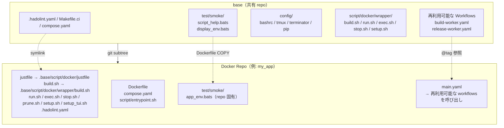
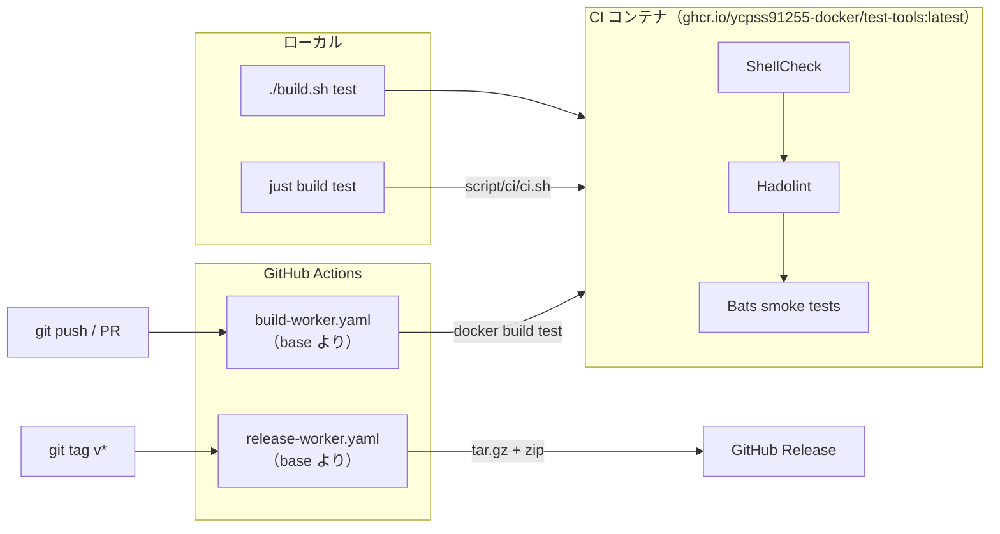

# base

[](https://github.com/ycpss91255-docker/base/actions/workflows/self-test.yaml)
[](https://codecov.io/gh/ycpss91255-docker/base)


[](../../LICENSE)

[ycpss91255-docker](https://github.com/ycpss91255-docker) 組織のすべての Docker コンテナ repo 用共有テンプレート。

**[English](../../README.md)** | **[繁體中文](README.zh-TW.md)** | **[简体中文](README.zh-CN.md)** | **[日本語](README.ja.md)**

---

## 目次

- [TL;DR](#tldr)
- [概要](#概要)
- [クイックスタート](#クイックスタート)
- [CI Reusable Workflows](#ci-reusable-workflows)
- [ローカルテスト実行](#ローカルテスト実行)
- [テスト](#テスト)
- [ディレクトリ構造](#ディレクトリ構造)

---

## TL;DR

```bash
# ゼロからの新規 repo：init + 初回コミット + subtree + init.sh
mkdir <repo_name> && cd <repo_name>
git init
git commit --allow-empty -m "chore: initial commit"
git subtree add --prefix=.base \
    https://github.com/ycpss91255-docker/base.git v0.30.0 --squash
./.base/init.sh

# 最新版にアップグレード
just upgrade-check   # 確認
just upgrade         # pull + バージョンファイル + workflow tag 更新

# CI 実行
just test            # ShellCheck + Bats + Kcov
just                 # 全コマンド表示
```

## 概要

本 repo は、すべての Docker コンテナ repo で共有されるスクリプト、テスト、CI workflow を一元管理しています。15 以上の repo で同一ファイルを個別管理する代わりに、各 repo が **git subtree** としてこのテンプレートを取り込み、symlink で参照します。

### アーキテクチャ



### CI/CD フロー



### 含まれるもの

| ファイル | 説明 |
|----------|------|
| `build.sh` | コンテナビルド（`--setup` は TTY がある場合 `setup_tui.sh` を起動、無ければ `setup.sh` を実行） |
| `run.sh` | コンテナ実行（X11/Wayland 対応；`--setup` の意味は `build.sh` と同じ） |
| `exec.sh` | 実行中のコンテナに入る |
| `stop.sh` | コンテナの停止・削除 |
| `prune.sh` | コンテナ / image / build キャッシュの整理 |
| `setup_tui.sh` | インタラクティブな setup.conf エディタ（dialog / whiptail フロントエンド） |
| `script/docker/wrapper/setup.sh` | システムパラメータの自動検出と `.env` + `compose.yaml` 生成 |
| `script/docker/lib/_lib.sh` | 共有 helper（`_load_env`、`_compose`、`_compose_project` など） |
| `script/docker/lib/bootstrap.sh` | wrapper の共通初期化と引数解析 |
| `script/docker/lib/compose.sh` | Docker Compose YAML の生成と操作 |
| `script/docker/lib/conf.sh` | INI ファイルパーサ + section マージ |
| `script/docker/lib/env.sh` | 環境変数のセットアップとデフォルト |
| `script/docker/lib/gitignore.sh` | Gitignore ファイル管理 |
| `script/docker/lib/hook.sh` | wrapper 毎の pre/post hook 呼び出し |
| `script/docker/lib/i18n.sh` | 言語検出とローカライズ（`_detect_lang`、`_LANG`） |
| `script/docker/lib/log.sh` | 統一されたログ / 出力ユーティリティ |
| `script/docker/lib/config_summary.sh` | ランタイム設定のサマリ |
| `script/docker/lib/conf_logging.sh` | ログ設定 helper |
| `script/docker/lib/_tui_backend.sh` | `setup_tui.sh` が使用する dialog / whiptail ラッパ関数 |
| `script/docker/lib/_tui_conf.sh` | INI バリデータ + 読み書き（`setup_tui.sh` と `setup.sh` の書き戻し用） |
| `script/docker/runtime/logging.sh` | host 側ログ tee helper |
| `script/docker/runtime/smoke.sh` | runtime install-check smoke |
| `script/docker/runtime/entrypoint.sh` | テンプレート entrypoint helper |
| `config/` | コンテナ内部のシェル設定ファイル（bashrc、tmux、terminator、pip） |
| `setup.conf` | 単一の repo ランタイム設定（image / build / deploy / gui / network / volumes） |
| `test/smoke/` | 共有 smoke テスト + runtime assertion helpers（下記参照） |
| `test/unit/` | Template 自身のテスト（bats + kcov） |
| `test/integration/` | Level-1 `init.sh` 統合テスト |
| `.hadolint.yaml` | 共有 Hadolint ルール |
| `justfile` | Repo コマンドエントリ（`just build`、`just run`、`just stop` 等）の `just <verb>` recipe。引数は `{{args}}` でそのまま wrapper に渡されます（`just build --no-cache test`）。`just` 単独で recipe 一覧を表示。 |
| `Makefile.ci` | Template CI コマンドエントリ（`make -f Makefile.ci test`、`make -f Makefile.ci lint` 等）。user-facing と CI-facing の分離は意図的。 |
| `init.sh` | 初回 symlink セットアップ + 新 repo スケルトン生成 |
| `upgrade.sh` | Subtree バージョンアップグレード |
| `script/ci/ci.sh` | CI パイプライン（ローカル + リモート） |
| `script/ci/lint_bare_stderr.sh` | 素の stderr 出力 lint チェッカ |
| `script/ci/lint_mixed_test_layout.sh` | mixed-tool テストレイアウトのバリデータ |
| `dockerfile/Dockerfile.example` | 新 repo のマルチステージ Dockerfile テンプレート |
| `dockerfile/Dockerfile.test-tools` | プリビルド lint/test ツール image（shellcheck、hadolint、bats、bats-mock） |
| `.github/workflows/` | 再利用可能な CI workflows（build + release） |

### Dockerfile ステージ（規約）

ダウンストリーム repo は `dockerfile/Dockerfile.example` で定義される標準のマルチステージ構成に従います。
すべてのステージは `ARG BASE_IMAGE` で指定されるベース image を共有します。

| ステージ | 親ステージ | 用途 | 出荷 |
|----------|------------|------|------|
| `sys` | `${BASE_IMAGE}` | ユーザー/グループ、sudo、タイムゾーン、ロケール、APT mirror | 中間 |
| `devel-base` | `sys` | 開発ツールと言語パッケージ | 中間 |
| `devel` | `devel-base` | アプリ固有ツール + `entrypoint.sh` + config レイヤリング | **はい**（主成果物） |
| `devel-test` | `devel` | 一時的：ShellCheck + Hadolint + Bats smoke（いずれも `test-tools:local` から） | いいえ（build 後破棄） |
| `runtime-base`（任意） | `sys` | 最小 runtime 依存（sudo、tini） | 中間 |
| `runtime`（任意） | `runtime-base` | install 成果物のみの軽量 runtime image（application repos で使用） | 有効時に出荷 |
| `runtime-test`（任意） | `runtime` | 一時的：runtime install-check smoke | いいえ（build 後破棄） |

補足：
- developer image のみを出荷する repo（`env/*`）は `runtime-base` /
  `runtime` をスキップし、該当セクションは `Dockerfile.example` 内で
  コメントアウトしたままにします。
- `devel-test` は常に `devel` を継承するため、`test/smoke/<repo>_env.bats` の
  runtime assertion が確認するバイナリやファイルは、ユーザーが
  `docker run ... <repo>:devel` で目にするものと一致します。
- `Dockerfile.test-tools` は lint/test ツールセット（bats + shellcheck + hadolint）をビルドします。ダウンストリームの `devel-test` ステージは `ARG TEST_TOOLS_IMAGE` build arg で参照します — デフォルト `test-tools:local`（ローカル `./build.sh` フロー、`Dockerfile.test-tools` を host Docker daemon に load）。CI では `ghcr.io/ycpss91255-docker/test-tools:vX.Y.Z`（`.github/workflows/release-test-tools.yaml` がタグ push ごとに publish するマルチアーキ image）で override し、buildx が registry からアーキ対応の bats / shellcheck / hadolint binary を直接 pull します。`docker-container` buildx driver の step 間 image store 分離問題を回避。

#### 追加ステージの追加（#215）

baseline blocklist `{sys, devel-base, devel, devel-test,
runtime-test}` 以外の（v0.21.x 移行期間中は旧名 `{base, test}` も受付）
`FROM <base> AS <stage>` は、自動的に compose サービスとして
emit されます — `extends: devel`（volumes / network / GPU / GUI /
cap_add / additional_contexts を継承）し、`build.target` /
`image` / `container_name` / `stdin_open` / `tty` / `profiles`
のみを override します。典型的な用途は entrypoint バリアント、
例えば NVIDIA Isaac Sim の `devel` 上に乗せる `headless` + `gui`
の 2 種類の起動モード。

ユーザー操作フロー：

```dockerfile
# Dockerfile に新 stage を追加（setup.conf は変更不要）
FROM devel AS headless
ENTRYPOINT ["/isaac-sim/runheadless.sh"]
CMD ["-v"]

FROM devel AS gui
ENTRYPOINT ["/isaac-sim/runapp.sh"]
```

```bash
just build                            # compose.yaml を再生成、全 stage を build
just run -t headless                  # headless バリアントを起動
just run -t gui                       # gui バリアントを起動
just exec -t headless bash            # running の headless container に exec

# Kit スタイルの `=` 付き引数も just ではそのまま渡せます (#469):
just exec -t headless-stream /isaac-sim/runheadless.sh -v --/app/livestream/port=49100

# 等価な直接 .sh 呼び出し:
./build.sh
./run.sh -t headless
./exec.sh -t headless bash
```

制約：

- Stage 名は `^[a-z][a-z0-9_-]*$` に一致する必要があり、大文字
  / 数字始まり / ピリオドなどは拒否されます（WARN + skip、
  他の stage は解析を続行）。
- baseline（`sys` / `devel-base` / `devel` / `devel-test` /
  `runtime-test`、v0.21.x 移行期間中は旧名 `base` / `test` も衝突
  対象）と衝突する場合は `setup.sh apply` が hard error で exit 1。
  template が管理する image tag namespace（`latest`、`v[0-9]*`）と
  の衝突も hard error。
- Stage の追加 / 削除は `setup.sh check-drift` をトリガーします
  （`.env` 内の `SETUP_DOCKERFILE_HASH` 経由）。次回 wrapper 起動
  時に自動的に `compose.yaml` を再生成します。`RUN apt-get install`
  などの他の編集は drift をトリガー**しません**。

#### Per-stage `setup.conf` overrides（#220）

#215 で auto-emit された stage はデフォルトで devel の runtime 設定
（volumes / GPU / network / GUI）を共有します。stage ごとに異なる
runtime 設定が必要な場合 — 例えば NVIDIA Isaac Sim の `headless`
が WebRTC livestream で `network=bridge` + port mapping + `gui=off`
を必要とし、`devel` と `gui` は `network=host` + X11 を維持する
場合 — repo の `setup.conf` に `[stage:<name>]` セクションを
追加します：

```ini
[gui]
mode = auto

[network]
mode = host

[stage:headless]
gui.mode = off
network.mode = bridge
network.port_1 = 8080:80
deploy.gpu_capabilities = gpu compute utility graphics video
```

`./setup_tui.sh` でも対話的に編集できます：

- **Advanced → Per-stage overrides**：直接エディタへ。このエントリ
  は Dockerfile に少なくとも 1 つの非 baseline stage がある場合の
  み表示されます。
- **Features → Per-stage overrides**（#221）：常時表示の機能一覧
  入口。条件を満たしている時はクリックで上記 Advanced と同じ
  エディタへ、満たしていない時は有効化方法を説明する msgbox を
  表示します。

Override 可能な key (v1)：

| Section | Keys |
|---|---|
| `[deploy]` | `gpu_mode`, `gpu_count`, `gpu_capabilities`, `runtime` |
| `[gui]` | `mode` |
| `[network]` | `mode`, `ipc`, `pid`, `network_name`, `port_<N>`, `port_inherit` |
| `[security]` | `privileged`, `cap_add_<N>`, `cap_add_inherit`, `cap_drop_<N>`, `cap_drop_inherit`, `security_opt_<N>`, `security_opt_inherit` |
| `[volumes]` | `mount_<N>`, `mount_inherit` |
| `[environment]` | `env_<N>`, `env_inherit` |

List フィールド（`mount_*` / `port_*` / `env_*` / `cap_add_*` /
`cap_drop_*` / `security_opt_*`）は **append-default**：stage の項目が
top-level の後に追加されます。完全に top-level を置き換える場合は
`<list>_inherit = false` を設定します（例：
`volumes.mount_inherit = false`、または
`security.cap_add_inherit = false` で stage が継承した caps をクリア
—— #526：読み取り専用の probe stage が flash stage の `SYS_ADMIN` を
クリア）。

注意事項：

- `[stage:devel]` は**予約済み** (v1 no-op + WARN)。devel を
  調整する場合は top-level セクションを直接編集してください。
  v2 で再検討します。
- `[stage:sys|base|test]` は **hard error**（baseline collision）。
- `[stage:foo]` で参照される stage が Dockerfile に存在しない
  場合 → **WARN + skip**（`setup.sh apply` の他の処理は継続）。
- allowlist 外の override key → **WARN + key 単位で skip**。

### Smoke test ヘルパー（ダウンストリーム repo 用）

`test/smoke/test_helper.bash`（各 smoke spec が
`load "${BATS_TEST_DIRNAME}/test_helper"` で読み込み）が runtime
assertion helpers のセットを提供します。ダウンストリーム repo は
素の `[ -f ... ]` / `command -v` より優先してこれらの helper を使用
すべきです。失敗時は欠落している成果物を直接指し示す decorated な
診断メッセージを出力します。

| Helper | 用法 |
|--------|------|
| `assert_cmd_installed <cmd>` | `<cmd>` が `PATH` 上にない場合に失敗 |
| `assert_cmd_runs <cmd> [flag]` | `<cmd> <flag>` が 0 以外で終了した場合に失敗（flag のデフォルトは `--version`） |
| `assert_file_exists <path>` | `<path>` が通常ファイルでない場合に失敗 |
| `assert_dir_exists <path>` | `<path>` がディレクトリでない場合に失敗 |
| `assert_file_owned_by <user> <path>` | `<path>` の所有者が `<user>` でない場合に失敗 |
| `assert_pip_pkg <pkg>` | `pip show <pkg>` が 0 以外で終了した場合に失敗 |

### 各 repo で個別管理するファイル（共有しない）

- `Dockerfile`
- `compose.yaml`
- `script/` — repo ローカルの **runtime helpers**（container 内で `ENTRYPOINT` / `CMD` または手動で呼ばれる）
  - `script/entrypoint.sh`（canonical）
  - ros / アプリ起動 helper 等
- `script/docker/` — repo ローカルの **Dockerfile-internal build helpers**（Dockerfile `RUN` で呼び、container 起動後は使わない；サンプル + lint COPY は `dockerfile/Dockerfile.example` 参照、#275）
- `doc/` と `README.md`
- Repo 固有の smoke test

## repo ごとのランタイム設定

各下流 repo は 1 つの `setup.conf` INI ファイルで自身のランタイム設定
（GPU 予約 / GUI env/volumes / network mode / 追加 volume mounts）を
駆動します。`setup.sh` がこれ + システム検出結果を読み、`.env` と
`compose.yaml` を再生成します — この 2 つの生成物をユーザが手動編集
する必要はありません。

### 単一 conf、7 つの section

```
[image]    rules = prefix:docker_, suffix:_ws, @default:unknown
[build]    apt_mirror_ubuntu、apt_mirror_debian            # Dockerfile build args
[deploy]   gpu_mode (auto|force|off)、gpu_count、gpu_capabilities
[gui]      mode (auto|force|off)
[network]  mode (host|bridge|none)、ipc、pid (host|private)、privileged
[volumes]  mount_1（workspace、初回 setup.sh 実行時に自動記入）
           mount_2..mount_N（ユーザ定義の追加 host mount；/dev デバイスは path 指定）
[logging]  driver（デフォルト json-file）、max_size、max_file、compress
           local_path（host 側 log ディレクトリ；/var/log/<repo> にバインドマウント）
           [logging.<svc>] で個別 service に key-level override 可能
```

テンプレート既定値は `.base/setup.conf`；repo ごとの上書きは
`<repo>/setup.conf`。セクションレベル **replace** 戦略：repo ファイルに
section があれば template の section を全置換；無ければ template 既定値を継承。

初回の `setup.sh` 実行時（repo 側の setup.conf がまだ無い状態）、
template ファイルが repo にコピーされ、検出された workspace が
`[volumes] mount_1` に書き込まれます。以降の実行は `mount_1` を
真のソースとして扱います — 空にすれば workspace マウントを
オプトアウトできます。編集方法：

```bash
./setup_tui.sh                      # インタラクティブな dialog/whiptail エディタ
./setup_tui.sh volumes              # 特定 section に直接ジャンプ
./build.sh --setup            # TTY 下では setup_tui.sh を起動、それ以外は setup.sh を実行
./.base/init.sh --gen-conf # .base/setup.conf を repo ルートに単純コピー
```

### ホスト側へのログ出力

`[logging] local_path` を設定するとコンテナの stdout/stderr が
ホスト側のファイルに tee 出力されます。docker daemon の json-file
ログは並行して保持されます：

```ini
[logging]
local_path = ./log/   # repo 相対、または /abs/、~/dir/ も可
```

任意の wrapper を再実行すると `compose.yaml` が再生成されます。
ホスト側のファイルは `<local_path>/<svc>.log`（サービスごと）に
出力されます。`docker logs <ct>` の動作は変わりません（json-file
はローリング履歴を維持、ホストファイルは今回の実行分を映します）。

**新規 repo**：本バージョン以降の `init.sh` で生成された
`script/entrypoint.sh` には helper の source 行が事前に組み込まれて
います。`[logging] local_path` を設定するだけで動作します。
**既存 repo**：`script/entrypoint.sh` の最後の `exec` の手前に
次の 1 行を追加して一度だけ移行してください：

```bash
. /usr/local/lib/base/_entrypoint_logging.sh
```

Helper は `Dockerfile.example` の devel stage によりイメージ内の
安定パス `/usr/local/lib/base/_entrypoint_logging.sh` にコピーされて
います（refs #368）。そのため、この source 行は build-time / runtime
どちらでも、どんな workspace 構成でも動作します — `$USER` 参照や
workspace bind mount への依存はありません。

トラブルシューティング：`local_path` を設定したのにホスト側
ファイルが空のまま → `script/entrypoint.sh` に source 行が
含まれているか確認してください
（`grep _entrypoint_logging script/entrypoint.sh`）。

### インタラクティブ TUI

`./setup_tui.sh` はメインメニューを開きます。バックエンドは
`dialog` または `whiptail`（どちらも無い場合は `sudo apt install
dialog` のヒントを表示して終了）。Cancel / Esc で保存せず退出；
保存後は自動的に `setup.sh` を呼び出して `.env` + `compose.yaml`
を再生成します。

メインメニュー構造（#221）：

```
Main
├─ image            IMAGE_NAME 検出ルール
├─ build            APT mirrors + Dockerfile build args
├─ Runtime  ──→     network / deploy（GPU）/ gui / environment / logging
├─ Mounts   ──→     volumes / devices / tmpfs
├─ Advanced ──→     security / additional_contexts
│                   / per_stage（条件付き）/ Reset
├─ Features         条件付き / 上級者向け機能の一覧（per_stage の状態を含む）
└─ Save & Exit
```

`./setup_tui.sh <section>` は引き続き任意の section エディタへ
直接ジャンプできます（例：`./setup_tui.sh volumes`）。

### setup.sh の実行タイミング

`setup.sh` は明示的にトリガーされた時のみ実行されます — build / run
の度に再実行されることはありません：

- **`./.base/init.sh`** がスケルトン生成後に 1 回自動実行
- **`just upgrade` / `./.base/upgrade.sh`** が subtree pull の後に
  init.sh 経由でもう一度実行されるため、アップグレードは常に新しい
  baseline で `.env` / `compose.yaml` を再生成した状態で着地します
- **`./build.sh --setup` / `./run.sh --setup`**（または `-s`）— ユーザが
  明示的に再実行。TTY がある場合は先に `setup_tui.sh` を起動して `setup.conf`
  を編集させ、TTY が無い場合は直接 `setup.sh` を呼び出します
- **初回 bootstrap**：`./build.sh` / `./run.sh` は `.env` が無い初回実行
  （CI の新規 clone 等）では、同じ TTY-aware フローを自動で通ります。
  `--setup` 指定は不要

> **Fresh-clone の lint カバレッジ（#216）**：image がローカルに
> キャッシュされていない `./run.sh` は Compose auto-build を起動
> しますが、auto-build は **`target: devel`**（または `-t` で指定
> された target）のみをビルドし、`target: devel-test`（pre-#243 は
> `test`）レイヤの ShellCheck / Hadolint / Bats smoke はスキップ
> されます。`run.sh`
> はこの状況を検知し、`compose up` の前に `[run] INFO:` ブロック
> を表示します（TTY 環境のみ）。CI と同じ完全な検証を 1 コマンド
> で実行したい場合は `--build` フラグを付けてください：
>
> ```bash
> just build test                   # 明示的に lint + smoke を実行
> just run --build                  # lint + smoke を実行してから compose up
> just run                          # デフォルト — 高速パス、lint/smoke はスキップ
> ```

`setup.sh apply` は毎回 `compose.yaml` をゼロから書き直しますが、
既存 `.env` の `WS_PATH` / `APT_MIRROR_UBUNTU` / `APT_MIRROR_DEBIAN` は
保持されるため、手動で調整した workspace パスや apt mirror はアップ
グレードで上書きされません。

### ドリフト検出

`setup.sh` は `.env` に `SETUP_CONF_HASH` / `SETUP_GUI_DETECTED` /
`SETUP_TIMESTAMP` を書き込みます。`./build.sh` / `./run.sh` は毎回
エントリ時点で現行の `setup.conf` ハッシュ + システム検出値と比較し、
以下のいずれかが変化した場合に `[WARNING]` を出力（実行は継続）：

- `setup.conf` の内容（conf hash）
- GPU / GUI の検出結果
- `USER_UID`（ユーザ ID の変化）

`--setup` を付けて再実行すれば `.env` + `compose.yaml` を再生成できます。

### フィールド配備（`setup.sh deploy`）

`./setup.sh deploy` は同じ `setup.conf` から自己完結型のフィールドバンドルを生成します（ルーティングモデルの deploy 側）。あるステージ（既定 `runtime`）を対象に、不変イメージと生成された `deploy.sh` ランチャの 2 つだけを含む単一の `tar.xz` を出力します。

```bash
./setup.sh deploy                       # runtime バンドルを生成（先に確認）
./setup.sh deploy --dry-run             # build plan を表示するだけで build しない
./setup.sh deploy --stage runtime -y    # 確認プロンプトをスキップ
./setup.sh deploy -o /tmp/robot.tar.xz  # 出力パスを指定
```

順に: (1) `[environment]` の既定値をイメージの実 `ENV` として焼き込み（S3）、`config/app/` があればイメージへ `COPY`（S4）—— フィールドイメージを自己完結化（env ファイルも config bind も持ち運ばない）; (2) `docker build --target <stage>`; (3) `deploy.sh` を生成 —— マシン依存の docker レベルフラグ（privileged / gpus / runtime / network / ipc / pid / devices / caps / shm / restart / group-add）をすべて inline した `docker run` ランチャで、当該ステージから dev の `compose.yaml` と同じ解決を行う; (4) `docker save` して `{image.tar, deploy.sh}` を `tar -cJf` でバンドル。

build 前に解決済みランチャを表示し、各 inline フラグを確認してから進めます（`-y` でスキップ；`--dry-run` は plan とランチャを表示するだけで build しない；非対話シェルで `-y` なしは拒否）。フィールドマシン側:

```bash
tar -xJf <name>-runtime.tar.xz
docker load < image.tar
./deploy.sh                 # または: DEPLOY_IMAGE=... DEPLOY_CONTAINER_NAME=... ./deploy.sh
```

ランチャは設計上 docker レベルフラグのみを持ちます: workload の環境変数は `ENV` として焼き込み済み（実行時に `./deploy.sh` の後ろに `-e` で上書き可）、dev の workspace bind は意図的に外しています（フィールドイメージは自身のコードを同梱）。`--group-add` の GID（iGPU `/dev/dri`）は生成ホスト由来で、別のフィールドマシンでは調整が必要な場合があります。

### setup.sh のサブコマンド（v0.11.0+）

`setup.sh` は git スタイルのバックエンドで、明示的なサブコマンドを提供します。build / run / TUI スクリプトが内部で呼び出してくれるので、直接呼び出すのはスクリプト化 / 非対話シナリオでの利用が想定されています：

| サブコマンド | 用途 |
|---|---|
| `apply` | setup.conf + システム検出から `.env` + `compose.yaml` を再生成 |
| `check-drift` | 同期なら 0、ドリフトしていれば 1（ドリフト内容は stderr） |
| `set <section>.<key> <value>` | 単一キーを書き込む |
| `show <section>[.<key>]` | 単一キーまたは section 全体を読み取る |
| `list [<section>]` | INI スタイルでダンプ |
| `add <section>.<list> <value>` | リスト型 section（`mount_*` / `env_*` / `port_*` …）に追加；空きスロット優先、無ければ `max+1` |
| `remove <section>.<key>` / `<section>.<list> <value>` | キー指定または値マッチで削除 |
| `reset [-y\|--yes]` | テンプレートのデフォルトに戻す；旧 `setup.conf` → `setup.conf.bak`、旧 `.env` → `.env.bak` |
| `deploy [--stage S] [--output F] [--dry-run] [-y]` | 自己完結型のフィールドバンドル（image + 生成 `deploy.sh` の `tar.xz`）を生成。stage `S` は既定 `runtime`；build 前に解決済みランチャをプレビューして確認。[フィールド配備](#フィールド配備setupsh-deploy)参照 |

型付きキーは `_tui_conf.sh` のバリデータ（TUI と同じもの）を経由します。`set` / `add` / `remove` / `reset` は **`.env` を自動再生成しません** — 必要に応じて `apply` を続けて呼ぶか、次回 `build.sh` / `run.sh` の drift 検出で自動再生成されます。

#### v0.10.x からの移行（BREAKING）

`setup.sh`（引数なし）と `setup.sh --base-path X --lang Y`（サブコマンドなし）は従来サイレントに `apply` にフォールスルーしていました。v0.11.0 でこのフォールスルーを廃止：

| 呼び出し方 | v0.11 以前 | v0.11+ |
|---|---|---|
| `setup.sh` | apply 実行 | help を表示して exit 0 |
| `setup.sh --base-path X --lang Y` | apply 実行 | exit 1「Unknown subcommand」 |
| `setup.sh apply [...]` | apply 実行 | apply 実行（変更なし） |

下流 repo にカスタムスクリプトが `setup.sh` を直接呼び出している場合、先頭に `apply` を付けてください。template 同梱の `build.sh` / `run.sh` / `init.sh` / `setup_tui.sh` はすでに更新済みです。

### 生成物（gitignored）

- `.env` — ランタイム変数 + `SETUP_*` drift metadata
- `compose.yaml` — baseline + 条件ブロック込みの完全な compose

いつでも `compose.yaml` を開けば現在の完全なランタイム設定を確認できます。
両ファイルは `just upgrade` のたびに再生成されます（init.sh が subtree
pull 後に `setup.sh apply` を再実行）— 手動編集はしないでください。
override は `setup.conf` に書きます。

### Wrapper 毎の pre/post hook（#440）

各 wrapper（`run` / `build` / `exec` / `stop` / `prune` / `setup` /
`setup_tui`）は、以下 2 つのオプショナルな repo-local script を検出します:

```
script/hooks/pre/<wrapper>.sh    # env 準備完了後、main logic 前
script/hooks/post/<wrapper>.sh   # main logic 後（run.sh は EXIT trap 内）
```

`init.sh` が 14 個の executable stub を自動生成（デフォルト `exit 0`）するので、
hook framework は箱から出してすぐに使えます。`exit 0` を host-side の処理
（例: `multiarch/qemu-user-static` の binfmt 登録、mount ディレクトリ作成、
hardware preflight）に置き換えてください。stub は upgrade に対して
冪等 — pre-#440 の template でも `just upgrade` 後に scaffolding が
補完されます。

**Contract:**

| 項目 | 動作 |
|---|---|
| 引数 | wrapper が受け取った `"$@"` と同じ |
| 実行位置 | ホスト（container 内では**ない**） |
| `pre` 非ゼロ | wrapper を abort |
| `post` 非ゼロ | wrapper exit code を override；cleanup は実行（run.sh） |
| 非 executable | hard fail + `chmod +x` ヒント |
| `--dry-run` | 両 hook とも silent skip |

**例 — jetson_sdk_manager の binfmt 登録:**

```bash
# script/hooks/pre/run.sh
#!/usr/bin/env bash
if [ ! -f /proc/sys/fs/binfmt_misc/qemu-aarch64 ]; then
  docker run --rm --privileged \
    multiarch/qemu-user-static --reset -p yes
fi
```

### 命名スキーム: 3 つの namespace と 2 つの user identity

`setup.sh` は `.env` / `compose.yaml` に 3 つの名前を生成します。
単一ユーザの開発機では見た目が似通っていますが、これらは**3 つの
独立した namespace**に属し、**2 つの異なる user identity**から
プレフィックスを取ります。共用ホスト（複数 OS user）のシナリオで
は区別が顕在化します。個人開発機では 2 つの identity が一致する
ことが多く、深追いする必要はありません。

| 名前 | 形式 | Namespace | User プレフィックス |
|---|---|---|---|
| `image:` | `${DOCKER_HUB_USER:-local}/<repo>:<tag>` | **Registry**（Docker Hub） | `DOCKER_HUB_USER` |
| `container_name:` | `${USER_NAME}-<repo>${INSTANCE_SUFFIX}` | **ローカル daemon**（同一 docker daemon 内のフラットなグローバル） | `USER_NAME`（OS user、refs #322） |
| compose project name | `${DOCKER_HUB_USER}-<repo>${INSTANCE_SUFFIX}` | **ローカル daemon**（デフォルト network / volume label に影響） | `DOCKER_HUB_USER` |

- `DOCKER_HUB_USER` — Docker Hub アカウント。registry 側で image
  に名前空間を付けるために使います。実際に push しない場合でも、
  image tag は `<DOCKER_HUB_USER>/<repo>:<tag>` という形で
  この identity を含みます。
- `USER_NAME` — ホストの OS user（`id -un`）。同じマシン上の
  異なる OS user が daemon のフラットな container 名前空間で
  衝突するのを防ぐために使います。

2 つの identity を意図的に分けています。Image は registry 上で
アドレス可能なオブジェクトなので Docker Hub identity を使う —
OS user でプレフィックスを付けてしまうと buildx cache や Docker
Hub の layer 共有が破綻します。Container name に OS identity を
使うのは、ここで解決したい衝突（同一ホスト上の 2 user が同一 repo
を同時実行）が daemon 側の問題であり、registry とは無関係だからです。

Project name に `DOCKER_HUB_USER` を使うのは #322 以前からの
決定で、そのまま据え置きました。個人開発機では 2 つの identity
が重なるため `container_name` と視覚的に揃います。共用ホストでは
`DOCKER_HUB_USER` も user ごとに異なるのが普通なので、project
name も結果としてユーザ間衝突を回避できます。`#322` の CHANGELOG
が言う「container レベルの命名を project レベルに揃える」とは
「単一ユーザ機」前提での記述です — どちらも user プレフィックス
を持つという意味では揃っていますが、複数ユーザ機ではそれぞれ別の
変数から来るので前綴文字列は同一ではありません。

**`INSTANCE_SUFFIX`** は 4 つ目の次元で、user 分離とは直交します。
同じ OS user が同一 repo の container を複数並行起動したい場合
（例: 2 つの branch を同時にテスト）、`INSTANCE_SUFFIX=2` を設定
すると `alice-<repo>-2` と対応する project name が得られます。
デフォルトは空文字列で、wrapper が対応する場面では `-n /
--instance` で指定できます。

**Per-instance overlay (#465)**。`run.sh --instance NAME` は次の
2 つの optional ファイルを compose overlay として自動検出します:

```
config/instances/<NAME>.yaml   → docker compose -f
config/instances/<NAME>.env    → docker compose --env-file
```

どちらか一方だけの存在も可、ファイルがなければ silent skip。yaml は
structural override（per-instance の ports、volumes、cache 等）、env は
`compose.yaml` と共有する `${VAR}` override に使います。`NAME` は
`^[a-z0-9][a-z0-9_-]*$` で validation され、path 安全を保証します。

具体例。OS user `alice`、Docker Hub user `alice-hub`、repo
`claude_code`、デフォルト `INSTANCE_SUFFIX` 空:

```
image:          alice-hub/claude_code:devel
container_name: alice-claude_code
project name:   alice-hub-claude_code
```

同一 OS user で 2 番目の instance（`INSTANCE_SUFFIX=2`）:

```
image:          alice-hub/claude_code:devel        (変わらず — 同じ image)
container_name: alice-claude_code-2
project name:   alice-hub-claude_code-2
```

同じホスト上の別の OS user `bob`:

```
image:          bob-hub/claude_code:devel          (registry tag が異なり cache 共有なし)
container_name: bob-claude_code
project name:   bob-hub-claude_code
```

`alice` と `bob` が同じ `DOCKER_HUB_USER` を共有している場合
（例: 共用 CI サービスアカウント）、`image` は Docker Hub 上で
衝突しますが `container_name` で区別できます — registry pull は
キャッシュされた image を共有し、ホスト内の daemon では互いに
分離されたままです。

## クイックスタート

### 新規 repo への追加

```bash
# 1. 空の repo を初期化（既存の repo でコミットが 1 つ以上ある場合はスキップ）
mkdir <repo_name> && cd <repo_name>
git init
git commit --allow-empty -m "chore: initial commit"

# 2. subtree 追加（特定のバージョン tag を指定）
git subtree add --prefix=.base \
    https://github.com/ycpss91255-docker/base.git v0.30.0 --squash

# 3. symlink 初期化（ワンコマンド）
./.base/init.sh
```

> `git subtree add` は `HEAD` の存在を前提とします。`git init` 直後でコミットが無い repo では `ambiguous argument 'HEAD'` と `working tree has modifications` で失敗します。空コミットで `HEAD` を作成しておけば subtree がマージできます。

### アップグレード

前提条件：`git config user.name` / `user.email` が設定済みで、working tree
が merge / rebase / cherry-pick / revert 進行中ではないこと — upgrade.sh
は対処方針付きのメッセージを出して fail-fast し、中途半端な pull を防ぎます。

```bash
# 新バージョンの確認
just upgrade-check

# 最新にアップグレード（subtree pull + バージョンファイル + workflow tag）
just upgrade

# バージョン指定
just upgrade v0.3.0
# 指定したバージョンが現在の local pin より古い場合（例：v0.12.0-rc1 から
# v0.11.0 への巻き戻し）は SemVer §11 に従って暗黙の downgrade として
# 拒否されます。意図的な rollback の場合は .base/.version を手動編集
# してください。

# just が使えない場合のフォールバック
./.base/upgrade.sh v0.3.0
```

`upgrade.sh` は一度に完結します：

1. `git subtree pull --prefix=.base ... --squash`
2. Post-pull 整合性チェック — subtree マーカー（`.base/.version`、
   `.base/init.sh`、`.base/script/docker/wrapper/setup.sh`）が消えた場合は
   `git reset --hard` で rollback（旧 `git-subtree.sh` の destructive FF
   対策）
3. `./.base/init.sh` 再実行：root symlinks（`build.sh` / `run.sh`
   / `justfile` …）の再同期、`.gitignore` を canonical entry set に
   同期、derived artifact になった旧 tracked ファイル（`.env`、
   `compose.yaml`、…）を `git rm --cached`、最後に `setup.sh apply` を
   呼んで `.env` + `compose.yaml` を再生成
4. `sed` で `.github/workflows/main.yaml` の
   `build-worker.yaml@vX.Y.Z` / `release-worker.yaml@vX.Y.Z` を更新

per-repo のファイルは上書きされません：`<repo>/setup.conf` はそのまま
保持され、`<repo>/config/`（bashrc / tmux / terminator …）も触りません
— 上流の `.base/config/` が前回 pull 以降変わっていれば、
upgrade.sh が `diff -ruN .base/config config` のヒントを表示するの
で、必要に応じて手動で reconcile してください。

手動で `git subtree pull` しないでください — 整合性チェック、init.sh
resync、sed の手順は忘れがちです。

#### 自動バージョン更新（任意）

ダウンストリーム repo は、`base` の新しい tag が出るたびに Dependabot が PR を立てるよう設定できます。`.github/dependabot.yml` を追加します：

```yaml
version: 2
updates:
  - package-ecosystem: "github-actions"
    directory: "/"
    schedule:
      interval: "weekly"
```

Dependabot は `main.yaml` 内の `uses: ycpss91255-docker/base/...@vX.Y.Z` ref を見て、base の最新 tag と照合して PR を出します。subtree 自体は引き続きローカルで `just upgrade vX.Y.Z` を実行する必要があります — Dependabot が扱うのは workflow ref のみです。

## CI Reusable Workflows

各 repo のローカル `build-worker.yaml` / `release-worker.yaml` を、本 repo の reusable workflows 呼び出しに置き換えます：

```yaml
# .github/workflows/main.yaml
jobs:
  call-docker-build:
    uses: ycpss91255-docker/base/.github/workflows/build-worker.yaml@v1
    with:
      image_name: my_app
      build_args: |
        BASE_IMAGE=python:3.11-slim
        APP_VERSION=1.0
        DEBIAN_CODENAME=bookworm

  call-release:
    needs: call-docker-build
    if: startsWith(github.ref, 'refs/tags/')
    uses: ycpss91255-docker/base/.github/workflows/release-worker.yaml@v1
    with:
      archive_name_prefix: my_app
```

### build-worker.yaml パラメータ

| パラメータ | 型 | 必須 | デフォルト | 説明 |
|------------|------|------|------------|------|
| `image_name` | string | はい | - | コンテナイメージ名 |
| `build_args` | string | いいえ | `""` | 複数行 KEY=VALUE ビルド引数 |
| `build_runtime` | boolean | いいえ | `true` | runtime stage をビルドするか |
| `platforms` | string | いいえ | `"linux/amd64"` | カンマ区切りのターゲットプラットフォーム；各プラットフォームがネイティブ runner 上で並列実行（`linux/amd64` → ubuntu-latest、`linux/arm64` → ubuntu-24.04-arm） |
| `test_tools_version` | string | いいえ | `"latest"` | `ghcr.io/ycpss91255-docker/test-tools:<tag>` のタグ。下流側は採用した template release にピン留めすると再現性が確保できる |

### release-worker.yaml パラメータ

| パラメータ | 型 | 必須 | デフォルト | 説明 |
|------------|------|------|------------|------|
| `archive_name_prefix` | string | はい | - | アーカイブ名プレフィックス |
| `extra_files` | string | いいえ | `""` | 追加ファイル（スペース区切り） |

## ローカルテスト実行

`Makefile.ci`（template ルートから）を使用：
```bash
make -f Makefile.ci test        # フル CI（ShellCheck + Bats + Kcov）docker compose 経由
make -f Makefile.ci lint        # ShellCheck のみ
make -f Makefile.ci clean       # カバレッジレポート削除
just             # repo recipe 一覧表示
make -f Makefile.ci help  # CI ターゲット表示
```

直接実行：
```bash
./script/ci/ci.sh          # フル CI（docker compose 経由）
./script/ci/ci.sh --ci     # コンテナ内で実行（compose から呼び出し）
```

## テスト

詳細は [TEST.md](../test/TEST.md) を参照。

## ディレクトリ構造

```
.base/
├── init.sh                           # Initialize repo (new or existing)
├── upgrade.sh                        # Upgrade template subtree version
├── script/
│   ├── docker/                       # Docker operation scripts
│   │   ├── wrapper/                  # User-facing wrapper scripts
│   │   │   ├── build.sh
│   │   │   ├── run.sh
│   │   │   ├── exec.sh
│   │   │   ├── stop.sh
│   │   │   ├── prune.sh
│   │   │   ├── setup.sh              # .env generator
│   │   │   └── setup_tui.sh          # Interactive setup editor
│   │   ├── lib/                      # Shared helper modules
│   │   │   ├── _lib.sh               # Core wrappers library
│   │   │   ├── bootstrap.sh          # Wrapper initialization
│   │   │   ├── compose.sh            # Compose generation
│   │   │   ├── conf.sh               # INI parser
│   │   │   ├── conf_logging.sh       # Logging config
│   │   │   ├── env.sh                # Environment setup
│   │   │   ├── gitignore.sh          # Gitignore management
│   │   │   ├── hook.sh               # Per-wrapper hooks
│   │   │   ├── i18n.sh               # Language detection
│   │   │   ├── log.sh                # Logging utilities
│   │   │   ├── config_summary.sh     # Config summary
│   │   │   ├── _tui_backend.sh       # TUI dialog/whiptail wrapper
│   │   │   ├── _tui_conf.sh          # TUI INI validators
│   │   │   ├── log-events.txt        # Log event catalog
│   │   │   └── log.lnav-format.json  # Lnav format definition
│   │   ├── runtime/                  # Runtime in-container scripts
│   │   │   ├── entrypoint.sh         # Template entrypoint helper
│   │   │   ├── logging.sh            # Host-side log tee helper
│   │   │   └── smoke.sh              # Runtime install-check smoke
│   │   ├── justfile                  # Docker operations entry (just)
│   │   └── setup.conf                # Template runtime config defaults
│   └── ci/                           # CI pipeline scripts
│       ├── ci.sh                     # CI orchestration (local + remote)
│       ├── lint_bare_stderr.sh       # Bare stderr lint checker
│       └── lint_mixed_test_layout.sh # Mixed-tool test layout validator
├── dockerfile/
│   ├── Dockerfile.example            # Multi-stage template (sys / devel-base / devel / devel-test / [runtime-base / runtime / runtime-test])
│   └── Dockerfile.test-tools         # Pre-built lint/test tools image
├── config/                           # Container-internal shell/tool configs
│   ├── docker/
│   │   └── setup.conf                # Runtime config (per-repo override mirror: <repo>/config/docker/setup.conf)
│   └── shell/
│       ├── bashrc
│       ├── bashrc.d/                 # Interactive shell bootstrap drop-ins
│       │   └── .gitkeep
│       ├── terminator/
│       │   ├── setup.sh
│       │   └── config
│       └── tmux/
│           ├── setup.sh
│           ├── README.adoc
│           └── tmux.conf
├── test/
│   ├── smoke/                        # Shared smoke tests + runtime assertion helpers
│   │   ├── test_helper.bash          # assert_cmd_installed / _runs / file / dir / owned_by / pip_pkg
│   │   ├── script_help.bats
│   │   └── display_env.bats
│   ├── unit/                         # Template self-tests (bats + kcov)
│   │   ├── test_helper.bash
│   │   ├── bashrc_spec.bats
│   │   ├── build_sh_spec.bats
│   │   ├── build_sh_prune_spec.bats
│   │   ├── build_worker_yaml_spec.bats
│   │   ├── ci_spec.bats
│   │   ├── compose_gen_spec.bats
│   │   ├── compose_logging_spec.bats
│   │   ├── compose_overlay_spec.bats
│   │   ├── conf_logging_spec.bats
│   │   ├── deploy_spec.bats
│   │   ├── entrypoint_logging_spec.bats
│   │   ├── exec_sh_spec.bats
│   │   ├── gitignore_spec.bats
│   │   ├── hook_spec.bats
│   │   ├── init_spec.bats
│   │   ├── lib_spec.bats
│   │   ├── lint_mixed_test_layout_spec.bats
│   │   ├── log_spec.bats
│   │   ├── makefile_user_spec.bats
│   │   ├── multi_distro_build_worker_yaml_spec.bats
│   │   ├── prune_sh_spec.bats
│   │   ├── release_test_tools_yaml_spec.bats
│   │   ├── run_sh_spec.bats
│   │   ├── runtime_smoke_spec.bats
│   │   ├── self_test_yaml_spec.bats
│   │   ├── setup_spec.bats
│   │   ├── smoke_helper_spec.bats
│   │   ├── stop_sh_spec.bats
│   │   ├── template_spec.bats
│   │   ├── terminator_config_spec.bats
│   │   ├── terminator_setup_spec.bats
│   │   ├── tmux_conf_spec.bats
│   │   ├── tmux_setup_spec.bats
│   │   ├── tui_backend_spec.bats
│   │   ├── tui_flow.bats
│   │   ├── tui_mount_assembler_spec.bats
│   │   ├── tui_spec.bats
│   │   ├── upgrade_spec.bats
│   │   └── wrapper_lib_lookup_spec.bats
│   ├── integration/                  # Level-1 init.sh end-to-end tests
│   │   ├── init_new_repo_spec.bats
│   │   ├── upgrade_spec.bats
│   │   ├── fresh_clone_portability_spec.bats
│   │   ├── gitignore_sync_spec.bats
│   │   └── wrapper_compose_dispatch_spec.bats
│   └── behavioural/                  # Runtime integration tests
│       └── runtime_test_smoke_spec.bats
├── Makefile.ci                       # Template CI entry (make test/lint/...)
├── compose.yaml                      # Docker CI runner
├── .hadolint.yaml                    # Shared Hadolint rules
├── .dockerignore
├── codecov.yml
├── .github/workflows/
│   ├── self-test.yaml                # Template CI
│   ├── build-worker.yaml             # Reusable build + smoke-test workflow
│   ├── release-worker.yaml           # Reusable release (source archive) workflow
│   ├── publish-worker.yaml           # Reusable image publish workflow (opt-in)
│   ├── multi-distro-build-worker.yaml # Multi-distro build workflow
│   └── release-test-tools.yaml       # Template's own test-tools image release
├── doc/
│   ├── readme/                       # README translations
│   │   ├── README.zh-TW.md
│   │   ├── README.zh-CN.md
│   │   └── README.ja.md
│   ├── adr/                          # Architecture Decision Records
│   │   ├── 00000001-setup-conf-vs-compose.md
│   │   ├── 00000002-no-latest-tag.md
│   │   ├── 00000003-env-vs-workload-param-boundary.md
│   │   └── 00000004-test-category-tool-subdir-layout.md
│   ├── test/
│   │   └── TEST.md                   # Test catalog and spec tables
│   ├── changelog/
│   │   └── CHANGELOG.md              # Release notes
│   └── deprecations.md
├── .gitignore
├── LICENSE
└── README.md
```

