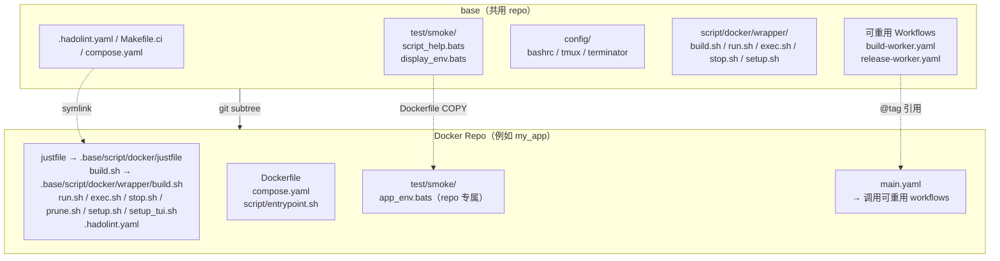
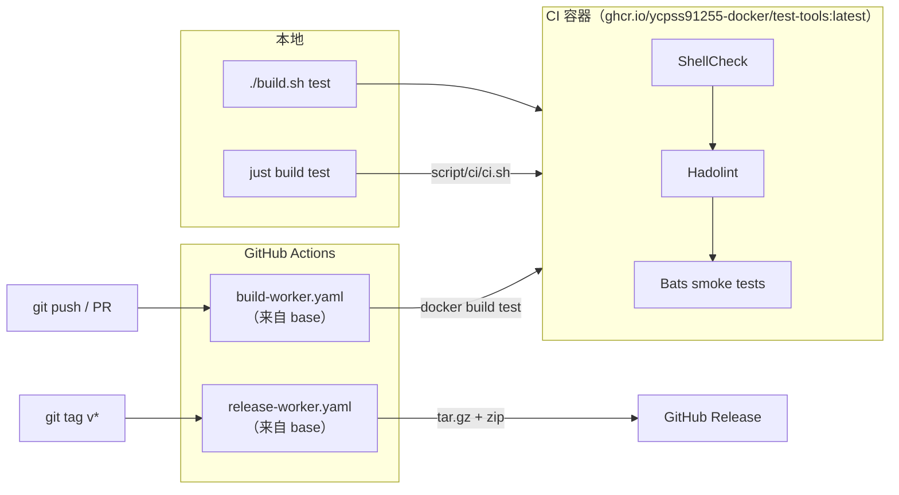

# base

[](https://github.com/ycpss91255-docker/base/actions/workflows/self-test.yaml)
[](https://codecov.io/gh/ycpss91255-docker/base)


[](../../LICENSE)

[ycpss91255-docker](https://github.com/ycpss91255-docker) 组织下所有 Docker 容器 repo 的共用模板。

**[English](../../README.md)** | **[繁體中文](README.zh-TW.md)** | **[简体中文](README.zh-CN.md)** | **[日本語](README.ja.md)**

---

## 目录

- [TL;DR](#tldr)
- [概述](#概述)
- [快速开始](#快速开始)
- [CI Reusable Workflows](#ci-reusable-workflows)
- [本地运行测试](#本地运行测试)
- [测试](#测试)
- [目录结构](#目录结构)

---

## TL;DR

```bash
# 从零开始的新 repo：init + 首个 commit + subtree + init.sh
mkdir <repo_name> && cd <repo_name>
git init
git commit --allow-empty -m "chore: initial commit"
git subtree add --prefix=.base \
    https://github.com/ycpss91255-docker/base.git v0.30.0 --squash
./.base/init.sh

# 升级到最新版
just upgrade-check   # 检查
just upgrade         # pull + 更新版本文件 + workflow tag

# 运行 CI
make test            # ShellCheck + Bats + Kcov
make help            # 显示所有命令
```

## 概述

此 repo 集中管理所有 Docker 容器 repo 共用的脚本、测试和 CI workflow。各 repo 通过 **git subtree** 拉入此模板，并使用 symlink 引用共用文件。

### 架构



### CI/CD 流程



### 包含内容

| 文件 | 说明 |
|------|------|
| `build.sh` | 构建容器（`--setup` 有 TTY 时启动 `setup_tui.sh`，否则调用 `setup.sh`） |
| `run.sh` | 运行容器（支持 X11/Wayland；`--setup` 语义与 `build.sh` 相同） |
| `exec.sh` | 进入运行中的容器 |
| `stop.sh` | 停止并移除容器 |
| `prune.sh` | 清理容器 / image / 构建缓存 |
| `setup_tui.sh` | 交互式 setup.conf 编辑器（dialog / whiptail 前端） |
| `script/docker/wrapper/setup.sh` | 自动检测系统参数并生成 `.env` + `compose.yaml` |
| `script/docker/lib/_lib.sh` | 核心 wrapper helper（env 加载、compose 调用、project 命名） |
| `script/docker/lib/bootstrap.sh` | 共用 wrapper 初始化与参数解析 |
| `script/docker/lib/compose.sh` | Docker Compose YAML 生成与处理 |
| `script/docker/lib/conf.sh` | INI 解析器与 section 合并器 |
| `script/docker/lib/conf_logging.sh` | Logging 配置 helper |
| `script/docker/lib/env.sh` | 环境变量设置与默认值 |
| `script/docker/lib/gitignore.sh` | Gitignore 文件管理 |
| `script/docker/lib/hook.sh` | 每个 wrapper 的 pre/post hook 调用 |
| `script/docker/lib/i18n.sh` | 语言检测与本地化 |
| `script/docker/lib/log.sh` | 统一日志与输出 helper |
| `script/docker/lib/config_summary.sh` | runtime 配置摘要 |
| `script/docker/lib/_tui_backend.sh` | TUI 用的 dialog / whiptail 包装函数 |
| `script/docker/lib/_tui_conf.sh` | TUI 的 INI validator + 读写逻辑 |
| `script/docker/runtime/entrypoint.sh` | 模板 entrypoint helper |
| `script/docker/runtime/logging.sh` | host 端 log tee helper |
| `script/docker/runtime/smoke.sh` | runtime 安装检查 smoke |
| `script/ci/ci.sh` | CI orchestration（本地 + 远端） |
| `script/ci/lint_bare_stderr.sh` | Bare stderr lint 检查器 |
| `script/ci/lint_mixed_test_layout.sh` | 混合工具测试布局验证器 |
| `config/` | Container 内部 shell 配置文件（bashrc、tmux、terminator） |
| `setup.conf` | 单一 per-repo runtime 配置（image / build / deploy / gui / network / volumes） |
| `test/smoke/` | 共用 smoke 测试 + runtime assertion helpers（见下方） |
| `test/unit/` | Template 自身测试（bats + kcov） |
| `test/integration/` | Level-1 `init.sh` 集成测试 |
| `test/behavioural/` | Runtime 集成测试 |
| `.hadolint.yaml` | 共用 Hadolint 规则 |
| `justfile` | Repo 命令入口（`just build`、`just run`、`just stop` 等）。各 verb 是 just recipe，参数透过 `{{args}}` 透传：sub-cmd 与 flag 都直接附在后面，不需要 `--` 分隔符（`just build --no-cache test`）。`just` 无参列出所有 recipe。 |
| `Makefile.ci` | Template CI 命令入口（`make -f Makefile.ci test`、`make -f Makefile.ci lint` 等）。user-facing 跟 CI-facing 是有意切割。 |
| `init.sh` | 首次初始化 symlinks + 新 repo 骨架生成 |
| `upgrade.sh` | Subtree 版本升级 |
| `dockerfile/Dockerfile.example` | 新 repo 的多阶段 Dockerfile 模板 |
| `dockerfile/Dockerfile.test-tools` | 预构建 lint/test 工具 image（shellcheck、hadolint、bats、bats-mock） |
| `.github/workflows/` | 可重用 CI workflows（build + release） |

### Dockerfile 分层（约定）

下游 repo 遵循标准多阶段配置，定义于 `dockerfile/Dockerfile.example`。
所有阶段共用 `ARG BASE_IMAGE` 指定的基础镜像。

| 阶段 | 父阶段 | 用途 | 是否出货 |
|------|--------|------|---------|
| `sys` | `${BASE_IMAGE}` | 用户/用户组、locale、时区、APT mirror | 中间 |
| `devel-base` | `sys` | 开发工具与语言套件 | 中间 |
| `devel` | `devel-base` | 应用专属工具、entrypoint、config 分层 | **是**（主要产物） |
| `devel-test` | `devel` | ShellCheck + Hadolint + Bats smoke（短暂：测试后丢弃） | 否（build 完即丢） |
| `runtime-base`（可选） | `sys` | 最小 runtime 依赖（sudo、tini） | 中间 |
| `runtime`（可选） | `runtime-base` | 仅含安装产物的精简 runtime 镜像 | 启用时出货 |
| `runtime-test`（可选） | `runtime` | runtime 安装检查 smoke（短暂） | 否 |

说明：
- 只出货 developer image 的 repo（`env/*`）会跳过 `runtime-base` /
  `runtime`——该 section 在 `Dockerfile.example` 保持注释状态。
- `devel-test` 总是从 `devel` 继承，所以 `test/smoke/<repo>_env.bats` 中的
  runtime assertion 所看到的二进制与文件，就是用户 `docker run ...
  <repo>:devel` 后会看到的内容。
- `Dockerfile.test-tools` 构建 lint/test 工具集（bats + shellcheck + hadolint）。下游 `devel-test` 阶段通过 `ARG TEST_TOOLS_IMAGE` build arg 引用 — 默认 `test-tools:local`（对应本地 `./build.sh` 流程,把 `Dockerfile.test-tools` 构建到 host Docker daemon）。CI 则覆盖成 `ghcr.io/ycpss91255-docker/test-tools:vX.Y.Z`（由 `.github/workflows/release-test-tools.yaml` 在每次 tag 推的预构建 multi-arch image）,buildx 直接从 registry 拉对应架构的 bats / shellcheck / hadolint binary,避开 `docker-container` buildx driver 跨 step 不共享 image store 的问题。

#### 添加额外 stage（#215）

任何在 baseline blocklist `{sys, devel-base, devel, devel-test,
runtime-test}` 之外的（v0.21.x 过渡期同时接受旧名 `{base, test}`）
`FROM <base> AS <stage>`，会被自动 emit 成一个 compose 服务 —
`extends: devel`（继承 volumes / network / GPU / GUI / cap_add /
additional_contexts），仅 override `build.target` / `image` /
`container_name` / `stdin_open` / `tty` / `profiles`。典型用例是
entrypoint 变体，如 NVIDIA Isaac Sim 在 `devel` 之上的
`headless` + `gui` 两种启动模式。

User 操作流程：

```dockerfile
# Dockerfile 加新 stage（不用动 setup.conf）
FROM devel AS headless
ENTRYPOINT ["/isaac-sim/runheadless.sh"]
CMD ["-v"]

FROM devel AS gui
ENTRYPOINT ["/isaac-sim/runapp.sh"]
```

```bash
just build                            # 重新生成 compose.yaml，build 所有 stages
just run -t headless                  # 跑 headless 变体
just run -t gui                       # 跑 gui 变体
just exec -t headless bash            # 进入 running 的 headless container

# Kit 风格的 `=` 参数会被 #414 guard 挡下，改走 EXEC_ARGS env var (#469)：
EXEC_ARGS='--/app/livestream/port=49100' \
  just exec -t headless-stream /isaac-sim/runheadless.sh -v

# 等效直接 .sh 写法：
./build.sh
./run.sh -t headless
./exec.sh -t headless bash
```

约束：

- Stage 名必须符合 `^[a-z][a-z0-9_-]*$` — 大写 / 数字开头 / 点号
  等会被拒（WARN + 跳过，其他 stage 继续解析）。
- 撞到 baseline（`sys` / `devel-base` / `devel` / `devel-test` /
  `runtime-test`，v0.21.x 过渡期亦同时接受旧名 `base` / `test`）
  `setup.sh apply` hard error 退出 1。撞到 template 控制的 image
  tag namespace（`latest`、`v[0-9]*`）也是 hard error。
- 添加 / 移除 stage 会触发 `setup.sh check-drift`（通过 `.env` 内
  的 `SETUP_DOCKERFILE_HASH`），下次 wrapper 跑会自动 regen
  `compose.yaml`。其他 `RUN apt-get install` 等修改**不会**触发 drift。

#### Per-stage `setup.conf` overrides（#220）

#215 auto-emit 出的 stage 默认共用 devel 的 runtime 设置
（volumes / GPU / network / GUI）。当某 stage 需要不同的 runtime
设置 — 例如 NVIDIA Isaac Sim 的 `headless` 跑 WebRTC livestream
要 `network=bridge` + 一个 port mapping + `gui=off`，但 `devel` 跟
`gui` 维持 `network=host` + X11 — 在 repo 的 `setup.conf` 加上
`[stage:<name>]` section：

```ini
[gui]
mode = auto

[network]
mode = host

[stage:headless]
gui.mode = off
network.mode = bridge
network.port_1 = 8080:80
deploy.gpu_capabilities = gpu compute utility graphics video
```

也可以用 `./setup_tui.sh` 走交互式编辑：

- **Advanced → Per-stage overrides**：直接进编辑器；该 entry 仅
  在 Dockerfile 有至少一个非 baseline stage 时才显示。
- **Features → Per-stage overrides**（#221）：永久可见的功能总
  览入口；条件已满足时点击等同上述 Advanced 路径，未满足时会
  弹 msgbox 说明如何启用。

允许 override 的 key（v1）：

| Section | Keys |
|---|---|
| `[deploy]` | `gpu_mode`, `gpu_count`, `gpu_capabilities`, `runtime` |
| `[gui]` | `mode` |
| `[network]` | `mode`, `ipc`, `pid`, `network_name`, `port_<N>`, `port_inherit` |
| `[security]` | `privileged`, `cap_add_<N>`, `cap_add_inherit`, `cap_drop_<N>`, `cap_drop_inherit`, `security_opt_<N>`, `security_opt_inherit` |
| `[volumes]` | `mount_<N>`, `mount_inherit` |
| `[environment]` | `env_<N>`, `env_inherit` |

List 字段（`mount_*` / `port_*` / `env_*` / `cap_add_*` / `cap_drop_*` /
`security_opt_*`）采 **append-default**：stage 的项目附加在 top-level
之后。要完全取代 top-level，设 `<list>_inherit = false`（例：
`volumes.mount_inherit = false`，或 `security.cap_add_inherit = false`
清掉某 stage 继承的 caps —— #526：只读 probe stage 可清掉 flash stage
的 `SYS_ADMIN`）。

注意事项：

- `[stage:devel]` 是**保留**的 (v1 no-op + WARN)。要调 devel 直接
  改 top-level section。v2 会重新评估。
- `[stage:sys|base|test]` 是 **hard error**（baseline collision）。
- `[stage:foo]` 对应的 stage 在 Dockerfile 不存在 → **WARN + 跳过**
  （`setup.sh apply` 其他流程继续）。
- 不在 allowlist 内的 override key → **WARN + 跳过该 key**。

### Smoke test helpers（供下游 repo 使用）

`test/smoke/test_helper.bash`（每个 smoke spec 通过
`load "${BATS_TEST_DIRNAME}/test_helper"` 加载）提供一组 runtime
assertion helpers。下游 repo 应优先使用这些 helper 而非原生的
`[ -f ... ]` / `command -v`，失败时会输出 decorated 诊断信息直指缺少
的工件。

| Helper | 用法 |
|--------|------|
| `assert_cmd_installed <cmd>` | `<cmd>` 不在 `PATH` 上时失败 |
| `assert_cmd_runs <cmd> [flag]` | `<cmd> <flag>` 非 0 时失败（flag 默认 `--version`） |
| `assert_file_exists <path>` | `<path>` 非 regular file 时失败 |
| `assert_dir_exists <path>` | `<path>` 非目录时失败 |
| `assert_file_owned_by <user> <path>` | `<path>` 所有者不是 `<user>` 时失败 |
| `assert_pip_pkg <pkg>` | `pip show <pkg>` 非 0 时失败 |

### 各 repo 自行维护的文件（不共用）

- `Dockerfile`
- `compose.yaml`
- `script/` — repo 本地的 **runtime helpers**（在 container 内被 `ENTRYPOINT` / `CMD` 或人工调用）
  - `script/entrypoint.sh`（canonical）
  - 任何 ros / app 启动 helper 等
- `script/docker/` — repo 本地的 **Dockerfile-internal build helpers**（在 Dockerfile `RUN` 阶段调用，container 启动后不会用到；范例与 lint COPY 见 `dockerfile/Dockerfile.example`，#275）
- `doc/` 和 `README.md`
- Repo 专属的 smoke test

## 各 repo runtime 配置

每个下游 repo 通过一个 `setup.conf` INI 文件驱动自己的 runtime 配置
（GPU 保留、GUI env/volumes、network mode、额外 volume mounts）。
`setup.sh` 读它 + 系统检测后重新生成 `.env` 和 `compose.yaml`，这两
个衍生文件用户不用动手编辑。

### 单一 conf、7 个 section

```
[image]    rules = prefix:docker_, suffix:_ws, @default:unknown
[build]    apt_mirror_ubuntu、apt_mirror_debian            # Dockerfile build args
[deploy]   gpu_mode (auto|force|off)、gpu_count、gpu_capabilities
[gui]      mode (auto|force|off)
[network]  mode (host|bridge|none)、ipc、pid (host|private)、privileged
[volumes]  mount_1（workspace，首次 setup.sh 执行时自动填入）
           mount_2..mount_N（用户自定义额外 host mount；/dev 设备走 path）
[logging]  driver（默认 json-file）、max_size、max_file、compress
           local_path（host 端 log 目录；bind-mount 到 /var/log/<repo>）
           [logging.<svc>] 可对单一 service 做 key-level override
```

Template default 在 `.base/setup.conf`；per-repo 覆盖放 `<repo>/setup.conf`。
Section-level **replace** 策略：per-repo 文件若有该 section 就整段取代
template；没写的 section 则吃 template 默认。

首次运行 `setup.sh`（尚无 per-repo setup.conf）时，template 文件会被
复制到 repo，并把检测到的 workspace 写入 `[volumes] mount_1`。后续
运行以 `mount_1` 为真实来源 — 清空该项即可放弃挂载 workspace。编辑方式：

```bash
./setup_tui.sh                      # 交互式 dialog/whiptail 编辑器
./setup_tui.sh volumes              # 直接跳到指定 section
./build.sh --setup            # 有 TTY 时启动 setup_tui.sh；无 TTY 时执行 setup.sh
./.base/init.sh --gen-conf # 单纯复制 .base/setup.conf 到 repo 根目录
```

### 输出 log 到 host

设 `[logging] local_path`，容器 stdout/stderr 会 tee 一份到 host 上的
文件，docker daemon 原本的 json-file log 同时保留：

```ini
[logging]
local_path = ./log/   # 相对 repo 根；或 /abs/、~/dir/ 也可
```

跑任何 wrapper 重新生成 `compose.yaml`。host 文件会落在
`<local_path>/<svc>.log`（每个 service 一份）。`docker logs <ct>`
行为不变（json-file 维持 rolling 历史；host 文件对应当前这次运行）。

**新 repo**：用本版本之后的 `init.sh` 生成时，`script/entrypoint.sh`
已内建 helper source，设 `[logging] local_path` 是唯一一步。
**已有 repo**：在 `script/entrypoint.sh` 的最终 `exec` 之前加一行做
一次性迁移：

```bash
. /usr/local/lib/base/_entrypoint_logging.sh
```

Helper 由 `Dockerfile.example` 的 devel stage COPY 到 image 内稳定路径
`/usr/local/lib/base/_entrypoint_logging.sh`（refs #368），所以这条
source line 在 build-time 与 runtime、各种 workspace 结构下都能 work
— 不需要 `$USER`，也不依赖 workspace bind mount。

疑难排查：`local_path` 设了但 host 文件没东西 → 确认
`script/entrypoint.sh` 真的有那行 source
（`grep _entrypoint_logging script/entrypoint.sh`）。

### 交互式 TUI

`./setup_tui.sh` 打开主菜单。底层是 `dialog` 或 `whiptail`（两者
都缺时会打印 `sudo apt install dialog` 提示并退出）。按 Cancel /
Esc 不存档离开；存档后会自动调用 `setup.sh` 重新生成 `.env` +
`compose.yaml`。

主菜单结构（#221）：

```
Main
├─ image            IMAGE_NAME 检测规则
├─ build            APT mirrors + Dockerfile build args
├─ Runtime  ──→     network / deploy（GPU）/ gui / environment / logging
├─ Mounts   ──→     volumes / devices / tmpfs
├─ Advanced ──→     security / additional_contexts
│                   / per_stage（条件式）/ Reset
├─ Features         条件式 / 进阶使用功能总览（含 per_stage 状态）
└─ Save & Exit
```

`./setup_tui.sh <section>` 仍可直接跳到任意 section 的编辑器
（如 `./setup_tui.sh volumes`），不必走主菜单。

### setup.sh 什么时候运行

`setup.sh` 仅在显式触发时才执行 — 并不会在每次 build / run 都重跑：

- **`./.base/init.sh`** 建完骨架自动运行一次
- **`just upgrade` / `./.base/upgrade.sh`** subtree pull 后通过 init.sh
  再跑一次，所以升级总是会用新版 baseline 重新生成 `.env` / `compose.yaml`
- **`./build.sh --setup` / `./run.sh --setup`**（或 `-s`）— 用户手动触发重跑；
  有 TTY 时先启动 `setup_tui.sh` 让用户修改 `setup.conf`，无 TTY 时直接调用 `setup.sh`
- **首次 bootstrap**：`./build.sh` / `./run.sh` 首次执行（`.env` 尚未存在，
  例如 CI 新 clone）会自动走相同的 TTY-aware 流程，不用带 `--setup`

> **Fresh-clone lint 覆盖率（#216）**：`./run.sh` 在本机没 image
> cached 时会走 Compose auto-build — 但 auto-build **只 build
> `target: devel`**（或 `-t` 指定的 target），会跳过 `target:
> devel-test`（pre-#243 该 stage 名为 `test`）那层的 ShellCheck /
> Hadolint / Bats smoke。`run.sh` 检测到这个情况
> 会在 `compose up` 前打印一段 `[run] INFO:` 提示（只在 TTY 环境）。
> 想要一次取得跟 CI 同样的完整验证，加 `--build` flag：
>
> ```bash
> just build test                   # 显式跑 lint + smoke
> just run --build                  # 跑完 lint + smoke 再 compose up
> just run                          # 默认 — 快速路径，跳过 lint/smoke
> ```

`setup.sh apply` 每次都会从头重新生成 `compose.yaml`，但会保留既有 `.env`
中的 `WS_PATH` / `APT_MIRROR_UBUNTU` / `APT_MIRROR_DEBIAN`，所以手动调过
的 workspace 路径或 apt mirror 升级时不会被覆盖。

### Drift 检测

`setup.sh` 把 `SETUP_CONF_HASH`、`SETUP_GUI_DETECTED`、`SETUP_TIMESTAMP`
写到 `.env`。每次 `./build.sh` / `./run.sh` 进入时会比对 `setup.conf`
当前 hash + 系统检测值，以下任一项改变时打印 `[WARNING]`（但不阻止执行）：

- `setup.conf` 内容（conf hash）
- GPU / GUI 检测结果
- `USER_UID`（用户身份）

带 `--setup` 重跑以重新生成 `.env` + `compose.yaml`。

### Field 部署（`setup.sh deploy`）

`./setup.sh deploy` 用同一份 `setup.conf` 打包出自带式 field bundle —— 即路由模型的 deploy 半边。它针对某个 stage（默认 `runtime`）产出单一 `tar.xz`，内含两样东西：不可变镜像，与生成的 `deploy.sh` 启动器。

```bash
./setup.sh deploy                       # 打包 runtime bundle（会先确认）
./setup.sh deploy --dry-run             # 只打印 build plan，不实际 build
./setup.sh deploy --stage runtime -y    # 跳过确认提示
./setup.sh deploy -o /tmp/robot.tar.xz  # 自定义输出路径
```

依序：(1) 把 `[environment]` 默认烤成镜像的真 `ENV`（S3）、有 `config/app/` 就 `COPY` 进镜像（S4），使 field 镜像自带（不带 env 文件、不带 config bind）；(2) `docker build --target <stage>`；(3) 生成 `deploy.sh` —— 一支把所有机器绑定的 docker 层级旗标（privileged / gpus / runtime / network / ipc / pid / devices / caps / shm / restart / group-add）inline 进去的 `docker run` 启动器，解析自该 stage、与 dev 的 `compose.yaml` 一致；(4) `docker save` 并 `tar -cJf` 出 `{image.tar, deploy.sh}`。

build 前会打印解析后的启动器让你逐项检视每个 inline 旗标再确认（`-y` 跳过；`--dry-run` 只打印 plan 与启动器不 build；非交互 shell 未带 `-y` 会拒绝）。field 机器上：

```bash
tar -xJf <name>-runtime.tar.xz
docker load < image.tar
./deploy.sh                 # 或：DEPLOY_IMAGE=... DEPLOY_CONTAINER_NAME=... ./deploy.sh
```

启动器刻意只带 docker 层级旗标：workload 环境变量已烤成 `ENV`（运行时可在 `./deploy.sh` 后用 `-e` 覆盖），dev 的 workspace bind 刻意舍弃（field 镜像自带代码）。`--group-add` 的 GID（iGPU `/dev/dri`）读自生成主机，换到不同 field 机器可能需调整。

### setup.sh 子命令（v0.11.0+）

`setup.sh` 是 git 风格的后端，提供明确的子命令。build / run / TUI 脚本会代为调用；直接调用适合脚本化 / 非交互场景：

| 子命令 | 用途 |
|---|---|
| `apply` | 从 setup.conf + 系统检测重新生成 `.env` + `compose.yaml` |
| `check-drift` | 同步返回 0、漂移返回 1（漂移描述输出到 stderr） |
| `set <section>.<key> <value>` | 写入单个键值 |
| `show <section>[.<key>]` | 读取单键或整个 section |
| `list [<section>]` | INI 风格 dump |
| `add <section>.<list> <value>` | 加到列表型 section（`mount_*` / `env_*` / `port_*` …）；优先填空 slot，否则用 `max+1` |
| `remove <section>.<key>` / `<section>.<list> <value>` | 按 key 或按值删除 |
| `reset [-y\|--yes]` | 恢复 template 默认；旧 `setup.conf` → `setup.conf.bak`、旧 `.env` → `.env.bak` |
| `deploy [--stage S] [--output F] [--dry-run] [-y]` | 打包自带式 field bundle（image + 生成 `deploy.sh` 的 `tar.xz`），stage `S` 默认 `runtime`；build 前先预览解析后的启动器并确认。见 [Field 部署](#field-部署setupsh-deploy) |

带类型的键会走 `_tui_conf.sh` 的 validator（与 TUI 同一套）。`set` / `add` / `remove` / `reset` **不**会自动重新生成 `.env` — 需要时自行接 `apply`，或下次 `build.sh` / `run.sh` 检测到 drift 也会自动重新生成。

#### v0.10.x 升级（BREAKING）

`setup.sh`（无参数）与 `setup.sh --base-path X --lang Y`（无子命令）以前会 silently 走到 `apply`。v0.11.0 移除这个 fall-through：

| 调用方式 | v0.11 之前 | v0.11+ |
|---|---|---|
| `setup.sh` | 跑 apply | 打印 help，exit 0 |
| `setup.sh --base-path X --lang Y` | 跑 apply | exit 1「Unknown subcommand」 |
| `setup.sh apply [...]` | 跑 apply | 跑 apply（不变） |

下游 repo 若有自定脚本直接调用 `setup.sh`，前面加 `apply`。template 内附的 `build.sh` / `run.sh` / `init.sh` / `setup_tui.sh` 都已更新。

### 衍生文件（gitignored）

- `.env` — runtime 变量 + `SETUP_*` drift metadata
- `compose.yaml` — 含 baseline 与条件区块的完整 compose

任何时候打开 `compose.yaml` 都能看到当下完整 runtime 配置。每次
`just upgrade` 都会重新生成这两个文件（init.sh 在 subtree pull 后重跑
`setup.sh apply`）— 不要手改，需要 override 写到 `setup.conf`。

### 每个 wrapper 的 pre/post hook（#440）

每个 wrapper（`run` / `build` / `exec` / `stop` / `prune` / `setup` /
`setup_tui`）会检测以下两个可选的 repo-local script：

```
script/hooks/pre/<wrapper>.sh    # env 准备完成后、主逻辑前
script/hooks/post/<wrapper>.sh   # 主逻辑后（run.sh 则在 EXIT trap 内）
```

`init.sh` 自动创建 14 个 executable stub（默认 `exit 0`），所以
hook 框架开箱即用。把 `exit 0` 换成你的 host-side 步骤（如
`multiarch/qemu-user-static` binfmt 注册、mount 目录创建、硬件预检）。
Stub 对 upgrade 幂等 — pre-#440 的 template 跑 `just upgrade` 后自动
补齐 scaffolding。

**Contract：**

| 方面 | 行为 |
|---|---|
| 参数 | 跟 wrapper 收到的 `"$@"` 一样 |
| 执行位置 | 主机（**不是** container 内） |
| `pre` 非零 | abort wrapper |
| `post` 非零 | override wrapper exit code；cleanup 照跑（run.sh） |
| 非 executable | hard fail + `chmod +x` 提示 |
| `--dry-run` | 两个 hook 都 silent skip |

**示例 — jetson_sdk_manager binfmt 注册：**

```bash
# script/hooks/pre/run.sh
#!/usr/bin/env bash
if [ ! -f /proc/sys/fs/binfmt_misc/qemu-aarch64 ]; then
  docker run --rm --privileged \
    multiarch/qemu-user-static --reset -p yes
fi
```

### 命名规则：三个 namespace、两个 user 身份

`setup.sh` 会在 `.env` / `compose.yaml` 产生三个名称。它们在单人
开发机上看起来很像，但其实分布在**三个独立的 namespace**，并使用
两个**不同的 user 身份**作前缀。多 user 共用主机的场景下这层差异
会浮现；个人开发机上两个身份通常一致可以不必深究。

| 名称 | 格式 | Namespace | User 前缀 |
|---|---|---|---|
| `image:` | `${DOCKER_HUB_USER:-local}/<repo>:<tag>` | **Registry**（Docker Hub） | `DOCKER_HUB_USER` |
| `container_name:` | `${USER_NAME}-<repo>${INSTANCE_SUFFIX}` | **本地 daemon**（同 docker daemon 内 flat 全局） | `USER_NAME`（OS user，refs #322） |
| compose project name | `${DOCKER_HUB_USER}-<repo>${INSTANCE_SUFFIX}` | **本地 daemon**（影响默认 network / volume label） | `DOCKER_HUB_USER` |

- `DOCKER_HUB_USER` — 你的 Docker Hub 账号，用于在 registry 端把
  image 加上命名空间。即使从未实际 push，image tag 也以这个
  identity 拼成 `<DOCKER_HUB_USER>/<repo>:<tag>`。
- `USER_NAME` — 主机 OS user（`id -un`），用来防止同一台机器上
  不同 OS user 在 daemon 的 flat container 命名空间内互撞。

刻意把两个身份分开。Image 用 Docker Hub 身份是因为 image 是会在
registry 上被定址的；如果以 OS user 做前缀，buildx cache 与
Docker Hub layer 共享会直接失效。Container name 用 OS 身份是
因为它解决的冲突（同 host 两个 user 跑同一个 repo）是 daemon 端
问题、与 registry 无关。

Project name 用 `DOCKER_HUB_USER` 是 #322 之前的决定，未变：在单
人开发机上两个身份重合，与 `container_name` 视觉对齐；多人共用机
上 `DOCKER_HUB_USER` 通常也不同，所以 project name 同样能避开
跨 user 冲突。`#322` CHANGELOG 写的「对齐 container-level 与
project-level naming」在「单人机」假设下成立 — 两者都带 user
前缀，差别只在「同一个 var 还是两个 var」；多人机场景下两个前缀
不是同一字符串。

**`INSTANCE_SUFFIX`** 是第四个维度，与 user 分隔正交。同一个
OS user 想同时跑同一 repo 多个 container（例如并行测两个 branch）：
设 `INSTANCE_SUFFIX=2` 就会得到 `alice-<repo>-2` 与对应的 project
name。默认空字符串；wrappers 支持的场合可用 `-n / --instance`。

**Per-instance overlay (#465)**。`run.sh --instance NAME` 还会自动
检测下面两个 optional 文件作为 compose overlay：

```
config/instances/<NAME>.yaml   → docker compose -f
config/instances/<NAME>.env    → docker compose --env-file
```

两个文件任一存在皆可；不存在就 silent skip。yaml 用于 structural
override（per-instance ports、volumes、cache 路径），env 用于与
`compose.yaml` 共享的 `${VAR}` override。`NAME` 受 `^[a-z0-9][a-z0-9_-]*$`
验证以保 path 安全。

示例。OS user `alice`、Docker Hub user `alice-hub`、repo
`claude_code`、默认 `INSTANCE_SUFFIX` 空：

```
image:          alice-hub/claude_code:devel
container_name: alice-claude_code
project name:   alice-hub-claude_code
```

同一 OS user 起第二份 instance（`INSTANCE_SUFFIX=2`）：

```
image:          alice-hub/claude_code:devel        (不变 — 同一份 image)
container_name: alice-claude_code-2
project name:   alice-hub-claude_code-2
```

第二位 OS user `bob` 在同台机器上：

```
image:          bob-hub/claude_code:devel          (不同 registry tag,无 cache 共用)
container_name: bob-claude_code
project name:   bob-hub-claude_code
```

若 `alice` 与 `bob` 共用同一个 `DOCKER_HUB_USER`（例如共用 CI
service 账号），`image` 会在 Docker Hub 端撞名，但 `container_name`
仍能区隔 — registry pull 共用 cached image、host 内 daemon 仍
彼此隔离。

## 快速开始

### 添加到新 repo

```bash
# 1. 初始化空的 repo（若已有 repo 且至少一个 commit 则跳过）
mkdir <repo_name> && cd <repo_name>
git init
git commit --allow-empty -m "chore: initial commit"

# 2. 添加 subtree（指定版本 tag）
git subtree add --prefix=.base \
    https://github.com/ycpss91255-docker/base.git v0.30.0 --squash

# 3. 初始化 symlinks（一个命令搞定）
./.base/init.sh
```

> `git subtree add` 需要 `HEAD` 存在。在刚 `git init` 且没有任何 commit 的 repo 上会报错 `ambiguous argument 'HEAD'` 与 `working tree has modifications`。用空 commit 建立 `HEAD`，subtree 才能 merge 进来。

### 升级

前置条件：`git config user.name` / `user.email` 必须有设置，working tree
不能在进行中的 merge / rebase / cherry-pick / revert — upgrade.sh 会
fail-fast 并打印可操作信息，避免半套 pull。

```bash
# 检查是否有新版
just upgrade-check

# 升级到最新（subtree pull + 版本文件 + workflow tag）
just upgrade

# 或指定版本
just upgrade v0.3.0
# 指定的版本若比目前 local 还旧（例如从 v0.12.0-rc1 退回 v0.11.0）会被
# 视为隐式 downgrade 拒绝（依 SemVer §11）。如果是刻意要 rollback，自
# 行手改 .base/.version。

# 没有 just 时的 fallback
./.base/upgrade.sh v0.3.0
```

`upgrade.sh` 一次完成：

1. `git subtree pull --prefix=.base ... --squash`
2. Post-pull 完整性检查 — subtree marker（`.base/.version`、
   `.base/init.sh`、`.base/script/docker/wrapper/setup.sh`）若不见了会
   `git reset --hard` rollback（防旧版 `git-subtree.sh` destructive FF）
3. `./.base/init.sh` 重跑：重整 root symlinks（`build.sh` / `run.sh`
   / `justfile` …）、把 `.gitignore` 同步到 canonical entry set、
   `git rm --cached` 已经变成 derived artifact 的旧 tracked 文件（`.env`、
   `compose.yaml`、…），最后调用 `setup.sh apply` 重新生成 `.env` +
   `compose.yaml`
4. `sed` 改写 `.github/workflows/main.yaml` 的
   `build-worker.yaml@vX.Y.Z` / `release-worker.yaml@vX.Y.Z`

per-repo 文件不会被覆盖：`<repo>/setup.conf` 保留原样、
`<repo>/config/`（bashrc / tmux / terminator …）也不动 — 若上游
`.base/config/` 自上次 pull 后有变动，upgrade.sh 会打印
`diff -ruN .base/config config` 提示，由你自行 reconcile。

不要手动 `git subtree pull` — 完整性检查、init.sh resync、sed 步骤
容易漏掉。

#### 自动升版（可选）

下游 repo 可以让 Dependabot 在 `base` 出新 tag 时自动开 PR。加入 `.github/dependabot.yml`：

```yaml
version: 2
updates:
  - package-ecosystem: "github-actions"
    directory: "/"
    schedule:
      interval: "weekly"
```

Dependabot 会读 `main.yaml` 里的 `uses: ycpss91255-docker/base/...@vX.Y.Z` ref，比对 base 最新 tag 后开 PR。subtree 本身仍需在本地跑 `just upgrade vX.Y.Z` — Dependabot 只负责 workflow ref。

## CI Reusable Workflows

各 repo 将本地的 `build-worker.yaml` / `release-worker.yaml` 替换为调用此 repo 的 reusable workflows：

```yaml
# .github/workflows/main.yaml
jobs:
  call-docker-build:
    uses: ycpss91255-docker/base/.github/workflows/build-worker.yaml@v1
    with:
      image_name: my_app
      build_args: |
        BASE_IMAGE=python:3.11-slim
        APP_VERSION=1.0
        DEBIAN_CODENAME=bookworm

  call-release:
    needs: call-docker-build
    if: startsWith(github.ref, 'refs/tags/')
    uses: ycpss91255-docker/base/.github/workflows/release-worker.yaml@v1
    with:
      archive_name_prefix: my_app
```

### build-worker.yaml 参数

| 参数 | 类型 | 必填 | 默认值 | 说明 |
|------|------|------|--------|------|
| `image_name` | string | 是 | - | 容器镜像名称 |
| `build_args` | string | 否 | `""` | 多行 KEY=VALUE 构建参数 |
| `build_runtime` | boolean | 否 | `true` | 是否构建 runtime stage |
| `platforms` | string | 否 | `"linux/amd64"` | 逗号分隔的目标平台；每个在原生 runner 上并行运行（`linux/amd64` → ubuntu-latest、`linux/arm64` → ubuntu-24.04-arm） |
| `test_tools_version` | string | 否 | `"latest"` | `ghcr.io/ycpss91255-docker/test-tools:<tag>` 的 tag，下游可固定到所升级的 template release 以保证可复现 |

### release-worker.yaml 参数

| 参数 | 类型 | 必填 | 默认值 | 说明 |
|------|------|------|--------|------|
| `archive_name_prefix` | string | 是 | - | Archive 名称前缀 |
| `extra_files` | string | 否 | `""` | 额外文件（空格分隔） |

## 本地运行测试

使用 `Makefile.ci`（在 template 根目录）：
```bash
make -f Makefile.ci test        # 完整 CI（ShellCheck + Bats + Kcov）通过 docker compose
make -f Makefile.ci lint        # 只运行 ShellCheck
make -f Makefile.ci clean       # 清除覆盖率报告
just                            # 显示 repo 命令
make -f Makefile.ci help        # 显示 CI 命令
```

或直接运行：
```bash
./script/ci/ci.sh          # 完整 CI（通过 docker compose）
./script/ci/ci.sh --ci     # 在容器内运行（由 compose 调用）
```

## 测试

详见 [TEST.md](../test/TEST.md)。

## 目录结构

```
.base/
├── init.sh                           # 初始化 repo（新建或既有）
├── upgrade.sh                        # 升级 template subtree 版本
├── script/
│   ├── docker/                       # Docker 操作脚本
│   │   ├── wrapper/                  # 面向用户的 wrapper 脚本
│   │   │   ├── build.sh
│   │   │   ├── run.sh
│   │   │   ├── exec.sh
│   │   │   ├── stop.sh
│   │   │   ├── prune.sh
│   │   │   ├── setup.sh              # .env 生成器
│   │   │   └── setup_tui.sh          # 交互式 setup 编辑器
│   │   ├── lib/                      # 共用 helper 模块
│   │   │   ├── _lib.sh               # 核心 wrapper 库
│   │   │   ├── bootstrap.sh          # wrapper 初始化
│   │   │   ├── compose.sh            # Compose 生成
│   │   │   ├── conf.sh               # INI 解析器
│   │   │   ├── conf_logging.sh       # Logging 配置
│   │   │   ├── env.sh                # 环境设置
│   │   │   ├── gitignore.sh          # Gitignore 管理
│   │   │   ├── hook.sh               # 每个 wrapper 的 hook
│   │   │   ├── i18n.sh               # 语言检测
│   │   │   ├── log.sh                # 日志 helper
│   │   │   ├── config_summary.sh     # 配置摘要
│   │   │   ├── _tui_backend.sh       # TUI dialog/whiptail 包装
│   │   │   ├── _tui_conf.sh          # TUI INI validators
│   │   │   ├── log-events.txt        # Log 事件目录
│   │   │   └── log.lnav-format.json  # Lnav 格式定义
│   │   ├── runtime/                  # Container 内 runtime 脚本
│   │   │   ├── entrypoint.sh         # Template entrypoint helper
│   │   │   ├── logging.sh            # host 端 log tee helper
│   │   │   └── smoke.sh              # Runtime 安装检查 smoke
│   │   ├── justfile                  # Docker 操作入口（just）
│   │   └── setup.conf                # Template runtime 配置默认
│   └── ci/                           # CI pipeline 脚本
│       ├── ci.sh                     # CI orchestration（本地 + 远端）
│       ├── lint_bare_stderr.sh       # Bare stderr lint 检查器
│       └── lint_mixed_test_layout.sh # 混合工具测试布局验证器
├── dockerfile/
│   ├── Dockerfile.example            # 多阶段模板（sys / devel-base / devel / devel-test / [runtime-base / runtime / runtime-test]）
│   └── Dockerfile.test-tools         # 预构建 lint/test 工具 image
├── config/                           # Container 内部 shell / 工具配置
│   ├── docker/
│   │   └── setup.conf                # Runtime 配置（per-repo override mirror: <repo>/config/docker/setup.conf）
│   └── shell/
│       ├── bashrc
│       ├── bashrc.d/                 # 交互式 shell bootstrap drop-ins
│       │   └── .gitkeep
│       ├── terminator/
│       │   ├── setup.sh
│       │   └── config
│       └── tmux/
│           ├── setup.sh
│           ├── README.adoc
│           └── tmux.conf
├── test/
│   ├── smoke/                        # 共用 smoke 测试 + runtime assertion helpers
│   │   ├── test_helper.bash          # assert_cmd_installed / _runs / file / dir / owned_by / pip_pkg
│   │   ├── script_help.bats
│   │   └── display_env.bats
│   ├── unit/                         # Template 自身测试（bats + kcov）
│   │   ├── test_helper.bash
│   │   ├── bashrc_spec.bats
│   │   ├── build_sh_spec.bats
│   │   ├── build_sh_prune_spec.bats
│   │   ├── build_worker_yaml_spec.bats
│   │   ├── ci_spec.bats
│   │   ├── compose_gen_spec.bats
│   │   ├── compose_logging_spec.bats
│   │   ├── compose_overlay_spec.bats
│   │   ├── conf_logging_spec.bats
│   │   ├── deploy_spec.bats
│   │   ├── entrypoint_logging_spec.bats
│   │   ├── exec_sh_spec.bats
│   │   ├── gitignore_spec.bats
│   │   ├── hook_spec.bats
│   │   ├── init_spec.bats
│   │   ├── lib_spec.bats
│   │   ├── lint_mixed_test_layout_spec.bats
│   │   ├── log_spec.bats
│   │   ├── makefile_user_spec.bats
│   │   ├── multi_distro_build_worker_yaml_spec.bats
│   │   ├── prune_sh_spec.bats
│   │   ├── release_test_tools_yaml_spec.bats
│   │   ├── run_sh_spec.bats
│   │   ├── runtime_smoke_spec.bats
│   │   ├── self_test_yaml_spec.bats
│   │   ├── setup_spec.bats
│   │   ├── smoke_helper_spec.bats
│   │   ├── stop_sh_spec.bats
│   │   ├── template_spec.bats
│   │   ├── terminator_config_spec.bats
│   │   ├── terminator_setup_spec.bats
│   │   ├── tmux_conf_spec.bats
│   │   ├── tmux_setup_spec.bats
│   │   ├── tui_backend_spec.bats
│   │   ├── tui_flow.bats
│   │   ├── tui_mount_assembler_spec.bats
│   │   ├── tui_spec.bats
│   │   ├── upgrade_spec.bats
│   │   └── wrapper_lib_lookup_spec.bats
│   ├── integration/                  # Level-1 init.sh 端到端测试
│   │   ├── init_new_repo_spec.bats
│   │   ├── upgrade_spec.bats
│   │   ├── fresh_clone_portability_spec.bats
│   │   ├── gitignore_sync_spec.bats
│   │   └── wrapper_compose_dispatch_spec.bats
│   └── behavioural/                  # Runtime 集成测试
│       └── runtime_test_smoke_spec.bats
├── Makefile.ci                       # Template CI 入口（make test/lint/...）
├── compose.yaml                      # Docker CI 运行器
├── .hadolint.yaml                    # 共用 Hadolint 规则
├── .dockerignore
├── codecov.yml
├── .github/workflows/
│   ├── self-test.yaml                # Template CI
│   ├── build-worker.yaml             # 可重用 build + smoke-test workflow
│   ├── release-worker.yaml           # 可重用 release（source archive）workflow
│   ├── publish-worker.yaml           # 可重用 image publish workflow（opt-in）
│   ├── multi-distro-build-worker.yaml # Multi-distro build workflow
│   └── release-test-tools.yaml       # Template 自身的 test-tools image release
├── doc/
│   ├── readme/                       # README 翻译
│   │   ├── README.zh-TW.md
│   │   ├── README.zh-CN.md
│   │   └── README.ja.md
│   ├── adr/                          # Architecture Decision Records
│   │   ├── 00000001-setup-conf-vs-compose.md
│   │   ├── 00000002-no-latest-tag.md
│   │   ├── 00000003-env-vs-workload-param-boundary.md
│   │   └── 00000004-test-category-tool-subdir-layout.md
│   ├── test/
│   │   └── TEST.md                   # 测试清单与 spec 表
│   ├── changelog/
│   │   └── CHANGELOG.md              # 发布记录
│   └── deprecations.md
├── .gitignore
├── LICENSE
└── README.md
```

