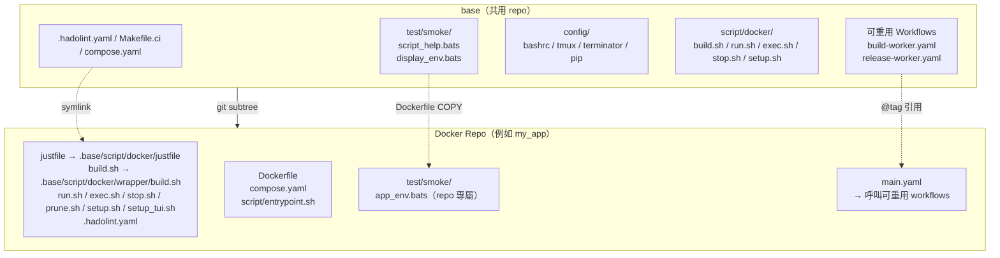
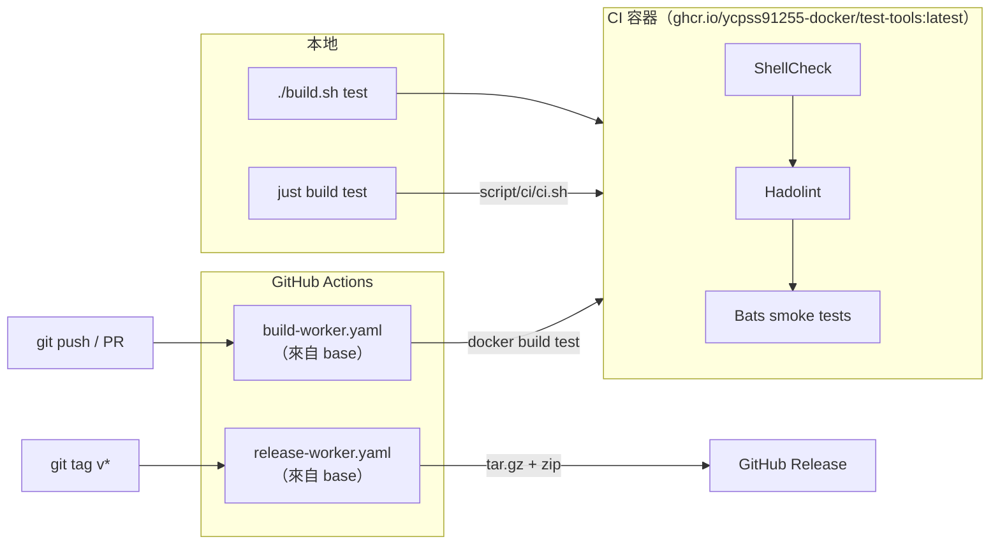

# base

[](https://github.com/ycpss91255-docker/base/actions/workflows/self-test.yaml)
[](https://codecov.io/gh/ycpss91255-docker/base)


[](../../LICENSE)

[ycpss91255-docker](https://github.com/ycpss91255-docker) 組織下所有 Docker 容器 repo 的共用模板。

**[English](../../README.md)** | **[繁體中文](README.zh-TW.md)** | **[简体中文](README.zh-CN.md)** | **[日本語](README.ja.md)**

---

## 目錄

- [TL;DR](#tldr)
- [概述](#概述)
- [快速開始](#快速開始)
- [CI Reusable Workflows](#ci-reusable-workflows)
- [本地執行測試](#本地執行測試)
- [測試](#測試)
- [目錄結構](#目錄結構)

---

## TL;DR

```bash
# 從零開始的新 repo：init + 首個 commit + subtree + init.sh
mkdir <repo_name> && cd <repo_name>
git init
git commit --allow-empty -m "chore: initial commit"
git subtree add --prefix=.base \
    https://github.com/ycpss91255-docker/base.git vX.Y.Z --squash
./.base/init.sh

# 升級到最新版
just upgrade-check   # 檢查
just upgrade         # pull + 更新版本檔 + workflow tag

# 執行 CI
make -f Makefile.ci test   # ShellCheck + Bats + Kcov
just                       # 列出所有 recipe
```

## 概述

此 repo 集中管理所有 Docker 容器 repo 共用的腳本、測試和 CI workflow。各 repo 透過 **git subtree** 拉入此模板，並使用 symlink 引用共用檔案。

### 架構



### CI/CD 流程



### 包含內容

| 檔案 | 說明 |
|------|------|
| `build.sh` | 建置容器（`--setup` 有 TTY 時啟動 `setup_tui.sh`，否則呼叫 `setup.sh`） |
| `run.sh` | 執行容器（支援 X11/Wayland；`--setup` 語意與 `build.sh` 相同） |
| `exec.sh` | 進入執行中的容器 |
| `stop.sh` | 停止並移除容器 |
| `prune.sh` | 清理容器 / image / build cache |
| `setup_tui.sh` | 互動式 setup.conf 編輯器（dialog / whiptail 前端） |
| `script/docker/wrapper/setup.sh` | 自動偵測系統參數並產生 `.env` + `compose.yaml` |
| `script/docker/lib/_lib.sh` | 共用 helper（`_load_env`、`_compose`、`_compose_project` 等） |
| `script/docker/lib/bootstrap.sh` | wrapper 共用初始化與參數解析 |
| `script/docker/lib/compose.sh` | Docker Compose YAML 產生與處理 |
| `script/docker/lib/conf.sh` | INI 解析器與 section 合併 |
| `script/docker/lib/conf_logging.sh` | logging 配置 helper |
| `script/docker/lib/env.sh` | 環境變數設定與預設值 |
| `script/docker/lib/gitignore.sh` | gitignore 檔案管理 |
| `script/docker/lib/hook.sh` | 各 wrapper 的 pre/post hook 呼叫 |
| `script/docker/lib/i18n.sh` | 語言偵測與在地化 |
| `script/docker/lib/log.sh` | 統一 logging 與輸出工具 |
| `script/docker/lib/config_summary.sh` | runtime 配置摘要 |
| `script/docker/lib/_tui_backend.sh` | TUI 使用的 dialog / whiptail 包裝函式 |
| `script/docker/lib/_tui_conf.sh` | TUI 的 INI validator + 讀寫 |
| `script/docker/runtime/logging.sh` | host 端 log tee helper |
| `script/docker/runtime/smoke.sh` | runtime install-check smoke |
| `script/docker/runtime/entrypoint.sh` | template entrypoint helper |
| `script/ci/ci.sh` | CI orchestration（本地 + 遠端） |
| `script/ci/lint_bare_stderr.sh` | Bare stderr lint 檢查 |
| `script/ci/lint_mixed_test_layout.sh` | Mixed-tool test layout 驗證 |
| `config/` | Container 內部 shell 設定檔（bashrc、tmux、terminator、pip） |
| `setup.conf` | 單一 per-repo runtime 配置（image / build / deploy / gui / network / volumes） |
| `test/smoke/` | 共用 smoke 測試 + runtime assertion helpers（見下方） |
| `test/unit/` | Template 自身測試（bats + kcov） |
| `test/integration/` | Level-1 `init.sh` 整合測試 |
| `test/behavioural/` | Runtime 整合測試 |
| `.hadolint.yaml` | 共用 Hadolint 規則 |
| `justfile` | Repo 指令入口（`just build`、`just run`、`just stop` 等 recipe）。Sub-cmd 與 flag 透過 `{{args}}` 直接傳遞，不需要 `--` 分隔符（`just build --no-cache test`）。`just` 無參時列出所有 recipe。 |
| `Makefile.ci` | Template CI 指令入口（`make -f Makefile.ci test`、`make -f Makefile.ci lint` 等）。user-facing 跟 CI-facing 是刻意切割。 |
| `init.sh` | 首次初始化 symlinks + 新 repo 骨架產生 |
| `upgrade.sh` | Subtree 版本升級 |
| `dockerfile/Dockerfile.example` | 新 repo 的多階段 Dockerfile 範本 |
| `dockerfile/Dockerfile.test-tools` | 預建置 lint/test 工具 image（shellcheck、hadolint、bats、bats-mock） |
| `.github/workflows/` | 可重用 CI workflows（build + release） |

### Dockerfile 分層（慣例）

下游 repo 遵循標準多階段配置，定義於 `dockerfile/Dockerfile.example`。
所有階段共用 `ARG BASE_IMAGE` 指定的基礎映像。

| 階段 | 父階段 | 用途 | 是否出貨 |
|------|--------|------|---------|
| `sys` | `${BASE_IMAGE}` | 使用者/群組、sudo、時區、語系、APT mirror | 中介 |
| `devel-base` | `sys` | 開發工具與語言套件 | 中介 |
| `devel` | `devel-base` | 應用專屬工具 + `entrypoint.sh` + config layering | **是**（主要產物） |
| `devel-test` | `devel` | 短暫：ShellCheck + Hadolint + Bats smoke（均來自 `test-tools:local`） | 否（build 完即丟） |
| `runtime-base`（選用） | `sys` | 最小 runtime 相依（sudo、tini） | 中介 |
| `runtime`（選用） | `runtime-base` | 精簡 runtime 映像（只含 install artifacts） | 啟用時出貨 |
| `runtime-test`（選用） | `runtime` | 短暫：runtime install-check smoke | 否（build 完即丟） |

說明：
- 只出貨 developer image 的 repo（`env/*`）會跳過 `runtime-base` /
  `runtime`——該 section 在 `Dockerfile.example` 維持註解狀態。
- `devel-test` 永遠從 `devel` 繼承，所以 `test/smoke/<repo>_env.bats` 裡的
  runtime assertion 所看到的二進位與檔案，就是使用者 `docker run ...
  <repo>:devel` 後會看到的內容。
- `Dockerfile.test-tools` 建置 lint/test 工具集（bats + shellcheck + hadolint）。下游 `devel-test` 階段透過 `ARG TEST_TOOLS_IMAGE` build arg 引用 — 預設 `test-tools:local`（對應本地 `./build.sh` 流程,把 `Dockerfile.test-tools` 建到 host Docker daemon）。CI 則覆寫成 `ghcr.io/ycpss91255-docker/test-tools:vX.Y.Z`（由 `.github/workflows/release-test-tools.yaml` 在每次 tag 推的預建 multi-arch image）,buildx 直接從 registry 拉對應架構的 bats / shellcheck / hadolint binary,避開 `docker-container` buildx driver 跨 step 不共享 image store 的問題。

#### 新增額外 stage（#215）

任何在 baseline blocklist `{sys, devel-base, devel, devel-test,
runtime-test}` 之外的（v0.21.x 過渡期同時接受舊名 `{base, test}`）
`FROM <base> AS <stage>`，會被自動 emit 成一個 compose 服務 —
`extends: devel`（繼承 volumes / network / GPU / GUI / cap_add /
additional_contexts），只 override `build.target` / `image` /
`container_name` / `stdin_open` / `tty` / `profiles`。典型用例是
entrypoint 變體，如 NVIDIA Isaac Sim 在 `devel` 之上的
`headless` + `gui` 兩種啟動模式。

User 操作流程：

```dockerfile
# Dockerfile 加新 stage（不用動 setup.conf）
FROM devel AS headless
ENTRYPOINT ["/isaac-sim/runheadless.sh"]
CMD ["-v"]

FROM devel AS gui
ENTRYPOINT ["/isaac-sim/runapp.sh"]
```

```bash
just build                            # 重新產 compose.yaml，build 所有 stages
just run -t headless                  # 跑 headless 變體
just run -t gui                       # 跑 gui 變體
just exec -t headless bash            # 進入 running 的 headless container

# Kit 風格的 `=` 參數可直接傳遞：
just exec -t headless-stream /isaac-sim/runheadless.sh -v --/app/livestream/port=49100

# 等效直接 .sh 寫法：
./build.sh
./run.sh -t headless
./exec.sh -t headless bash
```

限制：

- Stage 名必須符合 `^[a-z][a-z0-9_-]*$` — 大寫 / 數字開頭 / 點號
  等會被拒（WARN + 跳過，其他 stage 繼續解析）。
- 撞到 baseline（`sys` / `devel-base` / `devel` / `devel-test` /
  `runtime-test`，v0.21.x 過渡期亦同時接受舊名 `base` / `test`）
  `setup.sh apply` hard error 退出 1。撞到 template 控制的 image
  tag namespace（`latest`、`v[0-9]*`）也是 hard error。
- 加 / 移 stage 會觸發 `setup.sh check-drift`（透過 `.env` 內的
  `SETUP_DOCKERFILE_HASH`），下次 wrapper 跑會自動 regen
  `compose.yaml`。其他 `RUN apt-get install` 等修改**不會**觸發 drift。

#### Per-stage `setup.conf` overrides（#220）

#215 auto-emit 出來的 stage 預設共用 devel 的 runtime 設定
（volumes / GPU / network / GUI）。當某 stage 需要不同的 runtime
設定 — 例如 NVIDIA Isaac Sim 的 `headless` 跑 WebRTC livestream
要 `network=bridge` + 一個 port mapping + `gui=off`，但 `devel`
跟 `gui` 維持 `network=host` + X11 — 在 repo 的 `setup.conf` 加上
`[stage:<name>]` section：

```ini
[gui]
mode = auto

[network]
mode = host

[stage:headless]
gui.mode = off
network.mode = bridge
network.port_1 = 8080:80
deploy.gpu_capabilities = gpu compute utility graphics video
```

也可以用 `./setup_tui.sh` 走互動式編輯：

- **Advanced → Per-stage overrides**：直接進編輯器；該 entry 只在
  Dockerfile 有至少一個非 baseline stage 時才會出現。
- **Features → Per-stage overrides**（#221）：永久可見的功能總覽
  入口；條件已滿足時點下去等同上述 Advanced 路徑，未滿足時會跳
  msgbox 說明如何啟用。

允許 override 的 key（v1）：

| Section | Keys |
|---|---|
| `[deploy]` | `gpu_mode`, `gpu_count`, `gpu_capabilities`, `runtime` |
| `[gui]` | `mode` |
| `[network]` | `mode`, `ipc`, `pid`, `network_name`, `port_<N>`, `port_inherit` |
| `[security]` | `privileged`, `cap_add_<N>`, `cap_add_inherit`, `cap_drop_<N>`, `cap_drop_inherit`, `security_opt_<N>`, `security_opt_inherit` |
| `[volumes]` | `mount_<N>`, `mount_inherit` |
| `[environment]` | `env_<N>`, `env_inherit` |

List 欄位（`mount_*` / `port_*` / `env_*` / `cap_add_*` / `cap_drop_*` /
`security_opt_*`）採 **append-default**：stage 的項目附加在 top-level
之後。要完全取代 top-level，設 `<list>_inherit = false`（例：
`volumes.mount_inherit = false`，或 `security.cap_add_inherit = false`
清掉某 stage 繼承的 caps —— #526：唯讀 probe stage 可清掉 flash stage
的 `SYS_ADMIN`）。

注意事項：

- `[stage:devel]` 是**保留**的 (v1 no-op + WARN)。要調 devel 直接
  改 top-level section。v2 會重新評估。
- `[stage:sys|base|test]` 是 **hard error**（baseline collision）。
- `[stage:foo]` 對應的 stage 在 Dockerfile 不存在 → **WARN + 跳過**
  （`setup.sh apply` 其他流程繼續）。
- 不在 allowlist 內的 override key → **WARN + 跳過該 key**。

### Smoke test helpers（供下游 repo 使用）

`test/smoke/test_helper.bash`（每個 smoke spec 透過
`load "${BATS_TEST_DIRNAME}/test_helper"` 載入）提供一組 runtime
assertion helpers。下游 repo 應優先使用這些 helper 而非原生的
`[ -f ... ]` / `command -v`，失敗時會輸出 decorated 診斷訊息直指缺少
的工件。

| Helper | 用法 |
|--------|------|
| `assert_cmd_installed <cmd>` | `<cmd>` 不在 `PATH` 上時失敗 |
| `assert_cmd_runs <cmd> [flag]` | `<cmd> <flag>` 非 0 時失敗（flag 預設 `--version`） |
| `assert_file_exists <path>` | `<path>` 非 regular file 時失敗 |
| `assert_dir_exists <path>` | `<path>` 非目錄時失敗 |
| `assert_file_owned_by <user> <path>` | `<path>` 擁有者不是 `<user>` 時失敗 |
| `assert_pip_pkg <pkg>` | `pip show <pkg>` 非 0 時失敗 |

### 各 repo 自行維護的檔案（不共用）

- `Dockerfile`
- `compose.yaml`
- `script/` — repo 本地的 **runtime helpers**（在 container 內被 `ENTRYPOINT` / `CMD` 或人工呼叫）
  - `script/entrypoint.sh`（canonical）
  - 任何 ros / app 啟動 helper 等
- `script/docker/` — repo 本地的 **Dockerfile-internal build helpers**（在 Dockerfile `RUN` 階段呼叫，container 啟動後不會用到；範例與 lint COPY 見 `dockerfile/Dockerfile.example`，#275）
- `doc/` 和 `README.md`
- Repo 專屬的 smoke test

## 各 repo runtime 配置

每個下游 repo 透過一個 `setup.conf` INI 檔驅動自己的 runtime 配置
（GPU 保留、GUI env/volumes、network mode、額外 volume mounts）。
`setup.sh` 讀它 + 系統偵測後重新產生 `.env` 跟 `compose.yaml`，這
兩個衍生檔使用者不用動手編輯。

### 單一 conf、7 個 section

```
[image]    rules = prefix:docker_, suffix:_ws, @default:unknown
[build]    apt_mirror_ubuntu、apt_mirror_debian            # Dockerfile build args
[deploy]   gpu_mode (auto|force|off)、gpu_count、gpu_capabilities
[gui]      mode (auto|force|off)
[network]  mode (host|bridge|none)、ipc、pid (host|private)、privileged
[volumes]  mount_1（workspace，首次 setup.sh 執行時自動填入）
           mount_2..mount_N（使用者自訂額外 host mount；/dev 裝置走 path）
[logging]  driver（預設 json-file）、max_size、max_file、compress
           local_path（host 端 log 目錄；bind-mount 到 /var/log/<repo>）
           [logging.<svc>] 可對單一 service 做 key-level override
```

Template default 在 `.base/setup.conf`；per-repo 覆蓋放 `<repo>/setup.conf`。
Section-level **replace** 策略：per-repo 檔若有該 section 就整段取代
template；沒寫的 section 則吃 template 預設。

首次執行 `setup.sh`（尚無 per-repo setup.conf）時，template 檔會被
複製到 repo，並把偵測到的 workspace 寫入 `[volumes] mount_1`。後續
執行以 `mount_1` 為真實來源 — 清空該欄即可放棄掛 workspace。編輯方式：

```bash
./setup_tui.sh                      # 互動式 dialog/whiptail 編輯器
./setup_tui.sh volumes              # 直接跳到指定 section
./build.sh --setup            # 有 TTY 時啟動 setup_tui.sh；無 TTY 時執行 setup.sh
./.base/init.sh --gen-conf # 單純複製 .base/setup.conf 到 repo 根目錄
```

### 輸出 log 到 host

設 `[logging] local_path`，容器 stdout/stderr 會 tee 一份到 host 上的
檔案，docker daemon 原本的 json-file log 同時保留：

```ini
[logging]
local_path = ./log/   # 相對 repo 根；或 /abs/、~/dir/ 也可
```

跑任何 wrapper 重新產 `compose.yaml`。host 檔案會落在
`<local_path>/<svc>.log`（每個 service 一份）。`docker logs <ct>`
行為不變（json-file 維持 rolling 歷史；host 檔案對應當前這次執行）。

**新 repo**：用本版本之後的 `init.sh` 產生時，`script/entrypoint.sh`
已內建 helper source，設 `[logging] local_path` 是唯一一步。
**既有 repo**：在 `script/entrypoint.sh` 的最終 `exec` 之前加一行做
一次性遷移：

```bash
. /usr/local/lib/base/_entrypoint_logging.sh
```

Helper 由 `Dockerfile.example` 的 devel stage COPY 到 image 內穩定路徑
`/usr/local/lib/base/_entrypoint_logging.sh`（refs #368），所以這條
source line 在 build-time 與 runtime、各種 workspace 結構下都能 work
— 不需要 `$USER`，也不依賴 workspace bind mount。

疑難排解：`local_path` 設了但 host 檔案沒東西 → 確認
`script/entrypoint.sh` 真的有那行 source
（`grep _entrypoint_logging script/entrypoint.sh`）。

### 互動式 TUI

`./setup_tui.sh` 開啟主選單。底層是 `dialog` 或 `whiptail`（兩者都
缺時會印出 `sudo apt install dialog` 提示並退出）。按 Cancel / Esc
不存檔離開；存檔後會自動呼叫 `setup.sh` 重新產生 `.env` +
`compose.yaml`。

主選單結構（#221）：

```
Main
├─ image            IMAGE_NAME 偵測規則
├─ build            APT mirrors + Dockerfile build args
├─ Runtime  ──→     network / deploy（GPU）/ gui / environment / logging
├─ Mounts   ──→     volumes / devices / tmpfs
├─ Advanced ──→     security / additional_contexts
│                   / per_stage（條件式）/ Reset
├─ Features         條件式 / 進階使用功能總覽（含 per_stage 狀態）
└─ Save & Exit
```

`./setup_tui.sh <section>` 仍可直接跳到任意 section 的編輯器
（如 `./setup_tui.sh volumes`），不必走主選單。

### setup.sh 什麼時候跑

`setup.sh` 只在明確觸發時才執行 — 並不會在每次 build / run 都重跑：

- **`./.base/init.sh`** 建完骨架自動跑一次
- **`just upgrade` / `./.base/upgrade.sh`** subtree pull 後透過 init.sh
  再跑一次，所以升級永遠會用新版 baseline 重新產出 `.env` / `compose.yaml`
- **`./build.sh --setup` / `./run.sh --setup`**（或 `-s`）— 使用者手動觸發重跑；
  有 TTY 時先啟動 `setup_tui.sh` 讓使用者修改 `setup.conf`，無 TTY 時直接呼叫 `setup.sh`
- **首次 bootstrap**：`./build.sh` / `./run.sh` 首次執行（`.env` 尚未存在，
  例如 CI 新 clone）會自動走相同的 TTY-aware 流程，不用帶 `--setup`

> **Fresh-clone lint 覆蓋率（#216）**：`./run.sh` 在本機沒 image
> cached 時會走 Compose auto-build — 但 auto-build **只 build
> `target: devel`**（或 `-t` 指定的 target），會跳過 `target:
> devel-test`（pre-#243 該 stage 名為 `test`）那層的 ShellCheck /
> Hadolint / Bats smoke。`run.sh` 偵測到這個情況
> 會在 `compose up` 前印一段 `[run] INFO:` 提醒（只在 TTY 環境）。
> 想要一次取得跟 CI 同樣的完整驗證，加 `--build` flag：
>
> ```bash
> just build test                   # 顯式跑 lint + smoke
> just run --build                  # 跑完 lint + smoke 再 compose up
> just run                          # 預設 — 快速路徑，跳過 lint/smoke
> ```

`setup.sh apply` 每次都會從頭重生 `compose.yaml`，但會保留既有 `.env`
中的 `WS_PATH` / `APT_MIRROR_UBUNTU` / `APT_MIRROR_DEBIAN`，所以手動調過
的 workspace 路徑或 apt mirror 升級時不會被蓋掉。

### Drift 偵測

`setup.sh` 把 `SETUP_CONF_HASH`、`SETUP_GUI_DETECTED`、`SETUP_TIMESTAMP`
寫到 `.env`。每次 `./build.sh` / `./run.sh` 進入時會比對 `setup.conf`
當前 hash + 系統偵測值，以下任一項改變時印 `[WARNING]`（但不阻擋執行）：

- `setup.conf` 內容（conf hash）
- GPU / GUI 偵測結果
- `USER_UID`（使用者身份）

帶 `--setup` 重跑以重新產 `.env` + `compose.yaml`。

### Field 部署（`setup.sh deploy`）

`./setup.sh deploy` 用同一份 `setup.conf` 打包出自帶式 field bundle —— 即路由模型的 deploy 半邊。它針對某個 stage（預設 `runtime`）產出單一 `tar.xz`，內含兩樣東西：不可變映像檔，與生成的 `deploy.sh` 啟動器。

```bash
./setup.sh deploy                       # 打包 runtime bundle（會先確認）
./setup.sh deploy --dry-run             # 只印 build plan，不實際 build
./setup.sh deploy --stage runtime -y    # 跳過確認提示
./setup.sh deploy -o /tmp/robot.tar.xz  # 自訂輸出路徑
```

依序：(1) 把 `[environment]` 預設烤成映像的真 `ENV`（S3）、有 `config/app/` 就 `COPY` 進映像（S4），使 field 映像自帶（不帶 env 檔、不帶 config bind）；(2) `docker build --target <stage>`；(3) 生成 `deploy.sh` —— 一支把所有機器綁定的 docker 層級旗標（privileged / gpus / runtime / network / ipc / pid / devices / caps / shm / restart / group-add）inline 進去的 `docker run` 啟動器，解析自該 stage、與 dev 的 `compose.yaml` 一致；(4) `docker save` 並 `tar -cJf` 出 `{image.tar, deploy.sh}`。

build 前會印出解析後的啟動器讓你逐項檢視每個 inline 旗標再確認（`-y` 跳過；`--dry-run` 只印 plan 與啟動器不 build；非互動 shell 未帶 `-y` 會拒絕）。field 機器上：

```bash
tar -xJf <name>-runtime.tar.xz
docker load < image.tar
./deploy.sh                 # 或：DEPLOY_IMAGE=... DEPLOY_CONTAINER_NAME=... ./deploy.sh
```

啟動器刻意只帶 docker 層級旗標：workload 環境變數已烤成 `ENV`（執行時可在 `./deploy.sh` 後用 `-e` 覆寫），dev 的 workspace bind 刻意捨棄（field 映像自帶程式碼）。`--group-add` 的 GID（iGPU `/dev/dri`）讀自生成主機，換到不同 field 機器可能需調整。

### setup.sh 子指令（v0.11.0+）

`setup.sh` 是 git 風格的後端，提供明確的子指令。build / run / TUI 腳本會代為呼叫；直接呼叫適合腳本化／非互動情境：

| 子指令 | 用途 |
|---|---|
| `apply` | 從 setup.conf + 系統偵測重新產生 `.env` + `compose.yaml` |
| `check-drift` | 同步回 0、漂移回 1（漂移描述印到 stderr） |
| `set <section>.<key> <value>` | 寫單一鍵值 |
| `show <section>[.<key>]` | 讀單鍵或整 section |
| `list [<section>]` | INI 風格 dump |
| `add <section>.<list> <value>` | 加到清單型 section（`mount_*` / `env_*` / `port_*` …）；優先填空 slot，否則用 `max+1` |
| `remove <section>.<key>` / `<section>.<list> <value>` | 按 key 或按值刪除 |
| `reset [-y\|--yes]` | 回復 template 預設；舊 `setup.conf` → `setup.conf.bak`、舊 `.env` → `.env.bak` |
| `deploy [--stage S] [--output F] [--dry-run] [-y]` | 打包自帶式 field bundle（image + 生成 `deploy.sh` 的 `tar.xz`），stage `S` 預設 `runtime`；build 前先預覽解析後的啟動器並確認。見 [Field 部署](#field-部署setupsh-deploy) |

有型別的鍵會走 `_tui_conf.sh` 的 validator（與 TUI 同一套）。`set` / `add` / `remove` / `reset` **不**會自動重新產 `.env` — 需要時自行接 `apply`，或下次 `build.sh` / `run.sh` 偵測到 drift 也會自動重產。

#### v0.10.x 升級（BREAKING）

`setup.sh`（無參數）與 `setup.sh --base-path X --lang Y`（無子指令）以前會 silently 走到 `apply`。v0.11.0 拿掉這個 fall-through：

| 呼叫方式 | v0.11 之前 | v0.11+ |
|---|---|---|
| `setup.sh` | 跑 apply | 印 help、exit 0 |
| `setup.sh --base-path X --lang Y` | 跑 apply | exit 1「Unknown subcommand」 |
| `setup.sh apply [...]` | 跑 apply | 跑 apply（不變） |

下游 repo 若有自定 script 直接呼叫 `setup.sh`，前面加 `apply`。template 內附的 `build.sh` / `run.sh` / `init.sh` / `setup_tui.sh` 都已更新。

### 衍生檔（gitignored）

- `.env` — runtime 變數 + `SETUP_*` drift metadata
- `compose.yaml` — 含 baseline 與條件區塊的完整 compose

任何時候打開 `compose.yaml` 都能看到當下完整 runtime 配置。每次
`just upgrade` 都會重生這兩個檔（init.sh 在 subtree pull 後重跑
`setup.sh apply`）— 不要手改，需要 override 寫到 `setup.conf`。

### 每個 wrapper 的 pre/post hook（#440）

每個 wrapper（`run` / `build` / `exec` / `stop` / `prune` / `setup` /
`setup_tui`）會偵測下面這兩個可選的 repo-local script：

```
script/hooks/pre/<wrapper>.sh    # env 準備好後、主邏輯前
script/hooks/post/<wrapper>.sh   # 主邏輯後（run.sh 的話在 EXIT trap 內）
```

`init.sh` 自動建 14 個 executable stub（預設 `exit 0`），所以 hook
框架 out-of-the-box 直接可用。把 `exit 0` 換成你的 host-side 步驟
（例如 `multiarch/qemu-user-static` binfmt 註冊、mount 目錄建立、
硬體預檢）。Stub 對 upgrade 是 idempotent — pre-#440 的 template 跑
`just upgrade` 後自動補齊 scaffolding。

**Contract：**

| 面向 | 行為 |
|---|---|
| 參數 | 跟 wrapper 收到的 `"$@"` 一樣 |
| 執行位置 | 主機（**不是** container 內） |
| `pre` 非零 | abort wrapper |
| `post` 非零 | override wrapper exit code；cleanup 照跑（run.sh） |
| 非 executable | hard fail + `chmod +x` 提示 |
| `--dry-run` | 兩個 hook 都 silent skip |

**範例 — jetson_sdk_manager binfmt 註冊：**

```bash
# script/hooks/pre/run.sh
#!/usr/bin/env bash
if [ ! -f /proc/sys/fs/binfmt_misc/qemu-aarch64 ]; then
  docker run --rm --privileged \
    multiarch/qemu-user-static --reset -p yes
fi
```

### 命名規則：三個 namespace、兩個 user 身份

`setup.sh` 會在 `.env` / `compose.yaml` 產三個名稱。它們在單人開發
機上長得像，但實際分布在**三個獨立 namespace**，並取兩個**不同的
user 身份**做前綴。共用機器（多 OS user）的場景下這個差異會浮現；
個人開發機上兩個身份通常一致可不必細究。

| 名稱 | 格式 | Namespace | User 前綴 |
|---|---|---|---|
| `image:` | `${DOCKER_HUB_USER:-local}/<repo>:<tag>` | **Registry**（Docker Hub） | `DOCKER_HUB_USER` |
| `container_name:` | `${USER_NAME}-<repo>${INSTANCE_SUFFIX}` | **本地 daemon**（同 docker daemon 內 flat 全域） | `USER_NAME`（OS user，refs #322） |
| compose project name | `${DOCKER_HUB_USER}-<repo>${INSTANCE_SUFFIX}` | **本地 daemon**（影響預設 network / volume label） | `DOCKER_HUB_USER` |

- `DOCKER_HUB_USER` — 你的 Docker Hub 帳號，用來在 registry 端把
  image 加上命名空間。即使從未實際 push，image tag 仍透過這個
  identity 寫成 `<DOCKER_HUB_USER>/<repo>:<tag>`。
- `USER_NAME` — 主機 OS user（`id -un`），用來避免同台機器上不同
  OS user 在 daemon 的 flat container 命名空間互撞。

刻意把兩個身份分開。Image 用 Docker Hub 身份，因為 image 是會在
registry 上被定址的物件；若以 OS user 做前綴，buildx cache 與
Docker Hub layer 共用會直接破功。Container name 用 OS 身份，因為
這層解決的衝突（同 host 兩 user 同跑同 repo）是 daemon 端問題、
無 registry 牽涉。

Project name 用 `DOCKER_HUB_USER` 是 #322 之前就決定，未動：在
單人開發機上兩個身份重合，與 `container_name` 視覺上對齊；多人共
用機則因為 `DOCKER_HUB_USER` 通常也不同，所以 project name 一樣
能避開跨 user 衝突。`#322` 的 CHANGELOG 寫的「對齊 container-level
與 project-level naming」在「單人機」假設下成立 — 兩者都帶 user
前綴，差別只在「同一個 var 還是兩個 var」；多人機場景下兩個前綴
是不同字串。

**`INSTANCE_SUFFIX`** 是第四維，跟 user 分隔正交。同一個 OS user
要同時跑同一 repo 的多個 container（譬如平行測兩個 branch）：設
`INSTANCE_SUFFIX=2` 就會拿到 `alice-<repo>-2` 跟對應的 project
name。預設空字串；wrappers 支援的場合可用 `-n / --instance` 帶起來。

**Per-instance overlay (#465)**。`run.sh --instance NAME` 同時會自動
偵測下面兩個 optional 檔案當 compose overlay：

```
config/instances/<NAME>.yaml   → docker compose -f
config/instances/<NAME>.env    → docker compose --env-file
```

兩個檔案任一存在皆可；不存在就 silent skip。yaml 用於 structural
override（per-instance ports、volumes、cache 路徑），env 用於與
`compose.yaml` 共享的 `${VAR}` override。`NAME` 受 `^[a-z0-9][a-z0-9_-]*$`
驗證以保 path 安全。

範例。OS user `alice`，Docker Hub user `alice-hub`，repo
`claude_code`，預設 `INSTANCE_SUFFIX` 空：

```
image:          alice-hub/claude_code:devel
container_name: alice-claude_code
project name:   alice-hub-claude_code
```

同一 OS user 起第二份 instance（`INSTANCE_SUFFIX=2`）：

```
image:          alice-hub/claude_code:devel        (不變 — 同一份 image)
container_name: alice-claude_code-2
project name:   alice-hub-claude_code-2
```

第二位 OS user `bob` 在同台機器：

```
image:          bob-hub/claude_code:devel          (不同 registry tag,無 cache 共用)
container_name: bob-claude_code
project name:   bob-hub-claude_code
```

若 `alice` 與 `bob` 共用同一個 `DOCKER_HUB_USER`（例如共用 CI
service 帳號），`image` 會在 Docker Hub 端撞名，但 `container_name`
仍能區隔 — registry pull 共用 cached image、host 內 daemon 仍
彼此隔離。

## 快速開始

### 加入新 repo

```bash
# 1. 初始化空的 repo（若已有 repo 且至少一個 commit 則跳過）
mkdir <repo_name> && cd <repo_name>
git init
git commit --allow-empty -m "chore: initial commit"

# 2. 加入 subtree（釘到指定版本 tag）
git subtree add --prefix=.base \
    https://github.com/ycpss91255-docker/base.git vX.Y.Z --squash

# 3. 初始化 symlinks（一個指令搞定）
./.base/init.sh
```

> `git subtree add` 需要 `HEAD` 存在。在剛 `git init` 且沒有任何 commit 的 repo 上會報錯 `ambiguous argument 'HEAD'` 與 `working tree has modifications`。用空 commit 建立 `HEAD`，subtree 才能 merge 進來。

### 升級

前置條件：`git config user.name` / `user.email` 必須有設，working tree
不能在進行中的 merge / rebase / cherry-pick / revert — upgrade.sh 會
fail-fast 帶可操作訊息，避免半套 pull。

```bash
# 檢查是否有新版
just upgrade-check

# 升級到最新（subtree pull + 版本檔 + workflow tag）
just upgrade

# 或指定版本
just upgrade v0.3.0
# 指定的版本若比目前 local 還舊（例如從 v0.12.0-rc1 退回 v0.11.0）會被
# 視為隱式 downgrade 拒絕（依 SemVer §11）。如果是刻意要 rollback，自
# 行手改 .base/.version。

# 沒有 just 時的 fallback
./.base/upgrade.sh v0.3.0
```

`upgrade.sh` 一次完成：

1. `git subtree pull --prefix=.base ... --squash`
2. Post-pull 完整性檢查 — subtree marker（`.base/.version`、
   `.base/init.sh`、`.base/script/docker/wrapper/setup.sh`）若不見了會
   `git reset --hard` rollback（防舊版 `git-subtree.sh` destructive FF）
3. `./.base/init.sh` 重跑：重整 root symlinks（`build.sh` / `run.sh`
   / `justfile` …）、把 `.gitignore` 同步到 canonical entry set、
   `git rm --cached` 已經變成 derived artifact 的舊 tracked 檔（`.env`、
   `compose.yaml`、…），最後呼叫 `setup.sh apply` 重生 `.env` +
   `compose.yaml`
4. `sed` 改寫 `.github/workflows/main.yaml` 的
   `build-worker.yaml@vX.Y.Z` / `release-worker.yaml@vX.Y.Z`

per-repo 檔案不會被覆蓋：`<repo>/setup.conf` 保留原樣、
`<repo>/config/`（bashrc / tmux / terminator …）也不動 — 若上游
`.base/config/` 自上次 pull 後有變動，upgrade.sh 會印出
`diff -ruN .base/config config` 提示，由你自行 reconcile。

不要手動 `git subtree pull` — 完整性檢查、init.sh resync、sed 步驟
很容易漏掉。

#### 自動升版（選用）

下游 repo 可以讓 Dependabot 在 `base` 出新 tag 時自動開 PR。加入 `.github/dependabot.yml`：

```yaml
version: 2
updates:
  - package-ecosystem: "github-actions"
    directory: "/"
    schedule:
      interval: "weekly"
```

Dependabot 會讀 `main.yaml` 裡的 `uses: ycpss91255-docker/base/...@vX.Y.Z` ref，比對 base 最新 tag 後開 PR。subtree 本身仍需在本地跑 `just upgrade vX.Y.Z` — Dependabot 只負責 workflow ref。

## CI Reusable Workflows

各 repo 將本地的 `build-worker.yaml` / `release-worker.yaml` 替換為呼叫此 repo 的 reusable workflows：

```yaml
# .github/workflows/main.yaml
jobs:
  call-docker-build:
    uses: ycpss91255-docker/base/.github/workflows/build-worker.yaml@v1
    with:
      image_name: my_app
      build_args: |
        BASE_IMAGE=python:3.11-slim
        APP_VERSION=1.0
        DEBIAN_CODENAME=bookworm

  call-release:
    needs: call-docker-build
    if: startsWith(github.ref, 'refs/tags/')
    uses: ycpss91255-docker/base/.github/workflows/release-worker.yaml@v1
    with:
      archive_name_prefix: my_app
```

### build-worker.yaml 參數

| 參數 | 類型 | 必填 | 預設值 | 說明 |
|------|------|------|--------|------|
| `image_name` | string | 是 | - | 容器映像名稱 |
| `build_args` | string | 否 | `""` | 多行 KEY=VALUE 建置參數 |
| `build_runtime` | boolean | 否 | `true` | 是否建置 runtime stage |
| `platforms` | string | 否 | `"linux/amd64"` | 逗號分隔的目標平台；每個會在原生 runner 上平行跑（`linux/amd64` → ubuntu-latest、`linux/arm64` → ubuntu-24.04-arm） |
| `test_tools_version` | string | 否 | `"latest"` | `ghcr.io/ycpss91255-docker/test-tools:<tag>` 的 tag，下游可釘到所升級的 template release 以保證可重現 |

### release-worker.yaml 參數

| 參數 | 類型 | 必填 | 預設值 | 說明 |
|------|------|------|--------|------|
| `archive_name_prefix` | string | 是 | - | Archive 名稱前綴 |
| `extra_files` | string | 否 | `""` | 額外檔案（空格分隔） |

## 本地執行測試

使用 `Makefile.ci`（在 template 根目錄）：
```bash
make -f Makefile.ci test        # 完整 CI（ShellCheck + Bats + Kcov）透過 docker compose
make -f Makefile.ci lint        # 只跑 ShellCheck
make -f Makefile.ci clean       # 清除覆蓋率報表
just             # 列出 repo recipe
make -f Makefile.ci help  # 顯示 CI 指令
```

或直接執行：
```bash
./script/ci/ci.sh          # 完整 CI（透過 docker compose）
./script/ci/ci.sh --ci     # 在容器內執行（由 compose 呼叫）
```

## 測試

詳見 [TEST.md](../test/TEST.md)。

## 目錄結構

```
.base/
├── init.sh                           # 初始化 repo（新建或既有）
├── upgrade.sh                        # 升級 template subtree 版本
├── script/
│   ├── docker/                       # Docker 操作腳本
│   │   ├── wrapper/                  # 使用者面向的 wrapper 腳本
│   │   │   ├── build.sh
│   │   │   ├── run.sh
│   │   │   ├── exec.sh
│   │   │   ├── stop.sh
│   │   │   ├── prune.sh
│   │   │   ├── setup.sh              # .env 產生器
│   │   │   └── setup_tui.sh          # 互動式 setup 編輯器
│   │   ├── lib/                      # 共用 helper 模組
│   │   │   ├── _lib.sh               # 核心 wrapper 函式庫
│   │   │   ├── bootstrap.sh          # Wrapper 初始化
│   │   │   ├── compose.sh            # Compose 產生
│   │   │   ├── conf.sh               # INI 解析器
│   │   │   ├── conf_logging.sh       # Logging 配置
│   │   │   ├── env.sh                # 環境設定
│   │   │   ├── gitignore.sh          # Gitignore 管理
│   │   │   ├── hook.sh               # 各 wrapper hook
│   │   │   ├── i18n.sh               # 語言偵測
│   │   │   ├── log.sh                # Logging 工具
│   │   │   ├── config_summary.sh     # 配置摘要
│   │   │   ├── _tui_backend.sh       # TUI dialog/whiptail 包裝
│   │   │   ├── _tui_conf.sh          # TUI INI validator
│   │   │   ├── log-events.txt        # Log 事件目錄
│   │   │   └── log.lnav-format.json  # Lnav format 定義
│   │   ├── runtime/                  # 容器內 runtime 腳本
│   │   │   ├── entrypoint.sh         # Template entrypoint helper
│   │   │   ├── logging.sh            # Host 端 log tee helper
│   │   │   └── smoke.sh              # Runtime install-check smoke
│   │   ├── justfile                  # Docker 操作入口（just）
│   │   └── setup.conf                # Template runtime 配置預設
│   └── ci/                           # CI pipeline 腳本
│       ├── ci.sh                     # CI orchestration（本地 + 遠端）
│       ├── lint_bare_stderr.sh       # Bare stderr lint 檢查
│       └── lint_mixed_test_layout.sh # Mixed-tool test layout 驗證
├── dockerfile/
│   ├── Dockerfile.example            # 多階段範本（sys / devel-base / devel / devel-test / [runtime-base / runtime / runtime-test]）
│   └── Dockerfile.test-tools         # 預建置 lint/test 工具 image
├── config/                           # Container 內部 shell / 工具設定
│   ├── docker/
│   │   └── setup.conf                # Runtime 配置（per-repo override mirror: <repo>/config/docker/setup.conf）
│   └── shell/
│       ├── bashrc
│       ├── bashrc.d/                 # 互動式 shell bootstrap drop-in
│       │   └── .gitkeep
│       ├── terminator/
│       │   ├── setup.sh
│       │   └── config
│       └── tmux/
│           ├── setup.sh
│           ├── README.adoc
│           └── tmux.conf
├── test/
│   ├── smoke/                        # 共用 smoke 測試 + runtime assertion helpers
│   │   ├── test_helper.bash          # assert_cmd_installed / _runs / file / dir / owned_by / pip_pkg
│   │   ├── script_help.bats
│   │   └── display_env.bats
│   ├── unit/                         # 模板自身測試（bats + kcov）
│   │   ├── test_helper.bash
│   │   ├── bashrc_spec.bats
│   │   ├── build_sh_spec.bats
│   │   ├── build_sh_prune_spec.bats
│   │   ├── build_worker_yaml_spec.bats
│   │   ├── ci_spec.bats
│   │   ├── compose_gen_spec.bats
│   │   ├── compose_logging_spec.bats
│   │   ├── compose_overlay_spec.bats
│   │   ├── conf_logging_spec.bats
│   │   ├── deploy_spec.bats
│   │   ├── entrypoint_logging_spec.bats
│   │   ├── exec_sh_spec.bats
│   │   ├── gitignore_spec.bats
│   │   ├── hook_spec.bats
│   │   ├── init_spec.bats
│   │   ├── lib_spec.bats
│   │   ├── lint_mixed_test_layout_spec.bats
│   │   ├── log_spec.bats
│   │   ├── makefile_user_spec.bats
│   │   ├── multi_distro_build_worker_yaml_spec.bats
│   │   ├── prune_sh_spec.bats
│   │   ├── release_test_tools_yaml_spec.bats
│   │   ├── run_sh_spec.bats
│   │   ├── runtime_smoke_spec.bats
│   │   ├── self_test_yaml_spec.bats
│   │   ├── setup_spec.bats
│   │   ├── smoke_helper_spec.bats
│   │   ├── stop_sh_spec.bats
│   │   ├── template_spec.bats
│   │   ├── terminator_config_spec.bats
│   │   ├── terminator_setup_spec.bats
│   │   ├── tmux_conf_spec.bats
│   │   ├── tmux_setup_spec.bats
│   │   ├── tui_backend_spec.bats
│   │   ├── tui_flow.bats
│   │   ├── tui_mount_assembler_spec.bats
│   │   ├── tui_spec.bats
│   │   ├── upgrade_spec.bats
│   │   └── wrapper_lib_lookup_spec.bats
│   ├── integration/                  # Level-1 init.sh 端對端測試
│   │   ├── init_new_repo_spec.bats
│   │   ├── upgrade_spec.bats
│   │   ├── fresh_clone_portability_spec.bats
│   │   ├── gitignore_sync_spec.bats
│   │   └── wrapper_compose_dispatch_spec.bats
│   └── behavioural/                  # Runtime 整合測試
│       └── runtime_test_smoke_spec.bats
├── Makefile.ci                       # 模板 CI 入口（make test/lint/...）
├── compose.yaml                      # Docker CI 執行器
├── .hadolint.yaml                    # 共用 Hadolint 規則
├── .dockerignore
├── codecov.yml
├── .github/workflows/
│   ├── self-test.yaml                # 模板 CI
│   ├── build-worker.yaml             # 可重用 build + smoke-test workflow
│   ├── release-worker.yaml           # 可重用 release（source archive）workflow
│   ├── publish-worker.yaml           # 可重用 image publish workflow（opt-in）
│   ├── multi-distro-build-worker.yaml # 多 distro build workflow
│   └── release-test-tools.yaml       # 模板自身的 test-tools image release
├── doc/
│   ├── readme/                       # README 翻譯
│   │   ├── README.zh-TW.md
│   │   ├── README.zh-CN.md
│   │   └── README.ja.md
│   ├── adr/                          # Architecture Decision Records
│   │   ├── 00000001-setup-conf-vs-compose.md
│   │   ├── 00000002-no-latest-tag.md
│   │   ├── 00000003-env-vs-workload-param-boundary.md
│   │   └── 00000004-test-category-tool-subdir-layout.md
│   ├── test/
│   │   └── TEST.md                   # 測試清單與 spec 表
│   ├── changelog/
│   │   └── CHANGELOG.md              # 發布記錄
│   └── deprecations.md
├── .gitignore
├── LICENSE
└── README.md
```

