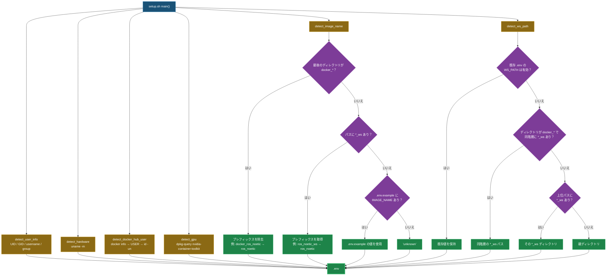
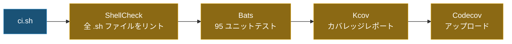

# Docker Setup Helper [](https://github.com/ycpss91255/docker_setup_helper/actions) [](https://codecov.io/gh/ycpss91255/docker_setup_helper)


[](../LICENSE)

[English](../README.md) | [繁體中文](README.zh-TW.md) | [简体中文](README.zh-CN.md) | [日本語]

> **TL;DR** — モジュール化 Bash ツールキット。システムパラメータ（UID/GID、GPU、アーキテクチャ、ワークスペース）を自動検出し、Docker Compose ビルド用の `.env` を生成。Bats + Kcov で 100% テストカバレッジ。
>
> ```bash
> ./src/setup.sh        # .env を生成
> ./ci.sh               # ローカルでテストを実行
> ```

モジュール化された Docker 環境セットアップツールキット。システムパラメータの自動検出と Docker コンテナビルド用の `.env` 生成を自動化します。従来の `get_param.sh` を置き換える、テスト可能で拡張性のあるアーキテクチャです。

## 🌟 特徴

- **システム検出**：ユーザー情報（UID/GID）、ハードウェアアーキテクチャ、GPU サポート、Docker Hub 認証情報を自動検出。
- **イメージ名推論**：ディレクトリ構造からイメージ名を推論（`docker_*` プレフィックス、`*_ws` サフィックス規約に対応）。
- **ワークスペース検出**：3 戦略のワークスペースパス検出（同階層スキャン、上方向走査、親ディレクトリフォールバック）。
- **`.env` 生成**：Docker Compose ビルドで即座に使える `.env` ファイルを生成。
- **Shell 設定管理**：Bash、Tmux、Terminator の設定スクリプトを同梱。

## 📁 プロジェクト構成

```text
.
├── src/
│   ├── setup.sh                         # メインスクリプト（get_param.sh の代替）
│   └── config/
│       ├── pip/
│       │   ├── setup.sh                 # pip パッケージインストールスクリプト
│       │   └── requirements.txt         # Python 依存パッケージ
│       └── shell/
│           ├── bashrc                   # Bash 設定ファイル
│           ├── terminator/
│           │   ├── setup.sh             # Terminator セットアップスクリプト
│           │   └── config               # Terminator 設定ファイル
│           └── tmux/
│               ├── setup.sh             # Tmux + TPM セットアップスクリプト
│               └── tmux.conf            # Tmux 設定ファイル
├── test/                                # Bats テストケース（95 テスト）
│   ├── test_helper.bash                 # テストユーティリティ & モックヘルパー
│   ├── setup_spec.bats                  # setup.sh テスト（35 ケース）
│   ├── bashrc_spec.bats                 # bashrc 検証テスト（14 ケース）
│   ├── pip_setup_spec.bats              # pip セットアップテスト（3 ケース）
│   ├── terminator_config_spec.bats      # terminator 設定検証（10 ケース）
│   ├── terminator_setup_spec.bats       # terminator セットアップテスト（7 ケース）
│   ├── tmux_conf_spec.bats             # tmux.conf 検証テスト（12 ケース）
│   └── tmux_setup_spec.bats             # tmux セットアップテスト（8 ケース）
├── ci.sh                                # ローカル CI エントリポイント
├── compose.yaml                         # Docker CI 環境
├── .codecov.yaml                        # Codecov 設定ファイル
└── LICENSE
```

## 📦 依存関係

ローカル CI ワークフローの実行に必要：
- **Docker**：テスト環境の実行用。
- **Docker Compose**：コンテナサービスの管理用。

CI コンテナ内で以下のツールが自動的に処理されます：
- **Bats Core**：テストフレームワーク。
- **ShellCheck**：静的解析ツール。
- **Kcov**：カバレッジレポート生成ツール。
- **bats-mock**：コマンドモックライブラリ。

## 🚀 クイックスタート

### 1. セットアップ実行（`.env` を生成）
```bash
./src/setup.sh
```
システムパラメータを自動検出し `.env` ファイルを生成：
```env
USER_NAME=youruser
USER_GROUP=yourgroup
USER_UID=1000
USER_GID=1000
HARDWARE=x86_64
DOCKER_HUB_USER=yourhubuser
GPU_ENABLED=false
IMAGE_NAME=myproject
WS_PATH=/path/to/workspace
```

### 2. Docker Compose で使用
生成された `.env` を `compose.yaml` で参照：
```yaml
services:
  dev:
    build:
      args:
        USER_NAME: ${USER_NAME}
        USER_UID: ${USER_UID}
        USER_GID: ${USER_GID}
    volumes:
      - ${WS_PATH}:/home/${USER_NAME}/work
```

### 3. Git Subtree で統合
```bash
git subtree add --prefix=docker_setup_helper \
    https://github.com/ycpss91255/docker_setup_helper.git main --squash
```

### 4. ローカルでフルチェック実行（CI）
```bash
chmod +x ci.sh
./ci.sh
```
Docker 経由で ShellCheck リント、Bats ユニットテスト、Kcov カバレッジレポートを実行します。

## 🛠 開発ガイド

### ShellCheck 準拠
本プロジェクトは ShellCheck を厳格に適用しています。動的ソーシングにはディレクティブを使用：
```bash
# shellcheck disable=SC1090
source "${DYNAMIC_PATH}"
```

### テストカバレッジ

カバレッジ目標：**Patch** 100%、**Project** 減少しないこと（`auto`）。

<details>
<summary>クリックしてテスト詳細を表示（95 テスト）</summary>

#### setup.sh（41）

| テスト項目 | 説明 |
|------------|------|
| `detect_user_info` | `USER` 環境変数が設定されている場合に使用 |
| `detect_user_info` | `USER` 未設定時は `id -un` にフォールバック |
| `detect_user_info` | group/uid/gid を正しく設定 |
| `detect_hardware` | `uname -m` の出力を返す |
| `detect_docker_hub_user` | ログイン時は `docker info` の username を使用 |
| `detect_docker_hub_user` | docker が空の場合は `USER` にフォールバック |
| `detect_docker_hub_user` | `USER` も未設定の場合は `id -un` にフォールバック |
| `detect_gpu` | nvidia-container-toolkit インストール時は `true` を返す |
| `detect_gpu` | 未インストール時は `false` を返す |
| `detect_image_name` | パス内で `*_ws` を検出 |
| `detect_image_name` | パス末端で `*_ws` を検出 |
| `detect_image_name` | `docker_*` がパス内の `*_ws` より優先 |
| `detect_image_name` | 最後のディレクトリから `docker_` プレフィックスを除去 |
| `detect_image_name` | 絶対パスルートから `docker_` を除去 |
| `detect_image_name` | 通常のディレクトリでは `unknown` を返す |
| `detect_image_name` | 汎用パスでは `unknown` を返す |
| `detect_image_name` | 結果を小文字に変換 |
| `detect_ws_path` | 戦略 1：`docker_*` が同階層の `*_ws` を検出 |
| `detect_ws_path` | 戦略 1：`docker_*` で同階層に `*_ws` がない場合は次へ |
| `detect_ws_path` | 戦略 2：パス内で `_ws` コンポーネントを検出 |
| `detect_ws_path` | 戦略 3：親ディレクトリにフォールバック |
| `write_env` | 必要な全変数を含む `.env` を作成 |
| `main` | `.env` が存在しない場合に作成 |
| `main` | 既存の `.env` を読み込み有効な `WS_PATH` を保持 |
| `main` | `.env` 内の `WS_PATH` が無効な場合に再検出 |
| `main` | `--base-path` 未指定時は `BASH_SOURCE` にフォールバック |
| `main` | 不明な引数でエラーを返す |
| `main` | `--base-path` の値が未指定でエラーを返す |
| `_msg` | デフォルトで英語メッセージを返す |
| `_msg` | `_LANG=zh` で中国語メッセージを返す |
| `_msg` | `_LANG=zh-CN` で簡体字中国語メッセージを返す |
| `_msg` | `_LANG=ja` で日本語メッセージを返す |
| `main` | `--lang zh` で中国語メッセージを設定 |
| `main` | `--lang` の値が未指定でエラーを返す |
| `_base_path` | デフォルトは repo root に解決、script ディレクトリではない（regression） |
| `_detect_lang` | `zh_TW.UTF-8` で `zh` を返す |
| `_detect_lang` | `zh_CN.UTF-8` で `zh-CN` を返す |
| `_detect_lang` | `ja_JP.UTF-8` で `ja` を返す |
| `_detect_lang` | `en_US.UTF-8` で `en` を返す |
| `_detect_lang` | `LANG` 未設定時は `en` を返す |
| `_detect_lang` | `SETUP_LANG` で上書きされる |

#### bashrc（14）

| テスト項目 | 説明 |
|------------|------|
| `alias_func` | 定義済み |
| `swc` | 定義済み |
| `color_git_branch` | 定義済み |
| `ros_complete` | 定義済み |
| `ros_source` | 定義済み |
| `ebc` | alias 定義済み |
| `sbc` | alias 定義済み |
| `alias_func` | bashrc 内で呼び出し |
| `color_git_branch` | bashrc 内で呼び出し |
| `ros_complete` | bashrc 内で呼び出し |
| `ros_source` | bashrc 内で呼び出し |
| `swc` | catkin `devel/setup.bash` を検索 |
| `ros_source` | `ROS_DISTRO` を参照 |
| `color_git_branch` | `PS1` を設定 |

#### pip セットアップ（3）

| テスト項目 | 説明 |
|------------|------|
| `setup.sh` | `requirements.txt` で `pip install` を実行 |
| `setup.sh` | `PIP_BREAK_SYSTEM_PACKAGES=1` を設定 |
| `setup.sh` | pip が利用不可の場合に失敗 |

#### terminator 設定ファイル（10）

| テスト項目 | 説明 |
|------------|------|
| 設定ファイル | `[global_config]` セクションあり |
| 設定ファイル | `[keybindings]` セクションあり |
| 設定ファイル | `[profiles]` セクションあり |
| 設定ファイル | `[layouts]` セクションあり |
| 設定ファイル | `[plugins]` セクションあり |
| profiles | `[[default]]` あり |
| default | システムフォント無効 |
| default | 無制限スクロールバック |
| layouts | Window タイプあり |
| layouts | Terminal タイプあり |

#### terminator セットアップ（7）

| テスト項目 | 説明 |
|------------|------|
| `check_deps` | terminator インストール時は 0 を返す |
| `check_deps` | terminator 未インストール時は失敗 |
| `_entry_point` | 依存関係が通れば main を呼び出し |
| `_entry_point` | 依存関係不足時は失敗 |
| `main` | terminator 設定ディレクトリを作成 |
| `main` | terminator 設定ファイルをコピー |
| `main` | 正しい user/group で `chown` を実行 |

#### tmux.conf（12）

| テスト項目 | 説明 |
|------------|------|
| 設定ファイル | prefix key を定義 |
| 設定ファイル | デフォルト shell が bash |
| 設定ファイル | デフォルトターミナルを設定 |
| 設定ファイル | マウスサポートを有効化 |
| 設定ファイル | vi `status-keys` を有効化 |
| 設定ファイル | vi `mode-keys` を有効化 |
| 設定ファイル | ウィンドウ分割バインドを定義 |
| 設定ファイル | 設定再読み込みバインドを定義 |
| 設定ファイル | ステータスバーを有効化 |
| 設定ファイル | ステータスバーの位置を設定 |
| 設定ファイル | tpm プラグインを宣言 |
| 設定ファイル | ファイル末尾で tpm を初期化 |

#### tmux セットアップ（8）

| テスト項目 | 説明 |
|------------|------|
| `check_deps` | tmux と git がインストール時は 0 を返す |
| `check_deps` | tmux 未インストール時は失敗 |
| `check_deps` | git 未インストール時は失敗 |
| `_entry_point` | 依存関係が通れば main を呼び出し |
| `_entry_point` | 依存関係不足時は失敗 |
| `main` | tpm リポジトリを clone |
| `main` | tmux 設定ディレクトリを作成 |
| `main` | `tmux.conf` を設定ディレクトリにコピー |

</details>

### BASH_SOURCE Guard パターン
全スクリプトでテスト可能性のため `BASH_SOURCE` ガードパターンを使用：
```bash
if [[ "${BASH_SOURCE[0]:-}" == "${0:-}" ]]; then
    main "$@"
fi
```

## アーキテクチャ

### 検出・生成フロー



### IMAGE_NAME 推論（`detect_image_name`）

repo ディレクトリパスをスキャンし、Docker イメージ名を推論：

| 優先順 | ルール | パス例 | 結果 |
|:------:|--------|--------|------|
| 1 | 最後のパスコンポーネントが `docker_*` に一致 → `docker_` プレフィックスを除去 | `/home/user/docker_ros_noetic` | `ros_noetic` |
| 2 | パス全体を**右→左**にスキャンし `*_ws` ディレクトリを探す → `_ws` 前の名前を使用 | `/home/user/ros_noetic_ws/docker/ros_noetic` → `ros_noetic_ws` を検出 | `ros_noetic` |
| 3 | repo ルートの `.env.example` から `IMAGE_NAME=` を読み取り | `.env.example` に `IMAGE_NAME=ros_noetic` が含まれる | `ros_noetic` |
| 4 | フォールバック | 上記いずれにも該当しない | `unknown` |

### WS_PATH ワークスペース検出（`detect_ws_path`）

3 つの戦略で検索、順番に実行し最初に成功したものを使用：

#### 戦略 1 — 同階層スキャン

**現在のディレクトリ名**が `docker_` で始まる場合、プレフィックスを除去し**同階層**の `{name}_ws` ディレクトリを探す。

```
/home/user/
├── docker_ros_noetic/    ← 現在のディレクトリが docker_* に一致
│   └── (このリポジトリ)       プレフィックス除去 → "ros_noetic"
└── ros_noetic_ws/        ← 同階層で ros_noetic_ws を検出 → WS_PATH
```

#### 戦略 2 — 上方向走査

**絶対パスを上方向にコンポーネントごとに**チェック。`_ws` で終わるコンポーネントがあればそのディレクトリを使用。

```
/home/user/ros_noetic_ws/src/docker_ros_noetic/
           ^^^^^^^^^^^^^^
           上方向走査：docker_ros_noetic → src → ros_noetic_ws（一致！）
           → WS_PATH = /home/user/ros_noetic_ws
```

#### 戦略 3 — 親ディレクトリフォールバック

どちらの戦略も `_ws` ディレクトリを見つけられなかった場合、repo の**親ディレクトリ**にフォールバック。

```
/home/user/projects/ros_noetic/
                    ^^^^^^^^^^^  ← repo（パス内に *_ws なし）
           ^^^^^^^^              ← WS_PATH = /home/user/projects
```

> **注意：** `.env` が既に存在し `WS_PATH` が有効なディレクトリを指している場合、検出は完全にスキップされ既存値が保持されます。

### CI パイプライン



## 📄 ライセンス
[GPL-3.0](../LICENSE)
