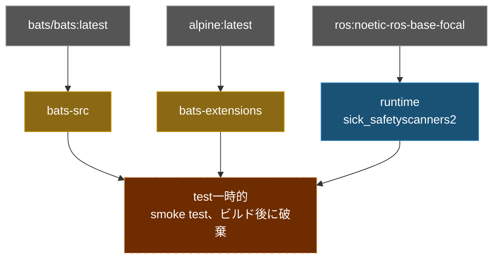

**[English](../README.md)** | **[繁體中文](README.zh-TW.md)** | **[简体中文](README.zh-CN.md)** | **[日本語](README.ja.md)**

# SICK Safety Scanner Docker コンテナ（ROS 1 Noetic）

> **TL;DR** — コンテナ化された SICK Safety Scanner ROS 1 Noetic ドライバ。apt で `ros-noetic-sick-safetyscanners2` をインストールし、privileged モードで `/dev` をマウントして実行します。
>
> ```bash
> ./build.sh && ./run.sh
> ```

## 目次

- [機能](#機能)
- [クイックスタート](#クイックスタート)
- [使い方](#使い方)
- [設定](#設定)
- [アーキテクチャ](#アーキテクチャ)
- [Smoke Tests](#smoke-tests)
- [ディレクトリ構成](#ディレクトリ構成)

---

## 機能

- **Apt ベースのインストール**：ROS apt リポジトリから `ros-noetic-sick-safetyscanners2` をインストール
- **Smoke Test**：Bats テストがビルド時に自動実行され、環境を検証
- **Docker Compose**：単一の `compose.yaml` で全ターゲットを管理
- **Privileged モード**：センサーアクセス用に `/dev` をマウントして事前設定済み
- **マルチアーキテクチャ**：x86_64 と ARM64（RPi、Jetson CPU モード）をサポート

## クイックスタート

```bash
# 1. ビルド
./build.sh

# 2. 実行（デフォルト：bash）
./run.sh

# または docker compose を直接使用
docker compose up runtime
docker compose down
```

## 使い方

### ランタイム

```bash
./build.sh                       # ビルド（デフォルト：runtime）
./build.sh --no-env test         # .env を更新せずにビルド
./run.sh                         # 起動（デフォルト：runtime）
./exec.sh                        # 実行中のコンテナに入る
./stop.sh                        # コンテナを停止・削除

docker compose build runtime     # 同等のコマンド
docker compose up runtime        # 起動
docker compose exec runtime bash # 実行中のコンテナに入る
```

### テスト（test）

Smoke tests はビルド時に自動実行されます。テスト失敗時はビルドも失敗します。

```bash
./build.sh test
# または
docker compose --profile test build test
```

## 設定

### .env パラメータ

| 変数 | 説明 | 例 |
|------|------|-----|
| `DOCKER_HUB_USER` | Docker Hub ユーザー名 | `myuser` |
| `IMAGE_NAME` | イメージ名 | `sick_noetic` |

## アーキテクチャ

### Docker ビルドステージ図



### ステージ説明

| ステージ | FROM | 用途 |
|----------|------|------|
| `bats-src` | `bats/bats:latest` | Bats バイナリソース、出荷しない |
| `bats-extensions` | `alpine:latest` | bats-support、bats-assert、出荷しない |
| `lint-tools` | `alpine:latest` | ShellCheck + Hadolint、出荷しない |
| `runtime` | `ros:noetic-ros-base-focal` | SICK Safety Scanner パッケージ |
| `test` | `runtime` | Lint + smoke tests、ビルド後に破棄 |

## Smoke Tests

詳細は [TEST.md](test/TEST.md) を参照。

## ディレクトリ構成

```text
sick_noetic/
├── compose.yaml                 # Docker Compose 定義
├── Dockerfile                   # マルチステージビルド
├── build.sh                     # ビルドスクリプト
├── run.sh                       # 実行スクリプト
├── exec.sh                      # 実行中のコンテナに入る
├── stop.sh                      # コンテナを停止・削除
├── .env.example                 # 環境変数テンプレート
├── .hadolint.yaml               # Hadolint 無視ルール
├── script/
│   └── entrypoint.sh            # コンテナエントリポイント
├── doc/
│   ├── README.zh-TW.md          # 繁体字中国語
│   ├── README.zh-CN.md          # 簡体字中国語
│   └── README.ja.md             # 日本語
├── .github/workflows/           # CI/CD
│   ├── main.yaml                # メインパイプライン
│   ├── build-worker.yaml        # Docker ビルド + smoke test
│   └── release-worker.yaml      # GitHub Release
└── test/
    └── smoke/              # Bats 環境テスト
        ├── ros_env.bats
        ├── script_help.bats
        └── test_helper.bash
```
