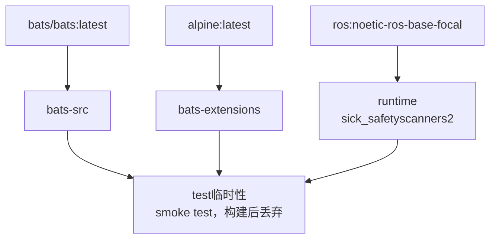

**[English](../README.md)** | **[繁體中文](README.zh-TW.md)** | **[简体中文](README.zh-CN.md)** | **[日本語](README.ja.md)**

# SICK Safety Scanner Docker 容器（ROS 1 Noetic）

> **TL;DR** — 容器化的 SICK Safety Scanner ROS 1 Noetic 驱动程序。通过 apt 安装 `ros-noetic-sick-safetyscanners2`，以 privileged 模式运行并挂载 `/dev`。
>
> ```bash
> ./build.sh && ./run.sh
> ```

## 目录

- [功能特性](#功能特性)
- [快速开始](#快速开始)
- [使用方式](#使用方式)
- [配置](#配置)
- [架构](#架构)
- [Smoke Tests](#smoke-tests)
- [目录结构](#目录结构)

---

## 功能特性

- **Apt 安装**：从 ROS apt 软件源安装 `ros-noetic-sick-safetyscanners2`
- **Smoke Test**：Bats 测试在构建时自动执行，验证环境正确性
- **Docker Compose**：单一 `compose.yaml` 管理所有目标
- **Privileged 模式**：预配置挂载 `/dev` 以访问传感器
- **多架构支持**：支持 x86_64 和 ARM64（RPi、Jetson CPU 模式）

## 快速开始

```bash
# 1. 构建
./build.sh

# 2. 运行（默认：bash）
./run.sh

# 或直接使用 docker compose
docker compose up runtime
docker compose down
```

## 使用方式

### 运行环境

```bash
./build.sh                       # 构建（默认：runtime）
./build.sh --no-env test         # 构建但不更新 .env
./run.sh                         # 启动（默认：runtime）
./exec.sh                        # 进入运行中的容器
./stop.sh                        # 停止并移除容器

docker compose build runtime     # 等效命令
docker compose up runtime        # 启动
docker compose exec runtime bash # 进入运行中的容器
```

### 测试（test）

Smoke tests 在构建时自动执行；测试失败则构建失败。

```bash
./build.sh test
# 或
docker compose --profile test build test
```

## 配置

### .env 参数

| 变量 | 说明 | 示例 |
|------|------|------|
| `DOCKER_HUB_USER` | Docker Hub 用户名 | `myuser` |
| `IMAGE_NAME` | 镜像名称 | `sick_noetic` |

## 架构

### Docker 构建阶段图



### 阶段说明

| 阶段 | FROM | 用途 |
|------|------|------|
| `bats-src` | `bats/bats:latest` | Bats 可执行文件来源，不出货 |
| `bats-extensions` | `alpine:latest` | bats-support、bats-assert，不出货 |
| `lint-tools` | `alpine:latest` | ShellCheck + Hadolint，不出货 |
| `runtime` | `ros:noetic-ros-base-focal` | SICK Safety Scanner 软件包 |
| `test` | `runtime` | Lint + smoke tests，构建后丢弃 |

## Smoke Tests

详见 [TEST.md](test/TEST.md)。

## 目录结构

```text
sick_noetic/
├── compose.yaml                 # Docker Compose 定义
├── Dockerfile                   # 多阶段构建
├── build.sh                     # 构建脚本
├── run.sh                       # 运行脚本
├── exec.sh                      # 进入运行中的容器
├── stop.sh                      # 停止并移除容器
├── .env.example                 # 环境变量模板
├── .hadolint.yaml               # Hadolint 忽略规则
├── script/
│   └── entrypoint.sh            # 容器入口点
├── doc/
│   ├── README.zh-TW.md          # 繁体中文
│   ├── README.zh-CN.md          # 简体中文
│   └── README.ja.md             # 日文
├── .github/workflows/           # CI/CD
│   ├── main.yaml                # 主要流程
│   ├── build-worker.yaml        # Docker 构建 + smoke test
│   └── release-worker.yaml      # GitHub Release
└── test/
    └── smoke/              # Bats 环境测试
        ├── ros_env.bats
        ├── script_help.bats
        └── test_helper.bash
```
