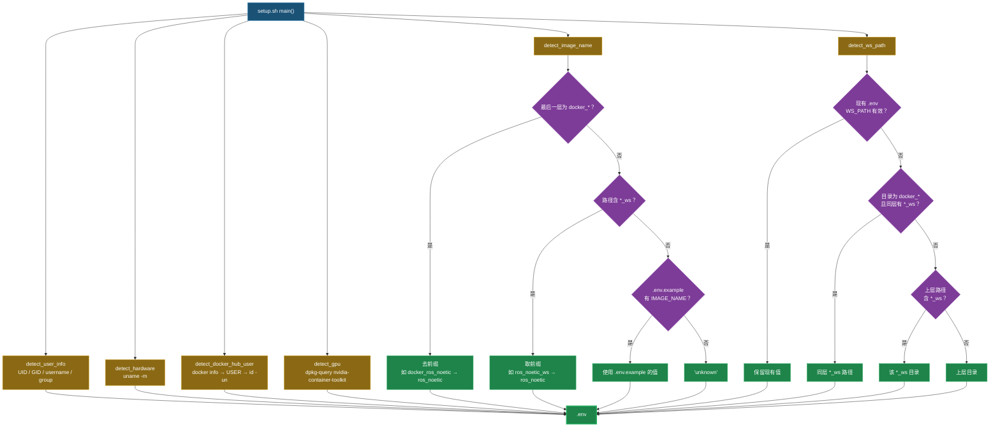
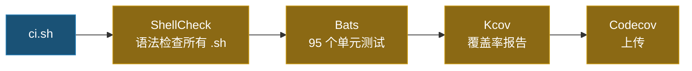

# Docker Setup Helper [](https://github.com/ycpss91255/docker_setup_helper/actions) [](https://codecov.io/gh/ycpss91255/docker_setup_helper)


[](../LICENSE)

[English](../README.md) | [繁體中文](README.zh-TW.md) | [简体中文] | [日本語](README.ja.md)

> **TL;DR** — 模块化 Bash 工具包，自动检测系统参数（UID/GID、GPU、架构、工作区）并生成 `.env` 供 Docker Compose 构建使用。100% 测试覆盖率（Bats + Kcov）。
>
> ```bash
> ./src/setup.sh        # 生成 .env
> ./ci.sh               # 本地运行测试
> ```

模块化的 Docker 环境配置工具包，自动检测系统参数并生成 `.env` 文件，供 Docker 容器构建使用。设计用来替代传统的 `get_param.sh`，具备可测试、可扩展的架构。

## 🌟 特色

- **系统检测**：自动检测用户信息（UID/GID）、硬件架构、GPU 支持及 Docker Hub 账号。
- **镜像名称推导**：从目录结构推导镜像名称（兼容 `docker_*` 前缀与 `*_ws` 后缀惯例）。
- **工作区搜索**：三策略工作区路径检测（同层扫描、向上遍历、回退上层目录）。
- **`.env` 生成**：产出可直接用于 Docker Compose 构建的 `.env` 文件。
- **Shell 配置管理**：内建 Bash、Tmux、Terminator 的配置脚本。

## 📁 项目结构

```text
.
├── src/
│   ├── setup.sh                         # 主程序（替代 get_param.sh）
│   └── config/
│       ├── pip/
│       │   ├── setup.sh                 # pip 包安装脚本
│       │   └── requirements.txt         # Python 依赖包
│       └── shell/
│           ├── bashrc                   # Bash 配置文件
│           ├── terminator/
│           │   ├── setup.sh             # Terminator 配置脚本
│           │   └── config               # Terminator 配置文件
│           └── tmux/
│               ├── setup.sh             # Tmux + TPM 配置脚本
│               └── tmux.conf            # Tmux 配置文件
├── test/                                # Bats 测试用例（95 个测试）
│   ├── test_helper.bash                 # 测试辅助工具与 mock 函数
│   ├── setup_spec.bats                  # setup.sh 测试（35 个用例）
│   ├── bashrc_spec.bats                 # bashrc 验证测试（14 个用例）
│   ├── pip_setup_spec.bats              # pip 安装测试（3 个用例）
│   ├── terminator_config_spec.bats      # terminator 配置验证（10 个用例）
│   ├── terminator_setup_spec.bats       # terminator 安装测试（7 个用例）
│   ├── tmux_conf_spec.bats             # tmux.conf 验证测试（12 个用例）
│   └── tmux_setup_spec.bats             # tmux 安装测试（8 个用例）
├── ci.sh                                # 本地 CI 启动脚本
├── compose.yaml                         # Docker CI 环境
├── .codecov.yaml                        # Codecov 配置文件
└── LICENSE
```

## 📦 依赖项

运行本地 CI 流程需要具备：
- **Docker**：用于运行测试环境。
- **Docker Compose**：用于管理容器服务。

CI 容器内部会自动处理以下工具：
- **Bats Core**：测试框架。
- **ShellCheck**：语法检查工具。
- **Kcov**：覆盖率报告生成器。
- **bats-mock**：命令模拟库。

## 🚀 快速上手

### 1. 运行配置（生成 `.env`）
```bash
./src/setup.sh
```
自动检测系统参数并生成 `.env` 文件：
```env
USER_NAME=youruser
USER_GROUP=yourgroup
USER_UID=1000
USER_GID=1000
HARDWARE=x86_64
DOCKER_HUB_USER=yourhubuser
GPU_ENABLED=false
IMAGE_NAME=myproject
WS_PATH=/path/to/workspace
```

### 2. 在 Docker Compose 中使用
在 `compose.yaml` 中引用生成的 `.env`：
```yaml
services:
  dev:
    build:
      args:
        USER_NAME: ${USER_NAME}
        USER_UID: ${USER_UID}
        USER_GID: ${USER_GID}
    volumes:
      - ${WS_PATH}:/home/${USER_NAME}/work
```

### 3. 通过 Git Subtree 集成
```bash
git subtree add --prefix=docker_setup_helper \
    https://github.com/ycpss91255/docker_setup_helper.git main --squash
```

### 4. 本地运行完整检查（CI）
```bash
chmod +x ci.sh
./ci.sh
```
通过 Docker 运行 ShellCheck 语法检查、Bats 单元测试及 Kcov 覆盖率报告。

## 🛠 开发指南

### ShellCheck 规范
本项目严格执行 ShellCheck 检查。若有动态加载需求，请使用标签抑制警告：
```bash
# shellcheck disable=SC1090
source "${DYNAMIC_PATH}"
```

### 测试覆盖率

覆盖率目标：**Patch** 100%，**Project** 只进步不退步（`auto`）。

<details>
<summary>展开查看测试详情（95 个测试）</summary>

#### setup.sh（41）

| 测试项目 | 说明 |
|----------|------|
| `detect_user_info` | `USER` 环境变量存在时使用 |
| `detect_user_info` | `USER` 未设置时回退 `id -un` |
| `detect_user_info` | 正确设置 group/uid/gid |
| `detect_hardware` | 返回 `uname -m` 输出 |
| `detect_docker_hub_user` | 已登录时使用 `docker info` 的 username |
| `detect_docker_hub_user` | docker 返回空值时回退 `USER` |
| `detect_docker_hub_user` | `USER` 也未设置时回退 `id -un` |
| `detect_gpu` | nvidia-container-toolkit 已安装时返回 `true` |
| `detect_gpu` | 未安装时返回 `false` |
| `detect_image_name` | 路径中找到 `*_ws` |
| `detect_image_name` | 路径末端找到 `*_ws` |
| `detect_image_name` | `docker_*` 优先于路径中的 `*_ws` |
| `detect_image_name` | 去除最后一层的 `docker_` 前缀 |
| `detect_image_name` | 从绝对路径根目录去除 `docker_` |
| `detect_image_name` | 普通目录返回 `unknown` |
| `detect_image_name` | 通用路径返回 `unknown` |
| `detect_image_name` | 结果转小写 |
| `detect_ws_path` | 策略 1：`docker_*` 找到同层 `*_ws` |
| `detect_ws_path` | 策略 1：`docker_*` 无同层 `*_ws` 时向下继续 |
| `detect_ws_path` | 策略 2：路径中找到 `_ws` 组件 |
| `detect_ws_path` | 策略 3：回退上层目录 |
| `write_env` | 创建含所有必要变量的 `.env` |
| `main` | `.env` 不存在时创建 |
| `main` | 读取现有 `.env` 并保留有效 `WS_PATH` |
| `main` | `.env` 中 `WS_PATH` 失效时重新检测 |
| `main` | 未指定 `--base-path` 时使用 `BASH_SOURCE` 回退值 |
| `main` | 未知参数时返回错误 |
| `main` | `--base-path` 缺少值时返回错误 |
| `_msg` | 默认返回英文消息 |
| `_msg` | `_LANG=zh` 时返回中文消息 |
| `_msg` | `_LANG=zh-CN` 时返回简体中文消息 |
| `_msg` | `_LANG=ja` 时返回日文消息 |
| `main` | `--lang zh` 设置中文消息 |
| `main` | `--lang` 缺少值时返回错误 |
| `_base_path` | 默认解析至 repo root，非 script 所在目录（regression） |
| `_detect_lang` | `zh_TW.UTF-8` 时返回 `zh` |
| `_detect_lang` | `zh_CN.UTF-8` 时返回 `zh-CN` |
| `_detect_lang` | `ja_JP.UTF-8` 时返回 `ja` |
| `_detect_lang` | `en_US.UTF-8` 时返回 `en` |
| `_detect_lang` | `LANG` 未设置时返回 `en` |
| `_detect_lang` | 被 `SETUP_LANG` 覆盖 |

#### bashrc（14）

| 测试项目 | 说明 |
|----------|------|
| `alias_func` | 已定义 |
| `swc` | 已定义 |
| `color_git_branch` | 已定义 |
| `ros_complete` | 已定义 |
| `ros_source` | 已定义 |
| `ebc` | alias 已定义 |
| `sbc` | alias 已定义 |
| `alias_func` | 在 bashrc 中被调用 |
| `color_git_branch` | 在 bashrc 中被调用 |
| `ros_complete` | 在 bashrc 中被调用 |
| `ros_source` | 在 bashrc 中被调用 |
| `swc` | 搜索 catkin `devel/setup.bash` |
| `ros_source` | 引用 `ROS_DISTRO` |
| `color_git_branch` | 设置 `PS1` |

#### pip 安装（3）

| 测试项目 | 说明 |
|----------|------|
| `setup.sh` | 以 `requirements.txt` 运行 `pip install` |
| `setup.sh` | 设置 `PIP_BREAK_SYSTEM_PACKAGES=1` |
| `setup.sh` | pip 不可用时失败 |

#### terminator 配置文件（10）

| 测试项目 | 说明 |
|----------|------|
| 配置文件 | 含 `[global_config]` 区段 |
| 配置文件 | 含 `[keybindings]` 区段 |
| 配置文件 | 含 `[profiles]` 区段 |
| 配置文件 | 含 `[layouts]` 区段 |
| 配置文件 | 含 `[plugins]` 区段 |
| profiles | 含 `[[default]]` |
| default | 禁用系统字体 |
| default | 无限制滚动缓冲 |
| layouts | 含 Window 类型 |
| layouts | 含 Terminal 类型 |

#### terminator 安装（7）

| 测试项目 | 说明 |
|----------|------|
| `check_deps` | terminator 已安装时返回 0 |
| `check_deps` | terminator 未安装时失败 |
| `_entry_point` | 依赖通过时调用 main |
| `_entry_point` | 依赖缺失时失败 |
| `main` | 创建 terminator 配置目录 |
| `main` | 复制 terminator 配置文件 |
| `main` | 以正确的 user/group 执行 `chown` |

#### tmux.conf（12）

| 测试项目 | 说明 |
|----------|------|
| 配置文件 | 定义 prefix key |
| 配置文件 | 默认 shell 为 bash |
| 配置文件 | 设置默认终端 |
| 配置文件 | 启用鼠标支持 |
| 配置文件 | 启用 vi `status-keys` |
| 配置文件 | 启用 vi `mode-keys` |
| 配置文件 | 定义分割窗口快捷键 |
| 配置文件 | 定义重载配置快捷键 |
| 配置文件 | 启用状态栏 |
| 配置文件 | 设置状态栏位置 |
| 配置文件 | 声明 tpm 插件 |
| 配置文件 | 文件末端初始化 tpm |

#### tmux 安装（8）

| 测试项目 | 说明 |
|----------|------|
| `check_deps` | tmux 与 git 已安装时返回 0 |
| `check_deps` | tmux 未安装时失败 |
| `check_deps` | git 未安装时失败 |
| `_entry_point` | 依赖通过时调用 main |
| `_entry_point` | 依赖缺失时失败 |
| `main` | clone tpm 仓库 |
| `main` | 创建 tmux 配置目录 |
| `main` | 复制 `tmux.conf` 至配置目录 |

</details>

### BASH_SOURCE Guard 模式
所有脚本均使用 `BASH_SOURCE` 守卫模式，确保可测试性：
```bash
if [[ "${BASH_SOURCE[0]:-}" == "${0:-}" ]]; then
    main "$@"
fi
```

## 架构

### 检测与生成流程



### IMAGE_NAME 推导（`detect_image_name`）

扫描 repo 目录路径，推导 Docker 镜像名称：

| 优先序 | 规则 | 示例路径 | 结果 |
|:------:|------|----------|------|
| 1 | 最后一层目录符合 `docker_*` → 去掉 `docker_` 前缀 | `/home/user/docker_ros_noetic` | `ros_noetic` |
| 2 | 扫描完整路径（**右→左**）找 `*_ws` 目录 → 取 `_ws` 前面的名称 | `/home/user/ros_noetic_ws/docker/ros_noetic` → 找到 `ros_noetic_ws` | `ros_noetic` |
| 3 | 读取 repo 根目录 `.env.example` 中的 `IMAGE_NAME=` | `.env.example` 含 `IMAGE_NAME=ros_noetic` | `ros_noetic` |
| 4 | 回退值 | 以上皆不符合 | `unknown` |

### WS_PATH 工作区检测（`detect_ws_path`）

三策略搜索，依序执行直到成功为止：

#### 策略 1 — 同层扫描

若**当前目录名称**以 `docker_` 开头，去掉前缀后在**同层**寻找 `{name}_ws` 目录。

```
/home/user/
├── docker_ros_noetic/    ← 当前目录符合 docker_*
│   └── (此 repo)            去前缀 → "ros_noetic"
└── ros_noetic_ws/        ← 同层找到 ros_noetic_ws → WS_PATH
```

#### 策略 2 — 向上遍历

沿着**绝对路径逐层向上**检查，若某层目录名称以 `_ws` 结尾，即使用该目录。

```
/home/user/ros_noetic_ws/src/docker_ros_noetic/
           ^^^^^^^^^^^^^^
           向上遍历：docker_ros_noetic → src → ros_noetic_ws（命中！）
           → WS_PATH = /home/user/ros_noetic_ws
```

#### 策略 3 — 回退上层目录

若以上两个策略都没有找到 `_ws` 目录，回退使用 repo 的**上一层目录**。

```
/home/user/projects/ros_noetic/
                    ^^^^^^^^^^^  ← repo（路径中无 *_ws）
           ^^^^^^^^              ← WS_PATH = /home/user/projects
```

> **注意：** 若 `.env` 已存在且 `WS_PATH` 指向有效目录，则完全跳过检测，保留现有值。

### CI 流程



## 📄 许可证
[GPL-3.0](../LICENSE)
