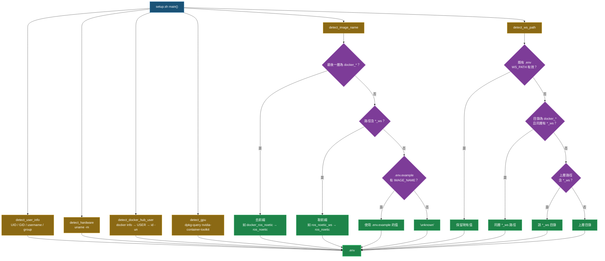
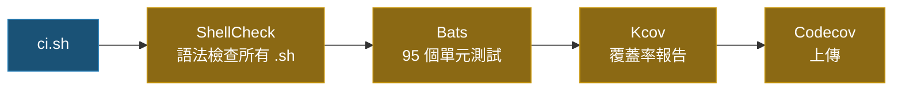

# Docker Setup Helper [](https://github.com/ycpss91255/docker_setup_helper/actions) [](https://codecov.io/gh/ycpss91255/docker_setup_helper)


[](../LICENSE)

[English](../README.md) | [繁體中文] | [简体中文](README.zh-CN.md) | [日本語](README.ja.md)

> **TL;DR** — 模組化 Bash 工具組，自動偵測系統參數（UID/GID、GPU、架構、工作區）並產生 `.env` 供 Docker Compose 建置使用。100% 測試覆蓋率（Bats + Kcov）。
>
> ```bash
> ./src/setup.sh        # 產生 .env
> ./ci.sh               # 在地執行測試
> ```

模組化的 Docker 環境設定工具組，自動偵測系統參數並產生 `.env` 檔案，供 Docker 容器建置使用。設計用來取代傳統的 `get_param.sh`，具備可測試、可擴展的架構。

## 🌟 特色

- **系統偵測**：自動偵測使用者資訊（UID/GID）、硬體架構、GPU 支援及 Docker Hub 帳號。
- **映像名稱推導**：從目錄結構推導映像名稱（相容 `docker_*` 前綴與 `*_ws` 後綴慣例）。
- **工作區搜尋**：三策略工作區路徑偵測（同層掃描、向上遍歷、退回上層目錄）。
- **`.env` 生成**：產出可直接用於 Docker Compose 建置的 `.env` 檔案。
- **Shell 設定管理**：內建 Bash、Tmux、Terminator 的設定腳本。

## 📁 專案結構

```text
.
├── src/
│   ├── setup.sh                         # 主程式（取代 get_param.sh）
│   └── config/
│       ├── pip/
│       │   ├── setup.sh                 # pip 套件安裝腳本
│       │   └── requirements.txt         # Python 相依套件
│       └── shell/
│           ├── bashrc                   # Bash 設定檔
│           ├── terminator/
│           │   ├── setup.sh             # Terminator 設定腳本
│           │   └── config               # Terminator 設定檔
│           └── tmux/
│               ├── setup.sh             # Tmux + TPM 設定腳本
│               └── tmux.conf            # Tmux 設定檔
├── test/                                # Bats 測試案例（95 個測試）
│   ├── test_helper.bash                 # 測試輔助工具與 mock 函式
│   ├── setup_spec.bats                  # setup.sh 測試（33 個案例）
│   ├── bashrc_spec.bats                 # bashrc 驗證測試（14 個案例）
│   ├── pip_setup_spec.bats              # pip 安裝測試（3 個案例）
│   ├── terminator_config_spec.bats      # terminator 設定驗證（10 個案例）
│   ├── terminator_setup_spec.bats       # terminator 安裝測試（7 個案例）
│   ├── tmux_conf_spec.bats             # tmux.conf 驗證測試（12 個案例）
│   └── tmux_setup_spec.bats             # tmux 安裝測試（8 個案例）
├── ci.sh                                # 在地 CI 啟動腳本
├── compose.yaml                         # Docker CI 環境
├── .codecov.yaml                        # Codecov 設定檔
└── LICENSE
```

## 📦 依賴項

執行在地 CI 流程需要具備：
- **Docker**：用於執行測試環境。
- **Docker Compose**：用於管理容器服務。

CI 容器內部會自動處理以下工具：
- **Bats Core**：測試框架。
- **ShellCheck**：語法檢查工具。
- **Kcov**：覆蓋率報告產生器。
- **bats-mock**：命令模擬函式庫。

## 🚀 快速上手

### 1. 執行設定（產生 `.env`）
```bash
./src/setup.sh
```
自動偵測系統參數並產生 `.env` 檔案：
```env
USER_NAME=youruser
USER_GROUP=yourgroup
USER_UID=1000
USER_GID=1000
HARDWARE=x86_64
DOCKER_HUB_USER=yourhubuser
GPU_ENABLED=false
IMAGE_NAME=myproject
WS_PATH=/path/to/workspace
```

### 2. 在 Docker Compose 中使用
在 `compose.yaml` 中引用產生的 `.env`：
```yaml
services:
  dev:
    build:
      args:
        USER_NAME: ${USER_NAME}
        USER_UID: ${USER_UID}
        USER_GID: ${USER_GID}
    volumes:
      - ${WS_PATH}:/home/${USER_NAME}/work
```

### 3. 透過 Git Subtree 整合
```bash
git subtree add --prefix=docker_setup_helper \
    https://github.com/ycpss91255/docker_setup_helper.git main --squash
```

### 4. 在地執行完整檢查（CI）
```bash
chmod +x ci.sh
./ci.sh
```
透過 Docker 執行 ShellCheck 語法檢查、Bats 單元測試及 Kcov 覆蓋率報告。

## 🛠 開發指南

### ShellCheck 規範
本專案嚴格執行 ShellCheck 檢查。若有動態載入需求，請使用標籤抑制警告：
```bash
# shellcheck disable=SC1090
source "${DYNAMIC_PATH}"
```

### 測試覆蓋率

覆蓋率目標：**Patch** 100%，**Project** 只進步不退步（`auto`）。

<details>
<summary>展開查看測試細項（95 個測試）</summary>

#### setup.sh（41）

| 測試項目 | 說明 |
|----------|------|
| `detect_user_info` | `USER` 環境變數存在時使用 |
| `detect_user_info` | `USER` 未設定時退回 `id -un` |
| `detect_user_info` | 正確設定 group/uid/gid |
| `detect_hardware` | 回傳 `uname -m` 輸出 |
| `detect_docker_hub_user` | 已登入時使用 `docker info` 的 username |
| `detect_docker_hub_user` | docker 回傳空值時退回 `USER` |
| `detect_docker_hub_user` | `USER` 也未設定時退回 `id -un` |
| `detect_gpu` | nvidia-container-toolkit 已安裝時回傳 `true` |
| `detect_gpu` | 未安裝時回傳 `false` |
| `detect_image_name` | 路徑中找到 `*_ws` |
| `detect_image_name` | 路徑末端找到 `*_ws` |
| `detect_image_name` | `docker_*` 優先於路徑中的 `*_ws` |
| `detect_image_name` | 去除最後一層的 `docker_` 前綴 |
| `detect_image_name` | 從絕對路徑根目錄去除 `docker_` |
| `detect_image_name` | 一般目錄回傳 `unknown` |
| `detect_image_name` | 通用路徑回傳 `unknown` |
| `detect_image_name` | 結果轉小寫 |
| `detect_ws_path` | 策略 1：`docker_*` 找到同層 `*_ws` |
| `detect_ws_path` | 策略 1：`docker_*` 無同層 `*_ws` 時向下繼續 |
| `detect_ws_path` | 策略 2：路徑中找到 `_ws` 元件 |
| `detect_ws_path` | 策略 3：退回上層目錄 |
| `write_env` | 建立含所有必要變數的 `.env` |
| `main` | `.env` 不存在時建立 |
| `main` | 讀取既有 `.env` 並保留有效 `WS_PATH` |
| `main` | `.env` 中 `WS_PATH` 失效時重新偵測 |
| `main` | 未指定 `--base-path` 時使用 `BASH_SOURCE` 退回值 |
| `main` | 未知參數時回傳錯誤 |
| `main` | `--base-path` 缺少值時回傳錯誤 |
| `_msg` | 預設回傳英文訊息 |
| `_msg` | `_LANG=zh` 時回傳中文訊息 |
| `_msg` | `_LANG=zh-CN` 時回傳簡體中文訊息 |
| `_msg` | `_LANG=ja` 時回傳日文訊息 |
| `main` | `--lang zh` 設定中文訊息 |
| `main` | `--lang` 缺少值時回傳錯誤 |
| `_base_path` | 預設解析至 repo root，非 script 所在目錄（regression） |
| `_detect_lang` | `zh_TW.UTF-8` 時回傳 `zh` |
| `_detect_lang` | `zh_CN.UTF-8` 時回傳 `zh-CN` |
| `_detect_lang` | `ja_JP.UTF-8` 時回傳 `ja` |
| `_detect_lang` | `en_US.UTF-8` 時回傳 `en` |
| `_detect_lang` | `LANG` 未設定時回傳 `en` |
| `_detect_lang` | 被 `SETUP_LANG` 覆蓋 |

#### bashrc（14）

| 測試項目 | 說明 |
|----------|------|
| `alias_func` | 已定義 |
| `swc` | 已定義 |
| `color_git_branch` | 已定義 |
| `ros_complete` | 已定義 |
| `ros_source` | 已定義 |
| `ebc` | alias 已定義 |
| `sbc` | alias 已定義 |
| `alias_func` | 在 bashrc 中被呼叫 |
| `color_git_branch` | 在 bashrc 中被呼叫 |
| `ros_complete` | 在 bashrc 中被呼叫 |
| `ros_source` | 在 bashrc 中被呼叫 |
| `swc` | 搜尋 catkin `devel/setup.bash` |
| `ros_source` | 引用 `ROS_DISTRO` |
| `color_git_branch` | 設定 `PS1` |

#### pip 安裝（3）

| 測試項目 | 說明 |
|----------|------|
| `setup.sh` | 以 `requirements.txt` 執行 `pip install` |
| `setup.sh` | 設定 `PIP_BREAK_SYSTEM_PACKAGES=1` |
| `setup.sh` | pip 不可用時失敗 |

#### terminator 設定檔（10）

| 測試項目 | 說明 |
|----------|------|
| 設定檔 | 含 `[global_config]` 區段 |
| 設定檔 | 含 `[keybindings]` 區段 |
| 設定檔 | 含 `[profiles]` 區段 |
| 設定檔 | 含 `[layouts]` 區段 |
| 設定檔 | 含 `[plugins]` 區段 |
| profiles | 含 `[[default]]` |
| default | 停用系統字型 |
| default | 無限制捲動緩衝 |
| layouts | 含 Window 類型 |
| layouts | 含 Terminal 類型 |

#### terminator 安裝（7）

| 測試項目 | 說明 |
|----------|------|
| `check_deps` | terminator 已安裝時回傳 0 |
| `check_deps` | terminator 未安裝時失敗 |
| `_entry_point` | 依賴通過時呼叫 main |
| `_entry_point` | 依賴缺失時失敗 |
| `main` | 建立 terminator 設定目錄 |
| `main` | 複製 terminator 設定檔 |
| `main` | 以正確的 user/group 執行 `chown` |

#### tmux.conf（12）

| 測試項目 | 說明 |
|----------|------|
| 設定檔 | 定義 prefix key |
| 設定檔 | 預設 shell 為 bash |
| 設定檔 | 設定預設終端 |
| 設定檔 | 啟用滑鼠支援 |
| 設定檔 | 啟用 vi `status-keys` |
| 設定檔 | 啟用 vi `mode-keys` |
| 設定檔 | 定義分割視窗快捷鍵 |
| 設定檔 | 定義重載設定快捷鍵 |
| 設定檔 | 啟用狀態列 |
| 設定檔 | 設定狀態列位置 |
| 設定檔 | 宣告 tpm 插件 |
| 設定檔 | 檔案末端初始化 tpm |

#### tmux 安裝（8）

| 測試項目 | 說明 |
|----------|------|
| `check_deps` | tmux 與 git 已安裝時回傳 0 |
| `check_deps` | tmux 未安裝時失敗 |
| `check_deps` | git 未安裝時失敗 |
| `_entry_point` | 依賴通過時呼叫 main |
| `_entry_point` | 依賴缺失時失敗 |
| `main` | clone tpm 儲存庫 |
| `main` | 建立 tmux 設定目錄 |
| `main` | 複製 `tmux.conf` 至設定目錄 |

</details>

### BASH_SOURCE Guard 模式
所有腳本皆使用 `BASH_SOURCE` 守衛模式，確保可測試性：
```bash
if [[ "${BASH_SOURCE[0]:-}" == "${0:-}" ]]; then
    main "$@"
fi
```

## 架構

### 偵測與產生流程



### IMAGE_NAME 推導（`detect_image_name`）

掃描 repo 目錄路徑，推導 Docker 映像名稱：

| 優先序 | 規則 | 範例路徑 | 結果 |
|:------:|------|----------|------|
| 1 | 最後一層目錄符合 `docker_*` → 去掉 `docker_` 前綴 | `/home/user/docker_ros_noetic` | `ros_noetic` |
| 2 | 掃描完整路徑（**右→左**）找 `*_ws` 目錄 → 取 `_ws` 前面的名稱 | `/home/user/ros_noetic_ws/docker/ros_noetic` → 找到 `ros_noetic_ws` | `ros_noetic` |
| 3 | 讀取 repo 根目錄 `.env.example` 中的 `IMAGE_NAME=` | `.env.example` 含 `IMAGE_NAME=ros_noetic` | `ros_noetic` |
| 4 | 退回值 | 以上皆不符合 | `unknown` |

### WS_PATH 工作區偵測（`detect_ws_path`）

三策略搜尋，依序執行直到成功為止：

#### 策略 1 — 同層掃描

若**目前目錄名稱**以 `docker_` 開頭，去掉前綴後在**同層**尋找 `{name}_ws` 目錄。

```
/home/user/
├── docker_ros_noetic/    ← 目前目錄符合 docker_*
│   └── (此 repo)            去前綴 → "ros_noetic"
└── ros_noetic_ws/        ← 同層找到 ros_noetic_ws → WS_PATH
```

#### 策略 2 — 向上遍歷

沿著**絕對路徑逐層向上**檢查，若某層目錄名稱以 `_ws` 結尾，即使用該目錄。

```
/home/user/ros_noetic_ws/src/docker_ros_noetic/
           ^^^^^^^^^^^^^^
           向上遍歷：docker_ros_noetic → src → ros_noetic_ws（命中！）
           → WS_PATH = /home/user/ros_noetic_ws
```

#### 策略 3 — 退回上層目錄

若以上兩個策略都沒有找到 `_ws` 目錄，退回使用 repo 的**上一層目錄**。

```
/home/user/projects/ros_noetic/
                    ^^^^^^^^^^^  ← repo（路徑中無 *_ws）
           ^^^^^^^^              ← WS_PATH = /home/user/projects
```

> **注意：** 若 `.env` 已存在且 `WS_PATH` 指向有效目錄，則完全跳過偵測，保留現有值。

### CI 流程



## 📄 授權
[GPL-3.0](../LICENSE)
